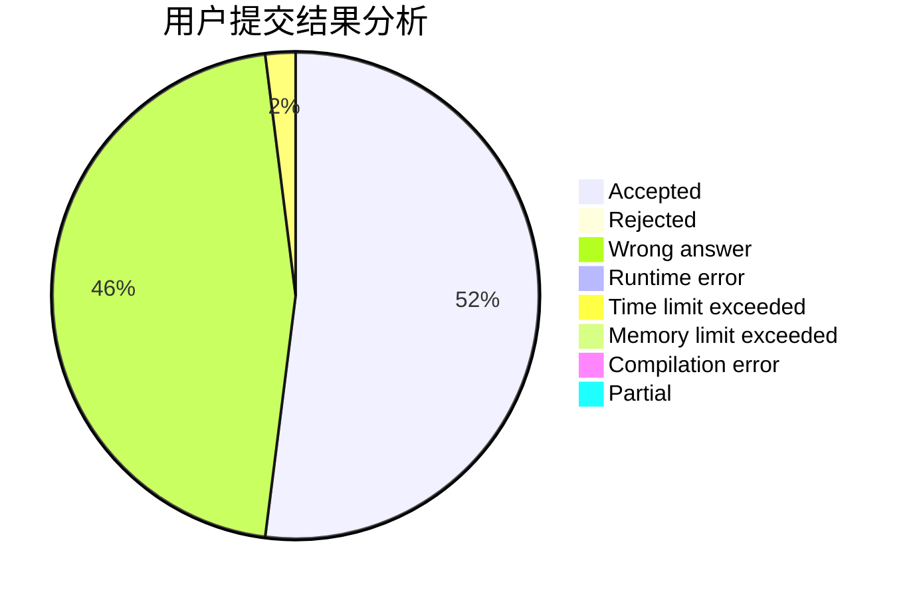
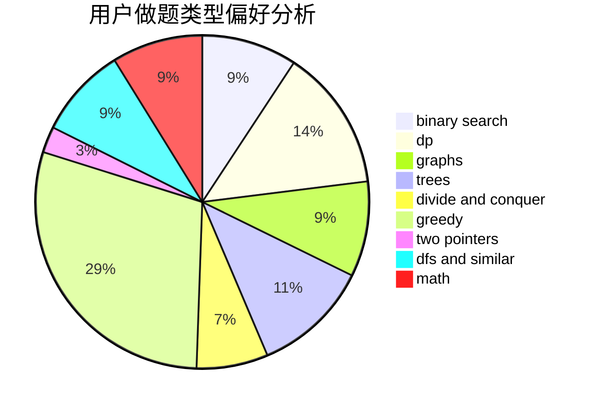

# Marcus0510

<!-- tabs:start -->

#### **用户提交结果分析**

#### **用户做题类型偏好分析**

<!-- tabs:end -->
# 推荐题目
[1039B](https://codeforces.com/contest/1039/problem/B)
[1194F](https://codeforces.com/contest/1194/problem/F)
[834C](https://codeforces.com/contest/834/problem/C)
[1161E](https://codeforces.com/contest/1161/problem/E)
[742E](https://codeforces.com/contest/742/problem/E)
[980A](https://codeforces.com/contest/980/problem/A)
[558D](https://codeforces.com/contest/558/problem/D)
[97E](https://codeforces.com/contest/97/problem/E)
[38B](https://codeforces.com/contest/38/problem/B)
[212C](https://codeforces.com/contest/212/problem/C)
