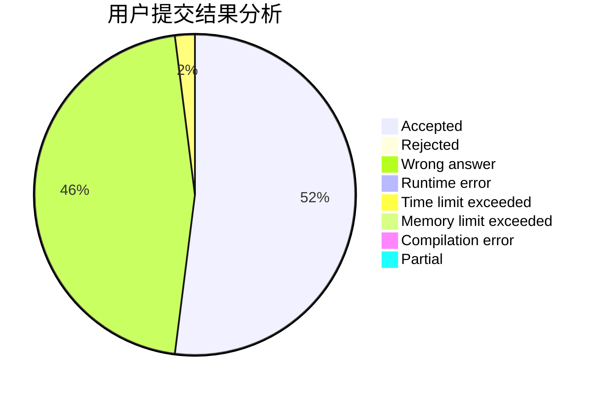
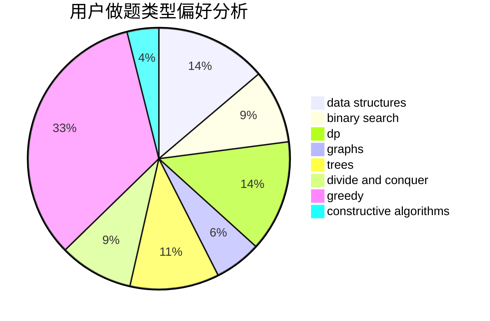
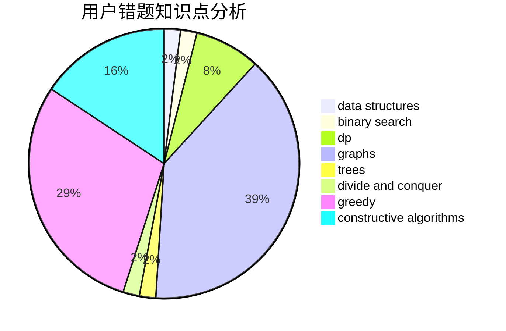

# Marcus0510

<!-- tabs:start -->

#### **用户提交结果分析**

#### **用户做题类型偏好分析**

#### **用户错题知识点分析**

<!-- tabs:end -->
# 推荐题目
[1039B](https://codeforces.com/contest/1039/problem/B)		binary search,
                        interactive,
                        probabilities		  
[1194F](https://codeforces.com/contest/1194/problem/F)		combinatorics,
                        dp,
                        number theory,
                        probabilities,
                        two pointers		  
[834C](https://codeforces.com/contest/834/problem/C)		dsu,graphs,sortings,trees		  
[1161E](https://codeforces.com/contest/1161/problem/E)		dsu,graphs,sortings,trees		  
[742E](https://codeforces.com/contest/742/problem/E)		dsu,graphs,sortings,trees		  
[980A](https://codeforces.com/contest/980/problem/A)		implementation,
                        math		  
[558D](https://codeforces.com/contest/558/problem/D)		data structures,
                        implementation,
                        sortings		  
[97E](https://codeforces.com/contest/97/problem/E)		dfs and similar,
                        dsu,
                        graphs,
                        trees		  
[38B](https://codeforces.com/contest/38/problem/B)		brute force,
                        implementation,
                        math		  
[212C](https://codeforces.com/contest/212/problem/C)		combinatorics,
                        dp,
                        math		  
