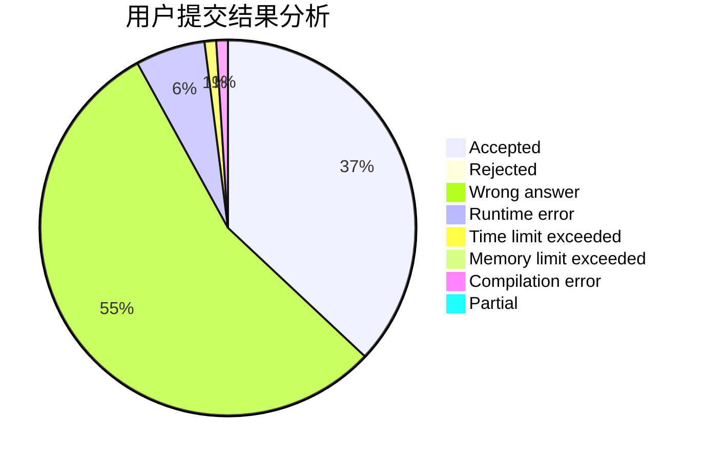
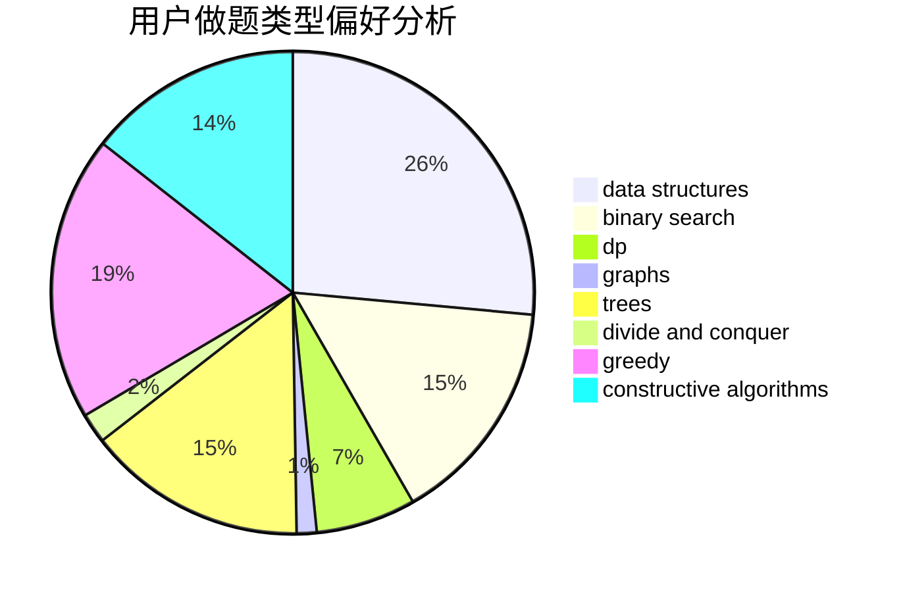
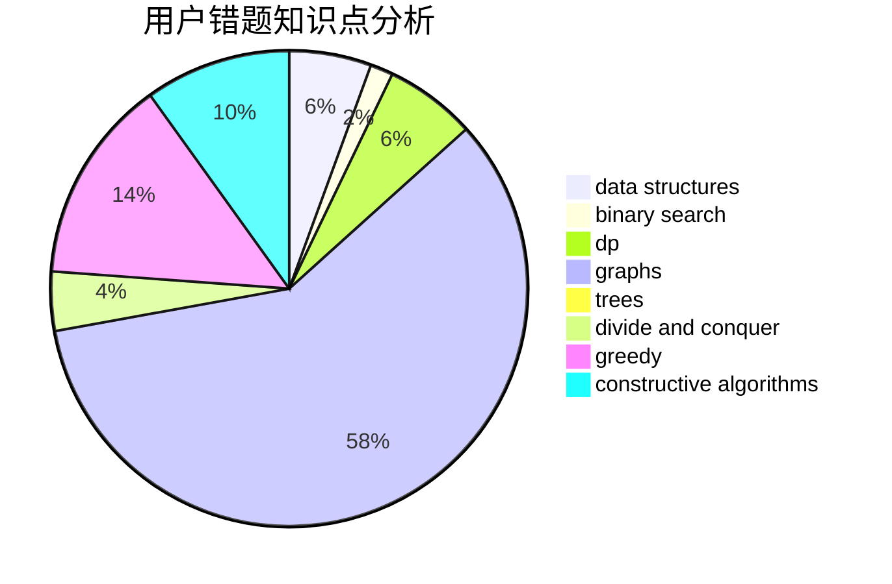

# Mark2020

<!-- tabs:start -->

#### **用户提交结果分析**

#### **用户做题类型偏好分析**

#### **用户错题知识点分析**

<!-- tabs:end -->
# 推荐题目
[1119H](https://codeforces.com/contest/1119/problem/H)		fft,
                        math		  
[713A](https://codeforces.com/contest/713/problem/A)		data structures,
                        implementation		  
[498D](https://codeforces.com/contest/498/problem/D)		data structures,
                        dp,
                        number theory		  
[840C](https://codeforces.com/contest/840/problem/C)		combinatorics,
                        dp		  
[1369F](https://codeforces.com/contest/1369/problem/F)		dfs and similar,
                        dp,
                        games		  
[545D](https://codeforces.com/contest/545/problem/D)		greedy,
                        implementation,
                        sortings		  
[1394C](https://codeforces.com/contest/1394/problem/C)		binary search,
                        geometry,
                        ternary search		  
[902B](https://codeforces.com/contest/902/problem/B)		dfs and similar,
                        dsu,
                        greedy		  
[703E](https://codeforces.com/contest/703/problem/E)		dp,
                        number theory		  
[268D](https://codeforces.com/contest/268/problem/D)		dp		  
