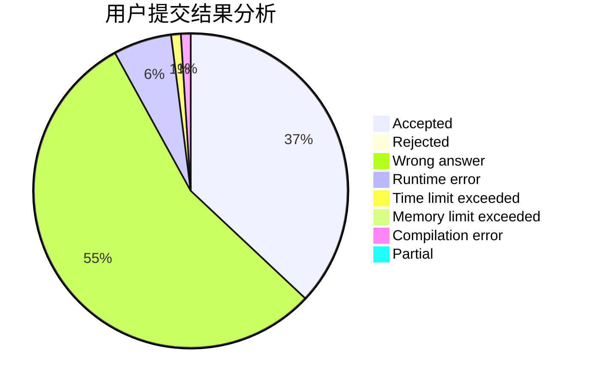
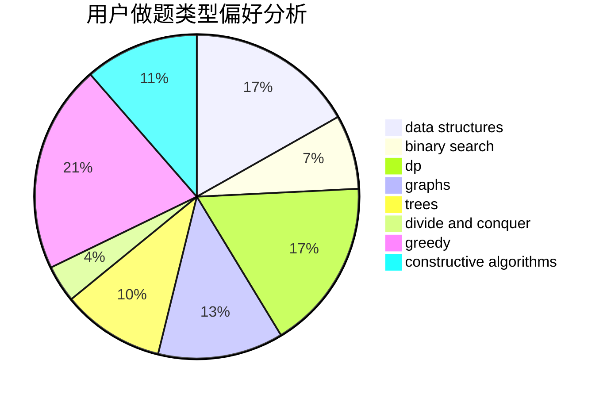
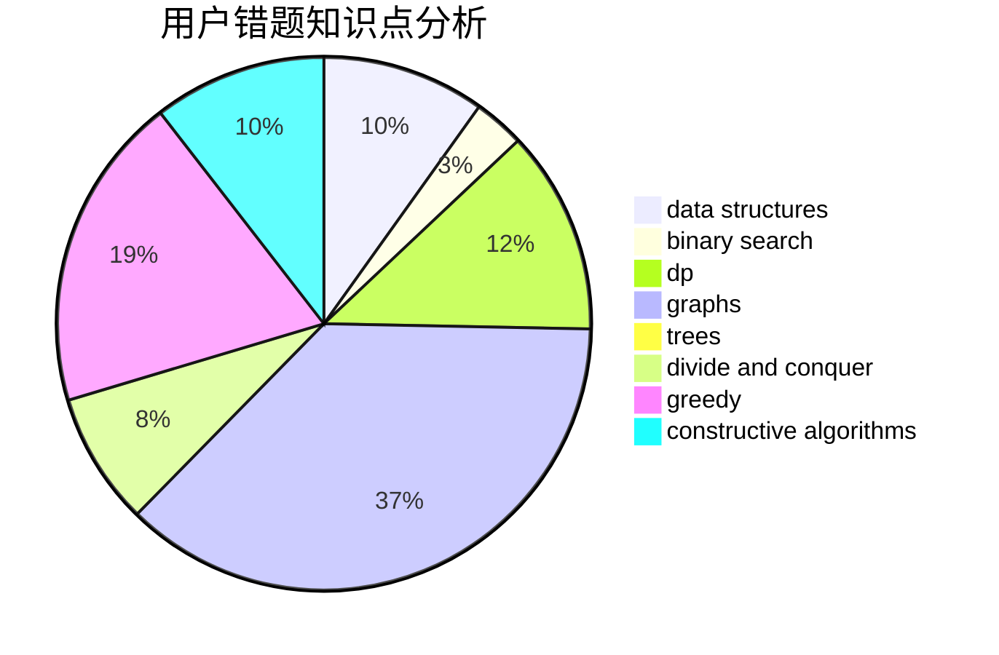

# Mark2020

<!-- tabs:start -->

#### **用户提交结果分析**

#### **用户做题类型偏好分析**

#### **用户错题知识点分析**

<!-- tabs:end -->
# 推荐题目
[1129D](https://codeforces.com/contest/1129/problem/D)		data structures,
                        dp		  
[732B](https://codeforces.com/contest/732/problem/B)		dp,
                        greedy		  
[519D](https://codeforces.com/contest/519/problem/D)		data structures,
                        dp,
                        two pointers		  
[85A](https://codeforces.com/contest/85/problem/A)		constructive algorithms,
                        implementation		  
[13771](https://codeforces.com/contest/1377/problem/1)		dsu,graphs,sortings,trees		  
[570A](https://codeforces.com/contest/570/problem/A)		implementation		  
[1402B](https://codeforces.com/contest/1402/problem/B)		*special problem,
                        geometry,
                        sortings		  
[918D](https://codeforces.com/contest/918/problem/D)		dsu,graphs,sortings,trees		  
[723A](https://codeforces.com/contest/723/problem/A)		implementation,
                        math,
                        sortings		  
[283E](https://codeforces.com/contest/283/problem/E)		combinatorics,
                        data structures,
                        math		  
