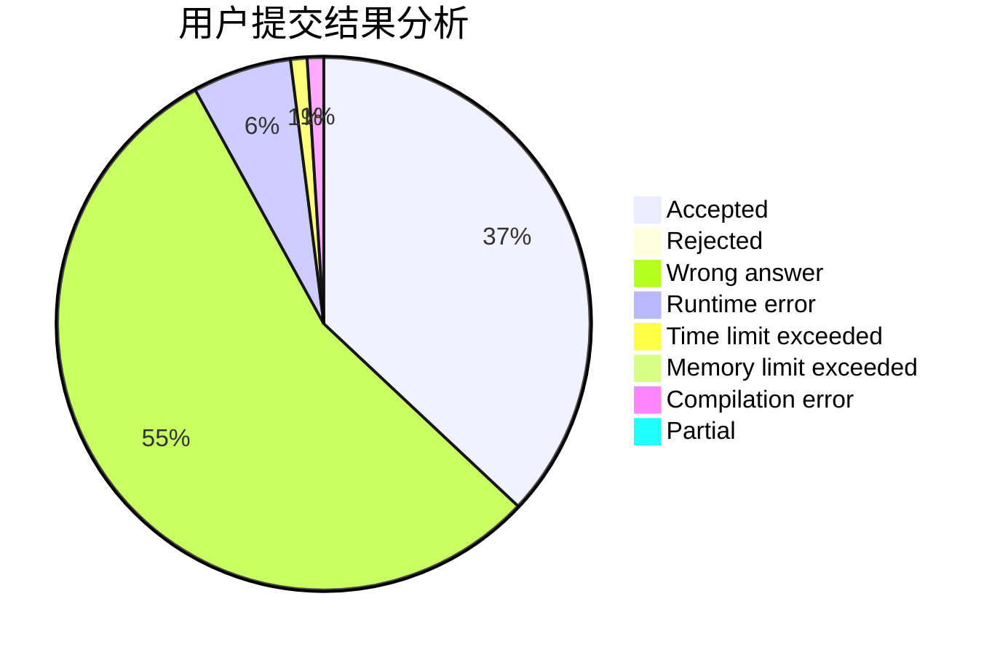
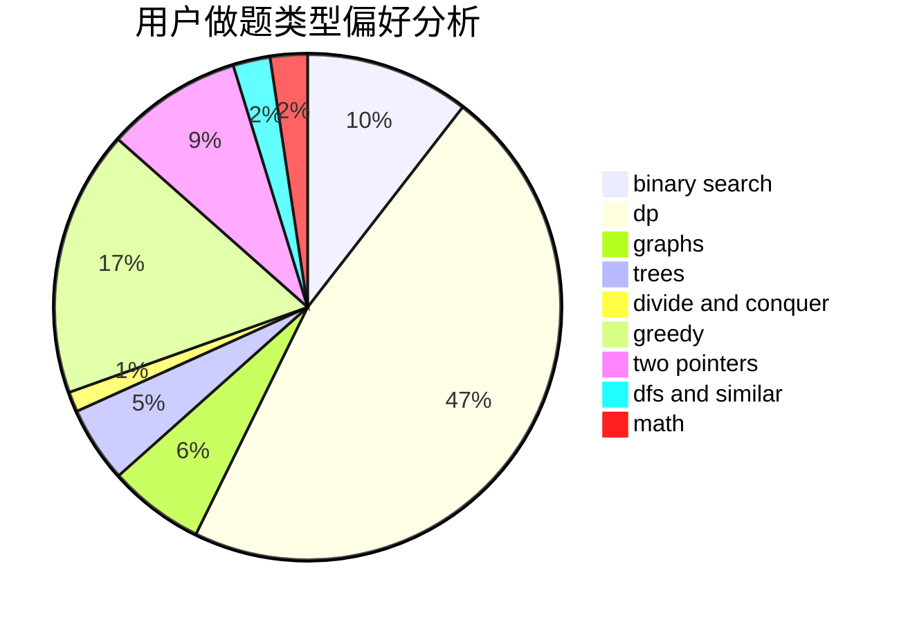

# Mark2020

<!-- tabs:start -->

#### **用户提交结果分析**

#### **用户做题类型偏好分析**

<!-- tabs:end -->
# 推荐题目
[1129D](https://codeforces.com/contest/1129/problem/D)
[732B](https://codeforces.com/contest/732/problem/B)
[519D](https://codeforces.com/contest/519/problem/D)
[85A](https://codeforces.com/contest/85/problem/A)
[13771](https://codeforces.com/contest/1377/problem/1)
[570A](https://codeforces.com/contest/570/problem/A)
[1402B](https://codeforces.com/contest/1402/problem/B)
[918D](https://codeforces.com/contest/918/problem/D)
[723A](https://codeforces.com/contest/723/problem/A)
[283E](https://codeforces.com/contest/283/problem/E)
