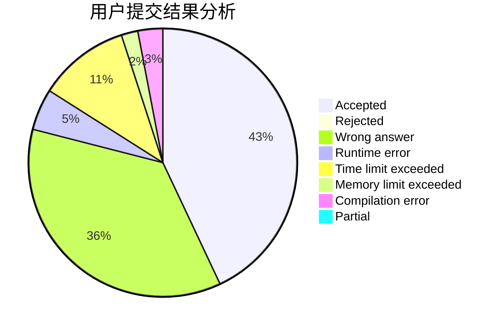
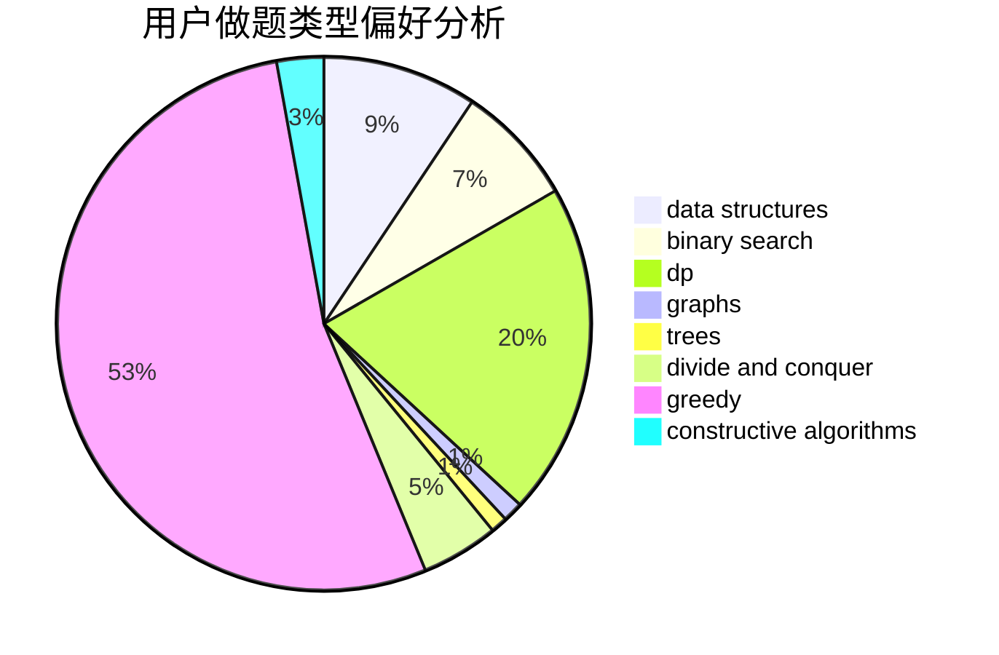
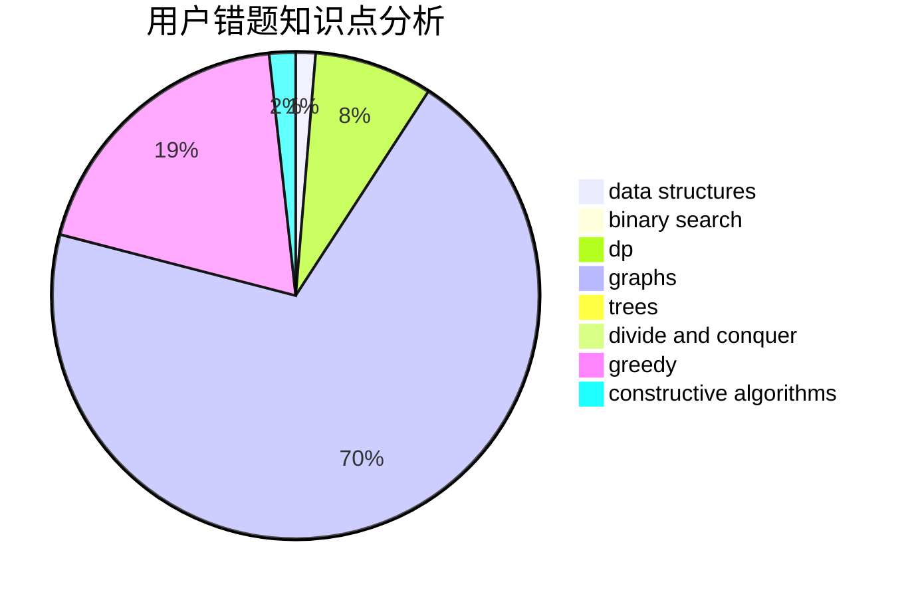

# Mars314

<!-- tabs:start -->

#### **用户提交结果分析**

#### **用户做题类型偏好分析**

#### **用户错题知识点分析**

<!-- tabs:end -->
# 推荐题目
[1487D](https://codeforces.com/contest/1487/problem/D)		binary search,
                        brute force,
                        math,
                        number theory		  
[1106F](https://codeforces.com/contest/1106/problem/F)		math,
                        matrices,
                        number theory		  
[1454C](https://codeforces.com/contest/1454/problem/C)		greedy,
                        implementation		  
[916E](https://codeforces.com/contest/916/problem/E)		data structures,
                        trees		  
[215B](https://codeforces.com/contest/215/problem/B)		greedy,
                        math		  
[1085F](https://codeforces.com/contest/1085/problem/F)		nan		  
[1183A](https://codeforces.com/contest/1183/problem/A)		implementation		  
[1011B](https://codeforces.com/contest/1011/problem/B)		binary search,
                        brute force,
                        implementation		  
[918B](https://codeforces.com/contest/918/problem/B)		implementation,
                        strings		  
[23E](https://codeforces.com/contest/23/problem/E)		dp		  
