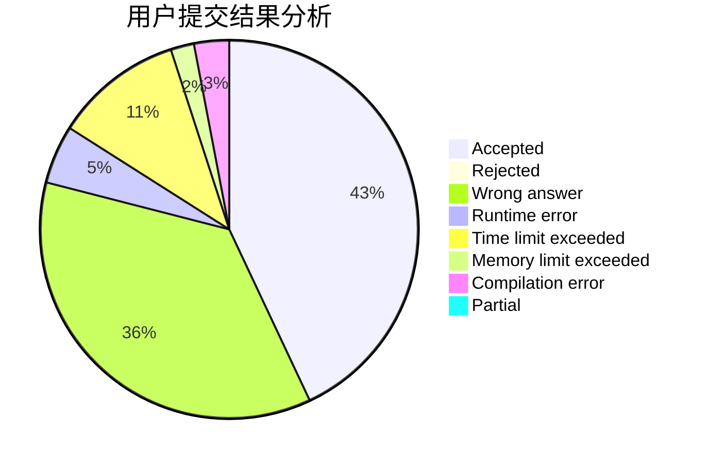
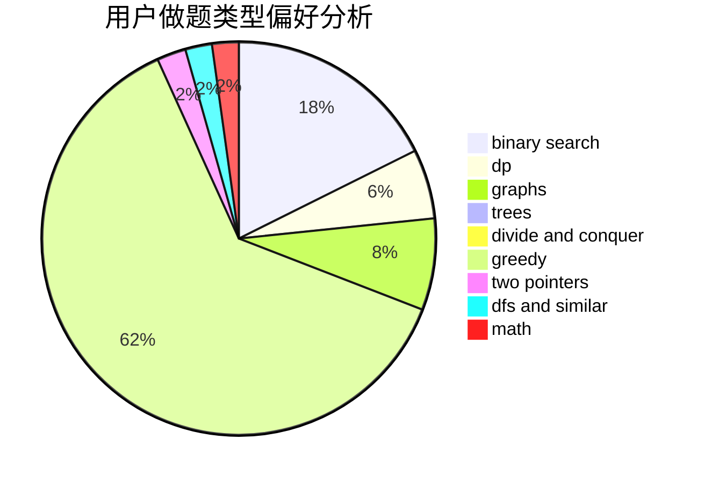

# Mars314

<!-- tabs:start -->

#### **用户提交结果分析**

#### **用户做题类型偏好分析**

<!-- tabs:end -->
# 推荐题目
[1495A](https://codeforces.com/contest/1495/problem/A)
[1107C](https://codeforces.com/contest/1107/problem/C)
[1463F](https://codeforces.com/contest/1463/problem/F)
[937A](https://codeforces.com/contest/937/problem/A)
[234A](https://codeforces.com/contest/234/problem/A)
[1086B](https://codeforces.com/contest/1086/problem/B)
[1185D](https://codeforces.com/contest/1185/problem/D)
[1011E](https://codeforces.com/contest/1011/problem/E)
[938E](https://codeforces.com/contest/938/problem/E)
[261B](https://codeforces.com/contest/261/problem/B)
