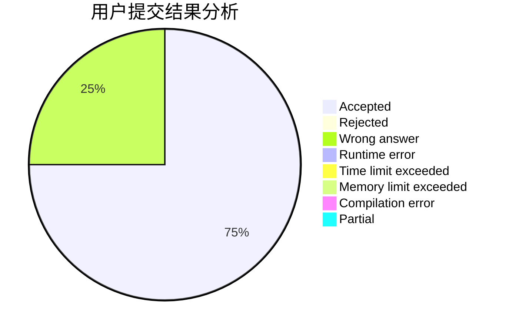
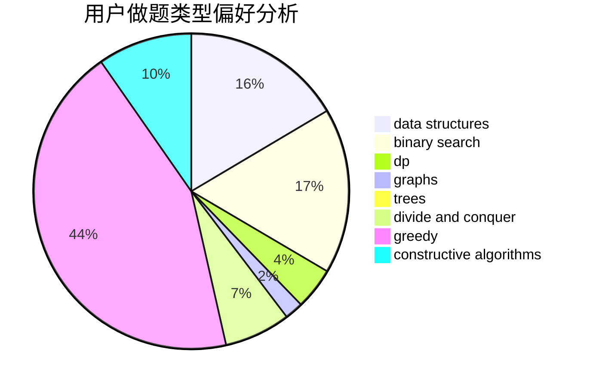

# Matrix53

<!-- tabs:start -->

#### **用户提交结果分析**

#### **用户做题类型偏好分析**

#### **用户错题知识点分析**

<!-- tabs:end -->
# 推荐题目
[1408E](https://codeforces.com/contest/1408/problem/E)		data structures,
                        dsu,
                        graphs,
                        greedy,
                        sortings,
                        trees		  
[14512](https://codeforces.com/contest/1451/problem/2)		dsu,graphs,sortings,trees		  
[569A](https://codeforces.com/contest/569/problem/A)		implementation,
                        math		  
[1482D](https://codeforces.com/contest/1482/problem/D)		data structures,
                        dsu,
                        implementation,
                        shortest paths		  
[1446E](https://codeforces.com/contest/1446/problem/E)		constructive algorithms,
                        dfs and similar		  
[578B](https://codeforces.com/contest/578/problem/B)		brute force,
                        greedy		  
[1459F](https://codeforces.com/contest/1459/problem/F)		dsu,graphs,sortings,trees		  
[94C](https://codeforces.com/contest/94/problem/C)		dsu,graphs,sortings,trees		  
[521B](https://codeforces.com/contest/521/problem/B)		dsu,graphs,sortings,trees		  
[542F](https://codeforces.com/contest/542/problem/F)		dp,
                        greedy		  
