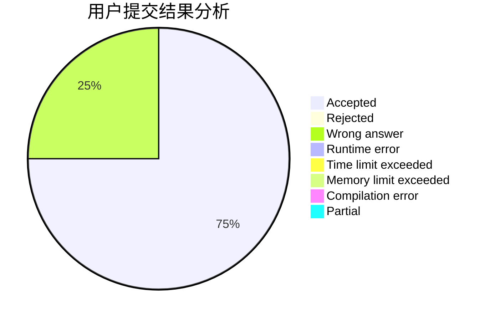
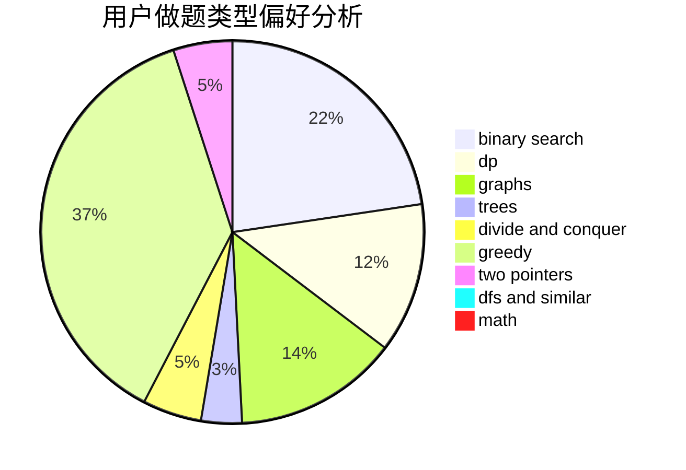

# Matrix53

<!-- tabs:start -->

#### **用户提交结果分析**

#### **用户做题类型偏好分析**

<!-- tabs:end -->
# 推荐题目
[1408E](https://codeforces.com/contest/1408/problem/E)
[14512](https://codeforces.com/contest/1451/problem/2)
[569A](https://codeforces.com/contest/569/problem/A)
[1482D](https://codeforces.com/contest/1482/problem/D)
[1446E](https://codeforces.com/contest/1446/problem/E)
[578B](https://codeforces.com/contest/578/problem/B)
[1459F](https://codeforces.com/contest/1459/problem/F)
[94C](https://codeforces.com/contest/94/problem/C)
[521B](https://codeforces.com/contest/521/problem/B)
[542F](https://codeforces.com/contest/542/problem/F)
