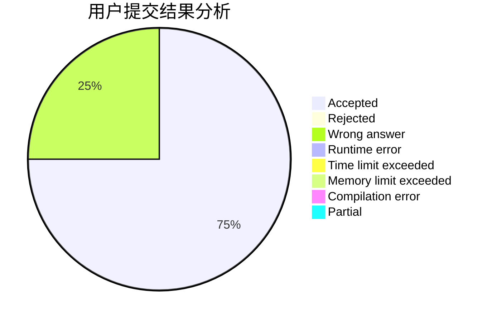
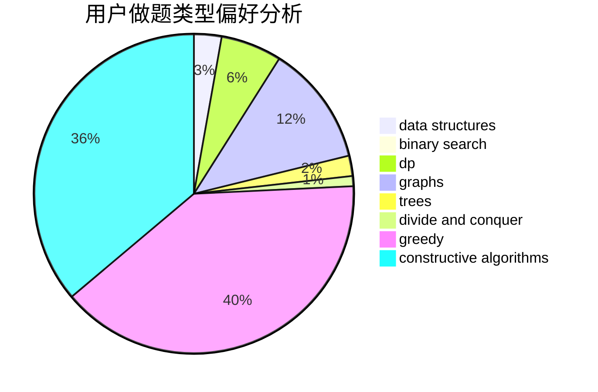

# Matrix53

<!-- tabs:start -->

#### **用户提交结果分析**

#### **用户做题类型偏好分析**

#### **用户错题知识点分析**

<!-- tabs:end -->
# 推荐题目
[1399D](https://codeforces.com/contest/1399/problem/D)		constructive algorithms,
                        data structures,
                        greedy,
                        implementation		  
[1440B](https://codeforces.com/contest/1440/problem/B)		greedy,
                        math		  
[544D](https://codeforces.com/contest/544/problem/D)		dsu,graphs,sortings,trees		  
[1473G](https://codeforces.com/contest/1473/problem/G)		combinatorics,
                        dp,
                        fft,
                        math		  
[1436F](https://codeforces.com/contest/1436/problem/F)		combinatorics,
                        math,
                        number theory		  
[552E](https://codeforces.com/contest/552/problem/E)		brute force,
                        dp,
                        expression parsing,
                        greedy,
                        implementation,
                        strings		  
[1450H2](https://codeforces.com/contest/1450H/problem/2)		combinatorics,
                        implementation,
                        math		  
[930A](https://codeforces.com/contest/930/problem/A)		dfs and similar,
                        graphs,
                        trees		  
[500B](https://codeforces.com/contest/500/problem/B)		dfs and similar,
                        dsu,
                        graphs,
                        greedy,
                        math,
                        sortings		  
[515E](https://codeforces.com/contest/515/problem/E)		data structures		  
