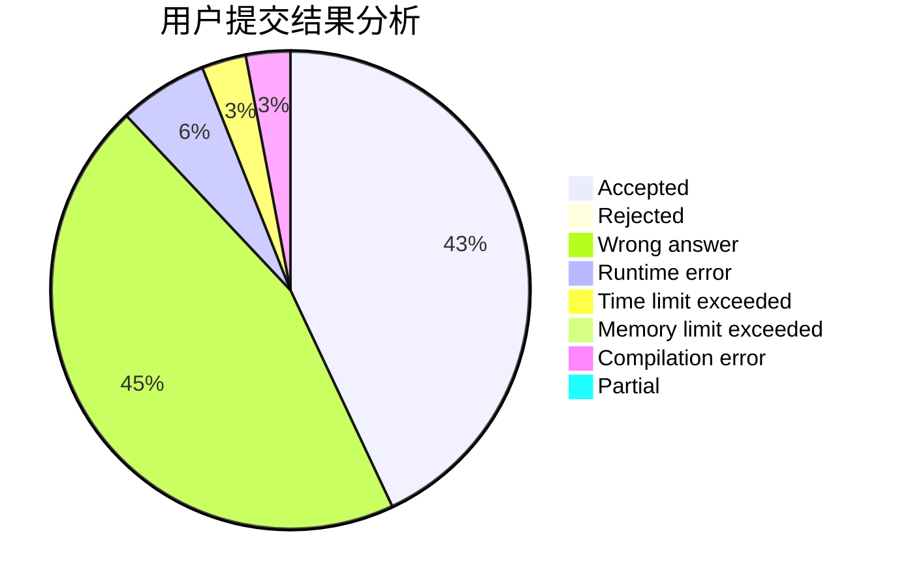
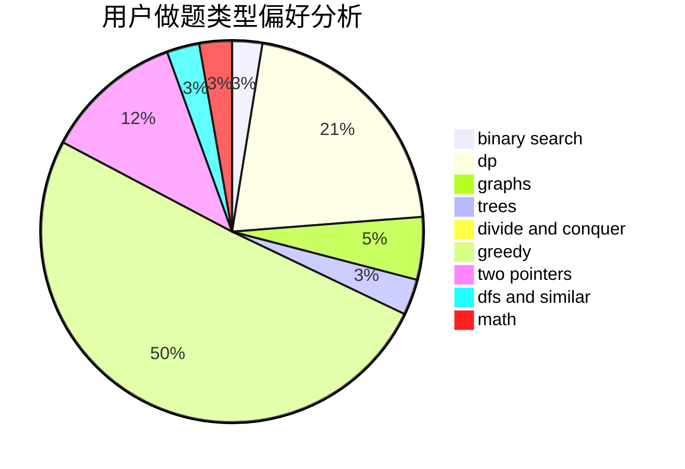

# Max.D.

<!-- tabs:start -->

#### **用户提交结果分析**

#### **用户做题类型偏好分析**

<!-- tabs:end -->
# 推荐题目
[1423I](https://codeforces.com/contest/1423/problem/I)
[1132F](https://codeforces.com/contest/1132/problem/F)
[782E](https://codeforces.com/contest/782/problem/E)
[1099F](https://codeforces.com/contest/1099/problem/F)
[962B](https://codeforces.com/contest/962/problem/B)
[847B](https://codeforces.com/contest/847/problem/B)
[433B](https://codeforces.com/contest/433/problem/B)
[8D](https://codeforces.com/contest/8/problem/D)
[353D](https://codeforces.com/contest/353/problem/D)
[1362E](https://codeforces.com/contest/1362/problem/E)
