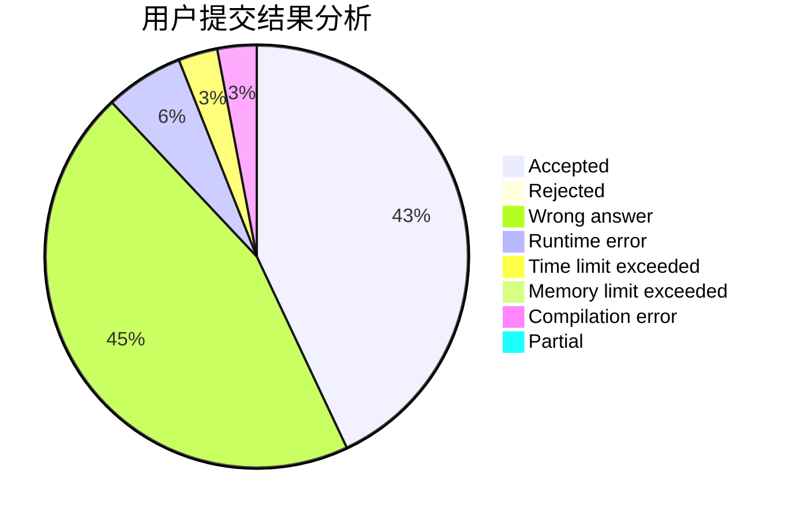
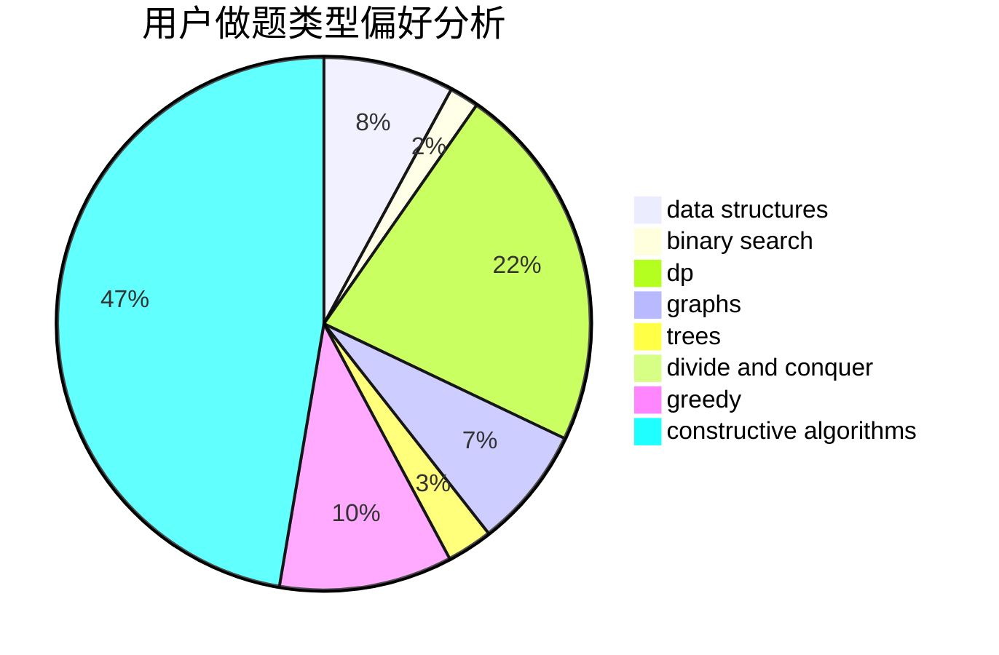
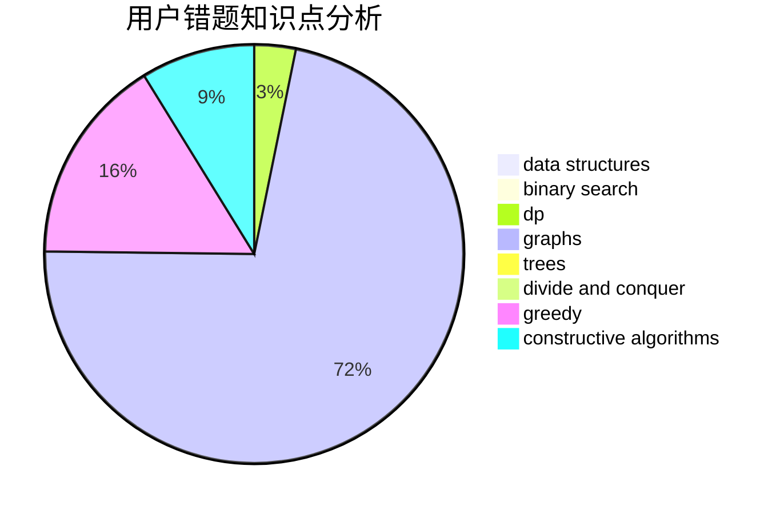

# Max.D.

<!-- tabs:start -->

#### **用户提交结果分析**

#### **用户做题类型偏好分析**

#### **用户错题知识点分析**

<!-- tabs:end -->
# 推荐题目
[1423I](https://codeforces.com/contest/1423/problem/I)		bitmasks		  
[1132F](https://codeforces.com/contest/1132/problem/F)		dp		  
[782E](https://codeforces.com/contest/782/problem/E)		dsu,graphs,sortings,trees		  
[1099F](https://codeforces.com/contest/1099/problem/F)		binary search,
                        data structures,
                        dfs and similar,
                        dp,
                        games,
                        trees		  
[962B](https://codeforces.com/contest/962/problem/B)		constructive algorithms,
                        greedy,
                        implementation		  
[847B](https://codeforces.com/contest/847/problem/B)		binary search,
                        data structures		  
[433B](https://codeforces.com/contest/433/problem/B)		dp,
                        implementation,
                        sortings		  
[8D](https://codeforces.com/contest/8/problem/D)		binary search,
                        geometry		  
[353D](https://codeforces.com/contest/353/problem/D)		constructive algorithms,
                        dp		  
[1362E](https://codeforces.com/contest/1362/problem/E)		dsu,graphs,sortings,trees		  
