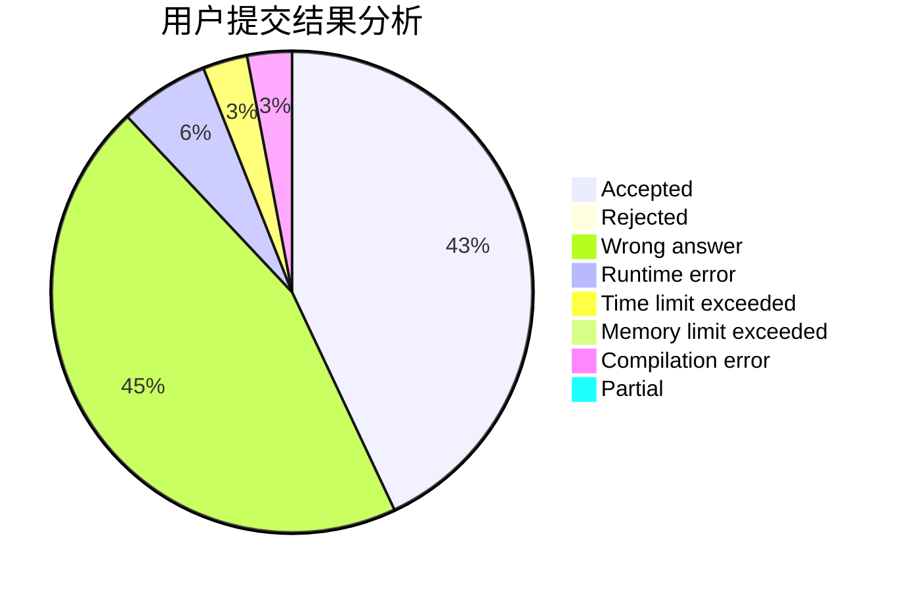
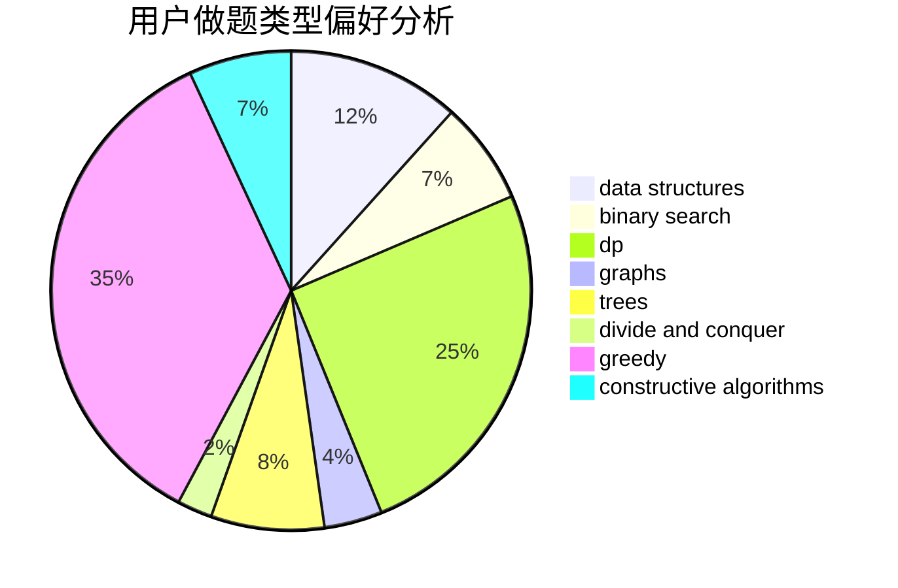
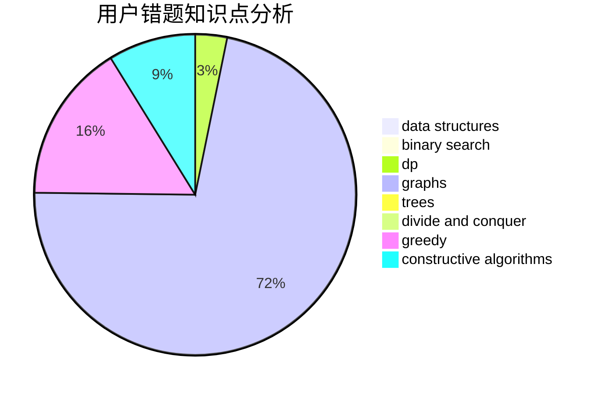

# Max.D.

<!-- tabs:start -->

#### **用户提交结果分析**

#### **用户做题类型偏好分析**

#### **用户错题知识点分析**

<!-- tabs:end -->
# 推荐题目
[1415E](https://codeforces.com/contest/1415/problem/E)		constructive algorithms,
                        greedy,
                        math		  
[1130E](https://codeforces.com/contest/1130/problem/E)		dsu,graphs,sortings,trees		  
[764B](https://codeforces.com/contest/764/problem/B)		constructive algorithms,
                        implementation		  
[1099C](https://codeforces.com/contest/1099/problem/C)		constructive algorithms,
                        implementation		  
[940E](https://codeforces.com/contest/940/problem/E)		data structures,
                        dp,
                        greedy,
                        math		  
[828D](https://codeforces.com/contest/828/problem/D)		dsu,graphs,sortings,trees		  
[404C](https://codeforces.com/contest/404/problem/C)		dfs and similar,
                        graphs,
                        sortings		  
[87C](https://codeforces.com/contest/87/problem/C)		dp,
                        games,
                        math		  
[321E](https://codeforces.com/contest/321/problem/E)		data structures,
                        divide and conquer,
                        dp		  
[1355F](https://codeforces.com/contest/1355/problem/F)		constructive algorithms,
                        interactive,
                        number theory		  
