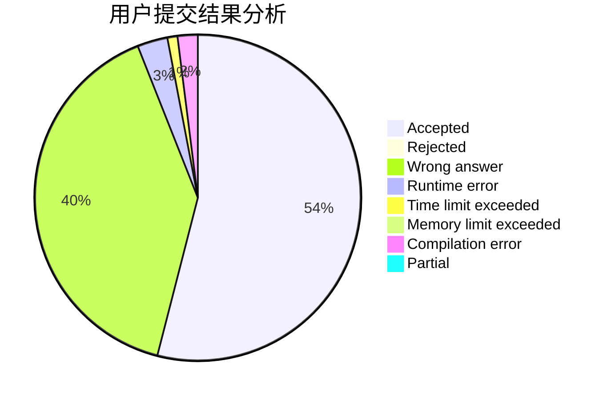
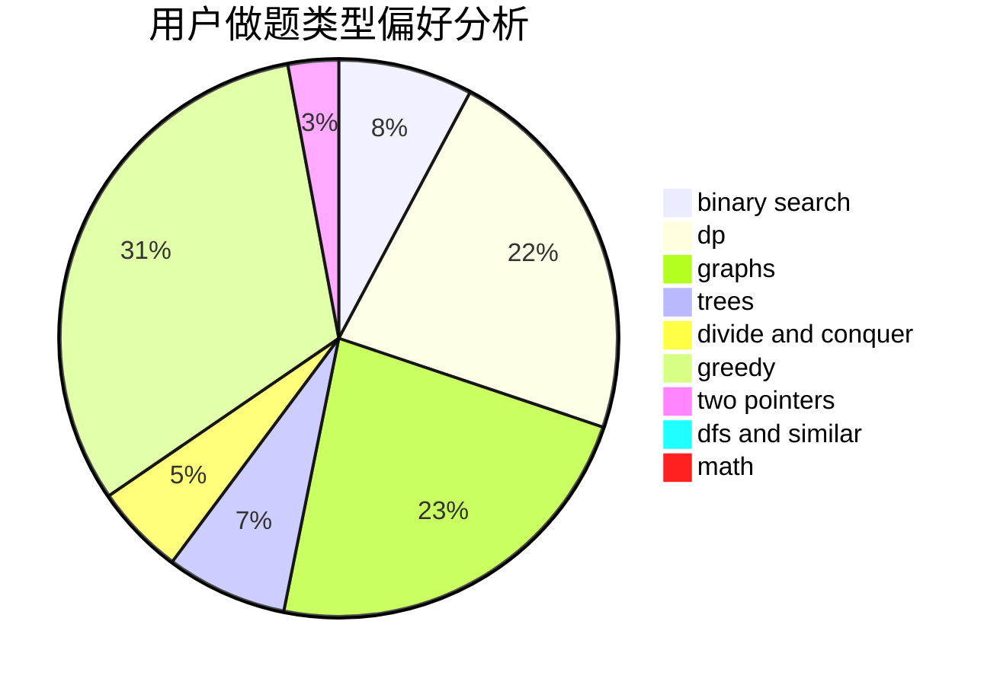

# Max__n.

<!-- tabs:start -->

#### **用户提交结果分析**

#### **用户做题类型偏好分析**

<!-- tabs:end -->
# 推荐题目
[548A](https://codeforces.com/contest/548/problem/A)
[489F](https://codeforces.com/contest/489/problem/F)
[182D](https://codeforces.com/contest/182/problem/D)
[1207B](https://codeforces.com/contest/1207/problem/B)
[12131](https://codeforces.com/contest/1213/problem/1)
[793G](https://codeforces.com/contest/793/problem/G)
[1261C](https://codeforces.com/contest/1261/problem/C)
[616B](https://codeforces.com/contest/616/problem/B)
[216D](https://codeforces.com/contest/216/problem/D)
[645D](https://codeforces.com/contest/645/problem/D)
