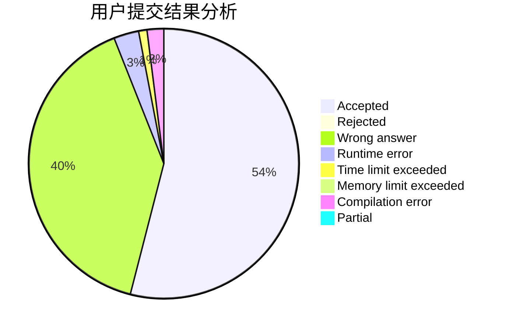
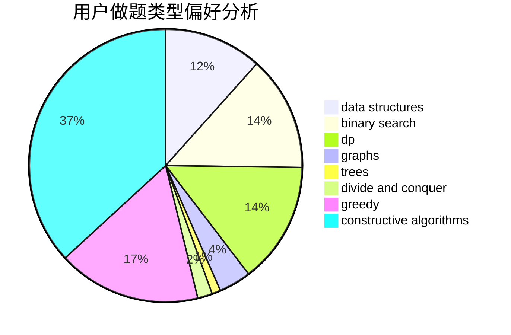
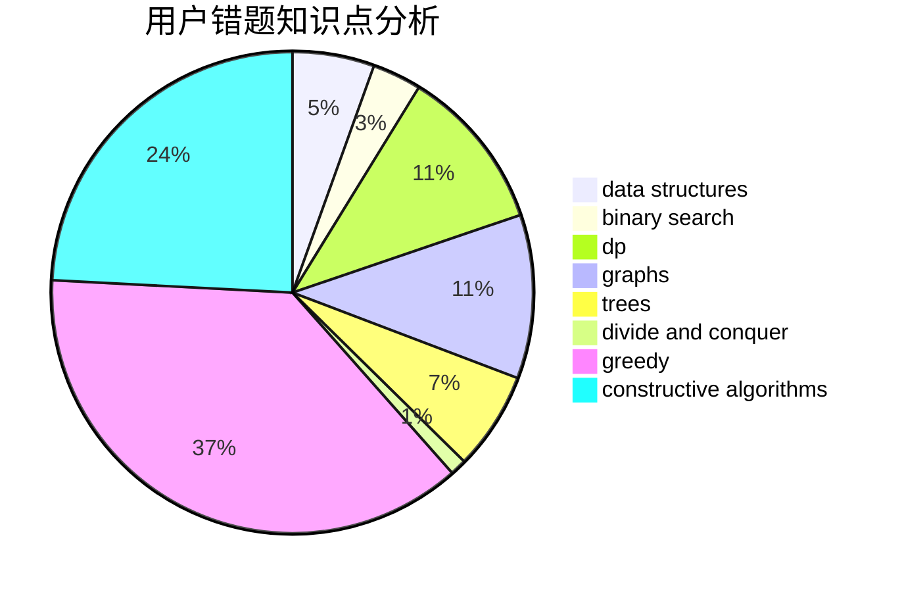

# Max__n.
<!-- tabs:start -->
#### **用户提交结果分析**

#### **用户做题类型偏好分析**

#### **用户错题知识点分析**

<!-- tabs:end -->
# 推荐题目
[Finding the Vertex](http://codeforces.com/problemset/problem/1444/E)		brute force,
                        dfs and similar,
                        dp,
                        interactive,
                        trees		  
[Mahmoud and Ehab and the message](http://codeforces.com/problemset/problem/959/B)		dsu,
                        greedy,
                        implementation		  
[Developing Skills](http://codeforces.com/problemset/problem/581/C)		implementation,
                        math,
                        sortings		  
[Neighbor Grid](http://codeforces.com/problemset/problem/1375/B)		constructive algorithms,
                        greedy		  
[Print a 1337-string...](http://codeforces.com/problemset/problem/1202/D)		combinatorics,
                        constructive algorithms,
                        math,
                        strings		  
[Closest Equals](http://codeforces.com/problemset/problem/522/D)		*special problem,
                        data structures		  
[A Serial Killer](http://codeforces.com/problemset/problem/776/A)		brute force,
                        implementation,
                        strings		  
[Industrial Nim](http://codeforces.com/problemset/problem/15/C)		games		  
[Sum Balance](https://codeforces.com/contest/1243/problem/E)		bitmasks,
                        dfs and similar,
                        dp,
                        graphs		  
[Hashing Trees](https://codeforces.com/contest/902/problem/C)		constructive algorithms,
                        trees		  
<!-- tabs:start -->
#### **data structures**
[Finding the Vertex](http://codeforces.com/problemset/problem/522/D)		*special problem,
                        data structures		  
[Mahmoud and Ehab and the message](http://codeforces.com/problemset/problem/878/B)		data structures,
                        implementation		  
[Developing Skills](http://codeforces.com/problemset/problem/702/E)		data structures,
                        graphs		  
[Neighbor Grid](http://codeforces.com/problemset/problem/845/D)		data structures,
                        dp,
                        greedy		  
[Print a 1337-string...](http://codeforces.com/problemset/problem/1492/C)		binary search,
                        data structures,
                        dp,
                        greedy,
                        two pointers		  
[Closest Equals](http://codeforces.com/problemset/problem/1490/G)		binary search,
                        data structures,
                        math		  
[A Serial Killer](http://codeforces.com/problemset/problem/1479/D)		binary search,
                        bitmasks,
                        brute force,
                        data structures,
                        probabilities,
                        trees		  
[Industrial Nim](http://codeforces.com/problemset/problem/1497/A)		brute force,
                        data structures,
                        greedy,
                        sortings		  
[Sum Balance](http://codeforces.com/problemset/problem/1491/C)		brute force,
                        data structures,
                        dp,
                        greedy,
                        implementation		  
[Hashing Trees](http://codeforces.com/problemset/problem/1492/B)		data structures,
                        greedy,
                        math		  
#### **binary search**
[Finding the Vertex](http://codeforces.com/problemset/problem/1492/C)		binary search,
                        data structures,
                        dp,
                        greedy,
                        two pointers		  
[Mahmoud and Ehab and the message](http://codeforces.com/problemset/problem/1463/D)		binary search,
                        constructive algorithms,
                        greedy,
                        two pointers		  
[Developing Skills](http://codeforces.com/problemset/problem/1490/G)		binary search,
                        data structures,
                        math		  
[Neighbor Grid](http://codeforces.com/problemset/problem/1479/D)		binary search,
                        bitmasks,
                        brute force,
                        data structures,
                        probabilities,
                        trees		  
[Print a 1337-string...](http://codeforces.com/problemset/problem/1436/E)		binary search,
                        data structures,
                        two pointers		  
[Closest Equals](http://codeforces.com/problemset/problem/1461/D)		binary search,
                        brute force,
                        data structures,
                        divide and conquer,
                        implementation,
                        sortings		  
[A Serial Killer](http://codeforces.com/problemset/problem/1493/C)		binary search,
                        brute force,
                        constructive algorithms,
                        greedy,
                        strings		  
[Industrial Nim](http://codeforces.com/problemset/problem/1487/D)		binary search,
                        brute force,
                        math,
                        number theory		  
[Sum Balance](http://codeforces.com/problemset/problem/1486/B)		binary search,
                        geometry,
                        shortest paths,
                        sortings		  
[Hashing Trees](http://codeforces.com/problemset/problem/1486/C1)		binary search,
                        interactive		  
#### **dp**
[Finding the Vertex](http://codeforces.com/problemset/problem/1444/E)		brute force,
                        dfs and similar,
                        dp,
                        interactive,
                        trees		  
[Mahmoud and Ehab and the message](https://codeforces.com/contest/1243/problem/E)		bitmasks,
                        dfs and similar,
                        dp,
                        graphs		  
[Developing Skills](http://codeforces.com/problemset/problem/959/E)		bitmasks,
                        dp,
                        graphs,
                        implementation,
                        math		  
[Neighbor Grid](http://codeforces.com/problemset/problem/1207/C)		dp,
                        greedy		  
[Print a 1337-string...](https://codeforces.com/contest/918/problem/D)		dfs and similar,
                        dp,
                        games,
                        graphs		  
[Closest Equals](http://codeforces.com/problemset/problem/1382/B)		dp,
                        games		  
[A Serial Killer](http://codeforces.com/problemset/problem/845/D)		data structures,
                        dp,
                        greedy		  
[Industrial Nim](http://codeforces.com/problemset/problem/1238/F)		dfs and similar,
                        dp,
                        graphs,
                        trees		  
[Sum Balance](http://codeforces.com/problemset/problem/1492/C)		binary search,
                        data structures,
                        dp,
                        greedy,
                        two pointers		  
[Hashing Trees](https://codeforces.com/contest/1457/problem/C)		brute force,
                        dp,
                        implementation		  
#### **graph**
[Finding the Vertex](https://codeforces.com/contest/1243/problem/E)		bitmasks,
                        dfs and similar,
                        dp,
                        graphs		  
[Mahmoud and Ehab and the message](http://codeforces.com/problemset/problem/702/E)		data structures,
                        graphs		  
[Developing Skills](http://codeforces.com/problemset/problem/959/E)		bitmasks,
                        dp,
                        graphs,
                        implementation,
                        math		  
[Neighbor Grid](https://codeforces.com/contest/918/problem/D)		dfs and similar,
                        dp,
                        games,
                        graphs		  
[Print a 1337-string...](http://codeforces.com/problemset/problem/780/D)		2-sat,
                        graphs,
                        greedy,
                        implementation,
                        shortest paths,
                        strings		  
[Closest Equals](http://codeforces.com/problemset/problem/1280/C)		dfs and similar,
                        graphs,
                        greedy,
                        trees		  
[A Serial Killer](http://codeforces.com/problemset/problem/1238/F)		dfs and similar,
                        dp,
                        graphs,
                        trees		  
[Industrial Nim](http://codeforces.com/problemset/problem/1487/C)		brute force,
                        constructive algorithms,
                        dfs and similar,
                        graphs,
                        greedy,
                        implementation,
                        math		  
[Sum Balance](http://codeforces.com/problemset/problem/1437/C)		dp,
                        flows,
                        graph matchings,
                        greedy,
                        math,
                        sortings		  
[Hashing Trees](http://codeforces.com/problemset/problem/1470/D)		constructive algorithms,
                        dfs and similar,
                        graph matchings,
                        graphs,
                        greedy		  
#### **trees**
[Finding the Vertex](http://codeforces.com/problemset/problem/1444/E)		brute force,
                        dfs and similar,
                        dp,
                        interactive,
                        trees		  
[Mahmoud and Ehab and the message](https://codeforces.com/contest/902/problem/C)		constructive algorithms,
                        trees		  
[Developing Skills](https://codeforces.com/contest/430/problem/C)		dfs and similar,
                        trees		  
[Neighbor Grid](http://codeforces.com/problemset/problem/959/C)		constructive algorithms,
                        trees		  
[Print a 1337-string...](http://codeforces.com/problemset/problem/1055/F)		strings,
                        trees		  
[Closest Equals](http://codeforces.com/problemset/problem/1280/C)		dfs and similar,
                        graphs,
                        greedy,
                        trees		  
[A Serial Killer](http://codeforces.com/problemset/problem/1238/F)		dfs and similar,
                        dp,
                        graphs,
                        trees		  
[Industrial Nim](http://codeforces.com/problemset/problem/1479/D)		binary search,
                        bitmasks,
                        brute force,
                        data structures,
                        probabilities,
                        trees		  
[Sum Balance](http://codeforces.com/problemset/problem/1511/C)		brute force,
                        data structures,
                        implementation,
                        trees		  
[Hashing Trees](http://codeforces.com/problemset/problem/1499/F)		combinatorics,
                        dfs and similar,
                        dp,
                        trees		  
#### **divide and conquer**
[Finding the Vertex](http://codeforces.com/problemset/problem/1461/D)		binary search,
                        brute force,
                        data structures,
                        divide and conquer,
                        implementation,
                        sortings		  
[Mahmoud and Ehab and the message](http://codeforces.com/problemset/problem/1466/G)		combinatorics,
                        divide and conquer,
                        hashing,
                        math,
                        string suffix structures,
                        strings		  
[Developing Skills](http://codeforces.com/problemset/problem/1490/D)		dfs and similar,
                        divide and conquer,
                        implementation		  
[Neighbor Grid](https://codeforces.com/contest/1483/problem/C)		data structures,
                        divide and conquer,
                        dp		  
[Print a 1337-string...](http://codeforces.com/problemset/problem/1491/E)		brute force,
                        dfs and similar,
                        divide and conquer,
                        number theory,
                        trees		  
[Closest Equals](http://codeforces.com/problemset/problem/1303/G)		data structures,
                        divide and conquer,
                        geometry,
                        trees		  
[A Serial Killer](http://codeforces.com/problemset/problem/1494/D)		constructive algorithms,
                        data structures,
                        dfs and similar,
                        divide and conquer,
                        dsu,
                        greedy,
                        sortings,
                        trees		  
[Industrial Nim](http://codeforces.com/problemset/problem/1482/E)		data structures,
                        divide and conquer,
                        dp		  
[Sum Balance](http://codeforces.com/problemset/problem/566/C)		dfs and similar,
                        divide and conquer,
                        trees		  
[Hashing Trees](http://codeforces.com/problemset/problem/1428/F)		binary search,
                        data structures,
                        divide and conquer,
                        dp,
                        two pointers		  
#### **greedy**
[Finding the Vertex](http://codeforces.com/problemset/problem/959/B)		dsu,
                        greedy,
                        implementation		  
[Mahmoud and Ehab and the message](http://codeforces.com/problemset/problem/1375/B)		constructive algorithms,
                        greedy		  
[Developing Skills](http://codeforces.com/problemset/problem/1254/B1)		constructive algorithms,
                        greedy,
                        math,
                        number theory,
                        ternary search,
                        two pointers		  
[Neighbor Grid](http://codeforces.com/problemset/problem/1207/C)		dp,
                        greedy		  
[Print a 1337-string...](http://codeforces.com/problemset/problem/845/D)		data structures,
                        dp,
                        greedy		  
[Closest Equals](http://codeforces.com/problemset/problem/780/D)		2-sat,
                        graphs,
                        greedy,
                        implementation,
                        shortest paths,
                        strings		  
[A Serial Killer](http://codeforces.com/problemset/problem/1280/C)		dfs and similar,
                        graphs,
                        greedy,
                        trees		  
[Industrial Nim](http://codeforces.com/problemset/problem/1473/A)		greedy,
                        implementation,
                        math,
                        sortings		  
[Sum Balance](http://codeforces.com/problemset/problem/1025/B)		brute force,
                        greedy,
                        number theory		  
[Hashing Trees](http://codeforces.com/problemset/problem/193/C)		constructive algorithms,
                        greedy,
                        math,
                        matrices		  
#### **constructive algorithms**
[Finding the Vertex](http://codeforces.com/problemset/problem/1375/B)		constructive algorithms,
                        greedy		  
[Mahmoud and Ehab and the message](http://codeforces.com/problemset/problem/1202/D)		combinatorics,
                        constructive algorithms,
                        math,
                        strings		  
[Developing Skills](https://codeforces.com/contest/902/problem/C)		constructive algorithms,
                        trees		  
[Neighbor Grid](http://codeforces.com/problemset/problem/1254/B1)		constructive algorithms,
                        greedy,
                        math,
                        number theory,
                        ternary search,
                        two pointers		  
[Print a 1337-string...](http://codeforces.com/problemset/problem/959/C)		constructive algorithms,
                        trees		  
[Closest Equals](http://codeforces.com/problemset/problem/1267/C)		constructive algorithms		  
[A Serial Killer](http://codeforces.com/problemset/problem/1477/A)		constructive algorithms,
                        math,
                        number theory		  
[Industrial Nim](http://codeforces.com/problemset/problem/1419/E)		constructive algorithms,
                        implementation,
                        math,
                        number theory		  
[Sum Balance](http://codeforces.com/problemset/problem/193/C)		constructive algorithms,
                        greedy,
                        math,
                        matrices		  
[Hashing Trees](http://codeforces.com/problemset/problem/1493/A)		constructive algorithms,
                        greedy		  
#### **sortings**
[Finding the Vertex](http://codeforces.com/problemset/problem/581/C)		implementation,
                        math,
                        sortings		  
[Mahmoud and Ehab and the message](http://codeforces.com/problemset/problem/598/C)		geometry,
                        sortings		  
[Developing Skills](http://codeforces.com/problemset/problem/1473/A)		greedy,
                        implementation,
                        math,
                        sortings		  
[Neighbor Grid](https://codeforces.com/contest/1496/problem/C)		geometry,
                        greedy,
                        math,
                        sortings		  
[Print a 1337-string...](http://codeforces.com/problemset/problem/1495/A)		geometry,
                        greedy,
                        math,
                        sortings		  
[Closest Equals](http://codeforces.com/problemset/problem/1497/A)		brute force,
                        data structures,
                        greedy,
                        sortings		  
[A Serial Killer](http://codeforces.com/problemset/problem/1427/A)		math,
                        sortings		  
[Industrial Nim](http://codeforces.com/problemset/problem/1461/D)		binary search,
                        brute force,
                        data structures,
                        divide and conquer,
                        implementation,
                        sortings		  
[Sum Balance](http://codeforces.com/problemset/problem/1437/C)		dp,
                        flows,
                        graph matchings,
                        greedy,
                        math,
                        sortings		  
[Hashing Trees](http://codeforces.com/problemset/problem/1473/A)		greedy,
                        implementation,
                        math,
                        sortings		  
<!-- tabs:end -->
