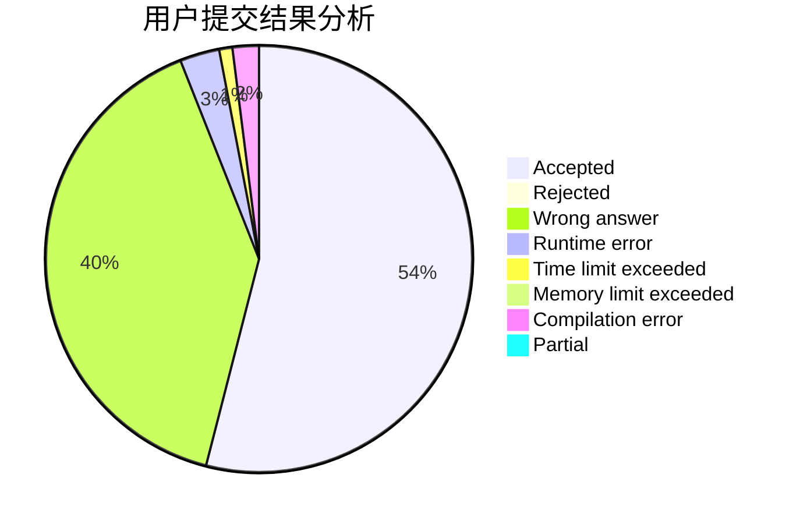
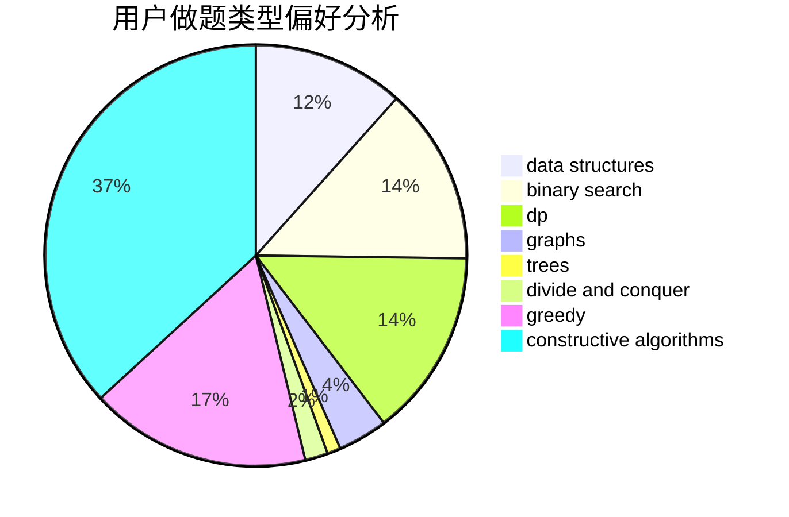
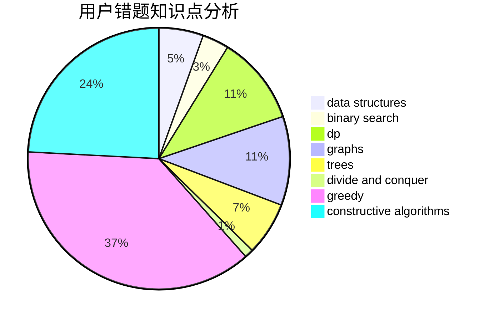

# Max__n.

<!-- tabs:start -->

#### **用户提交结果分析**

#### **用户做题类型偏好分析**

#### **用户错题知识点分析**

<!-- tabs:end -->
# 推荐题目
[522D](https://codeforces.com/contest/522/problem/D)		*special problem,
                        data structures		  
[471A](https://codeforces.com/contest/471/problem/A)		implementation		  
[15C](https://codeforces.com/contest/15/problem/C)		games		  
[1202D](https://codeforces.com/contest/1202/problem/D)		combinatorics,
                        constructive algorithms,
                        math,
                        strings		  
[1207C](https://codeforces.com/contest/1207/problem/C)		dp,
                        greedy		  
[776A](https://codeforces.com/contest/776/problem/A)		brute force,
                        implementation,
                        strings		  
[1254B1](https://codeforces.com/contest/1254B/problem/1)		constructive algorithms,
                        greedy,
                        math,
                        number theory,
                        ternary search,
                        two pointers		  
[598C](https://codeforces.com/contest/598/problem/C)		geometry,
                        sortings		  
[193C](https://codeforces.com/contest/193/problem/C)		constructive algorithms,
                        greedy,
                        math,
                        matrices		  
[621B](https://codeforces.com/contest/621/problem/B)		combinatorics,
                        implementation		  
