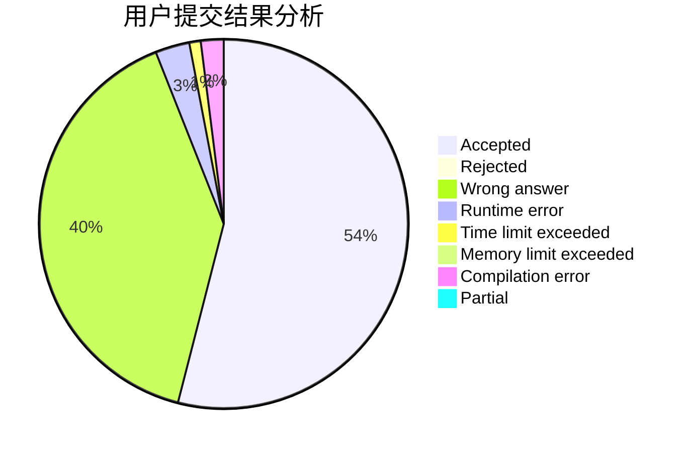
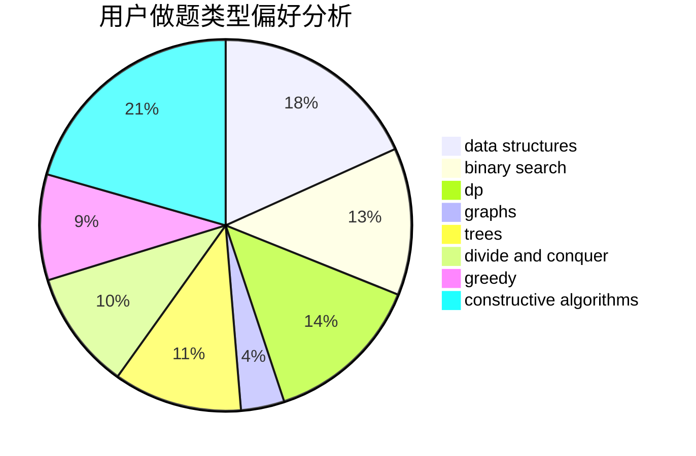
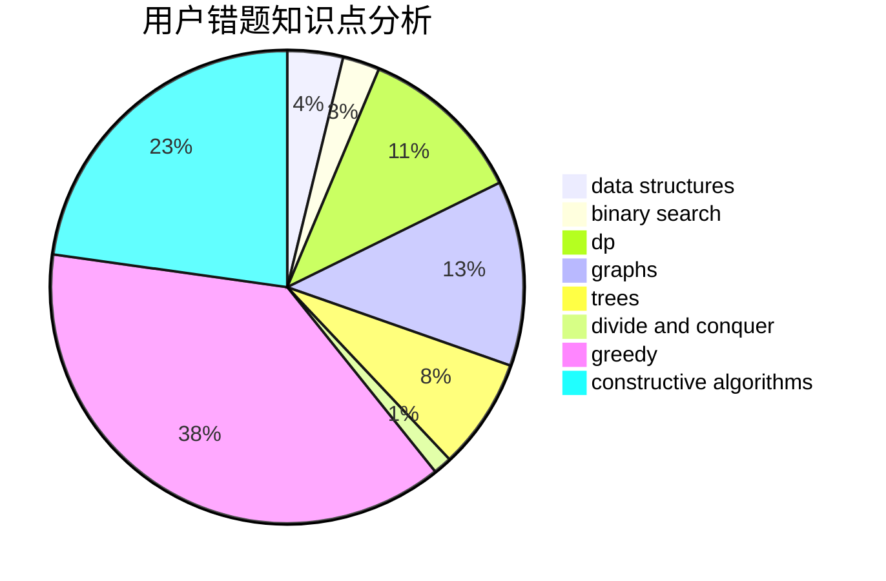

# Max__n.

<!-- tabs:start -->

#### **用户提交结果分析**

#### **用户做题类型偏好分析**

#### **用户错题知识点分析**

<!-- tabs:end -->
# 推荐题目
[548A](https://codeforces.com/contest/548/problem/A)		brute force,
                        implementation,
                        strings		  
[489F](https://codeforces.com/contest/489/problem/F)		combinatorics,
                        dp		  
[182D](https://codeforces.com/contest/182/problem/D)		brute force,
                        hashing,
                        implementation,
                        math,
                        strings		  
[1207B](https://codeforces.com/contest/1207/problem/B)		constructive algorithms,
                        greedy,
                        implementation		  
[12131](https://codeforces.com/contest/1213/problem/1)		dsu,graphs,sortings,trees		  
[793G](https://codeforces.com/contest/793/problem/G)		data structures,
                        divide and conquer,
                        flows,
                        graph matchings		  
[1261C](https://codeforces.com/contest/1261/problem/C)		dsu,graphs,sortings,trees		  
[616B](https://codeforces.com/contest/616/problem/B)		games,
                        greedy		  
[216D](https://codeforces.com/contest/216/problem/D)		binary search,
                        sortings,
                        two pointers		  
[645D](https://codeforces.com/contest/645/problem/D)		binary search,
                        dp,
                        graphs		  
