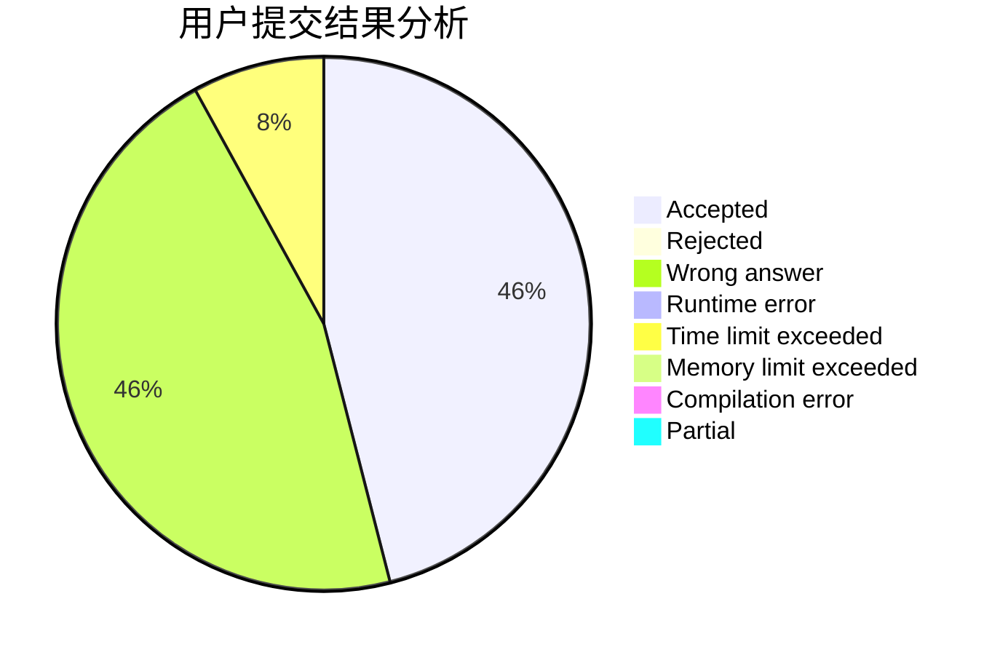
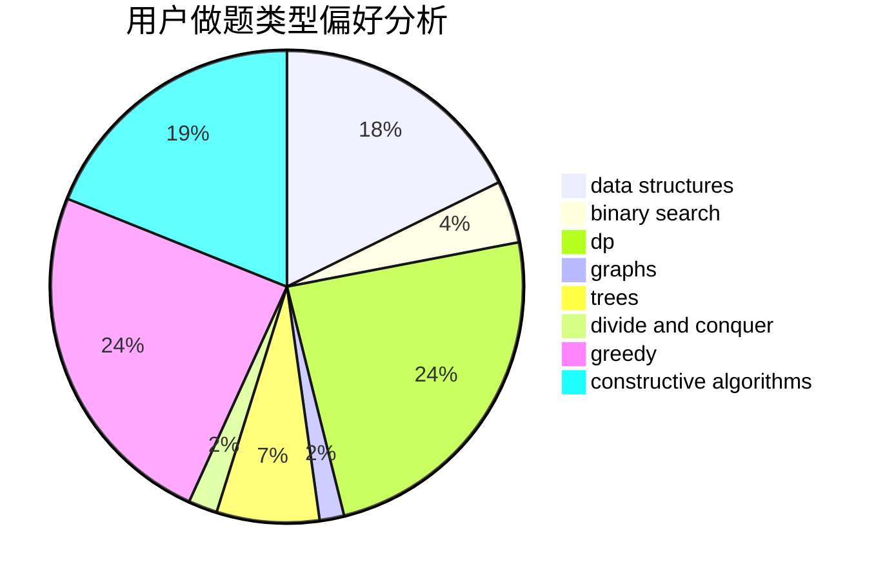
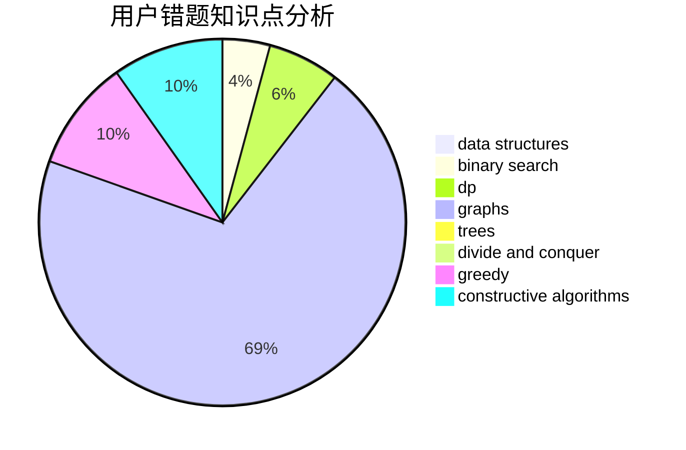

# 79975580

<!-- tabs:start -->

#### **用户提交结果分析**

#### **用户做题类型偏好分析**

#### **用户错题知识点分析**

<!-- tabs:end -->
# 推荐题目
[1058C](https://codeforces.com/contest/1058/problem/C)		dsu,graphs,sortings,trees		  
[1110F](https://codeforces.com/contest/1110/problem/F)		data structures,
                        trees		  
[1335B](https://codeforces.com/contest/1335/problem/B)		constructive algorithms		  
[1162A](https://codeforces.com/contest/1162/problem/A)		implementation		  
[1346E](https://codeforces.com/contest/1346/problem/E)		*special problem,
                        dp,
                        graphs		  
[1426C](https://codeforces.com/contest/1426/problem/C)		binary search,
                        constructive algorithms,
                        math		  
[1427B](https://codeforces.com/contest/1427/problem/B)		greedy,
                        implementation,
                        sortings		  
[1010A](https://codeforces.com/contest/1010/problem/A)		binary search,
                        math		  
[1334E](https://codeforces.com/contest/1334/problem/E)		combinatorics,
                        graphs,
                        greedy,
                        math,
                        number theory		  
[126B](https://codeforces.com/contest/126/problem/B)		binary search,
                        dp,
                        hashing,
                        string suffix structures,
                        strings		  
