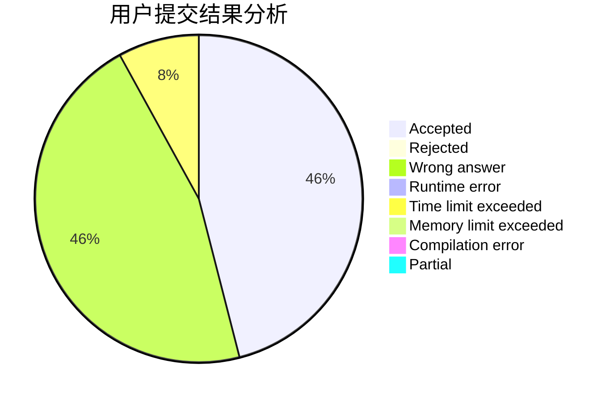
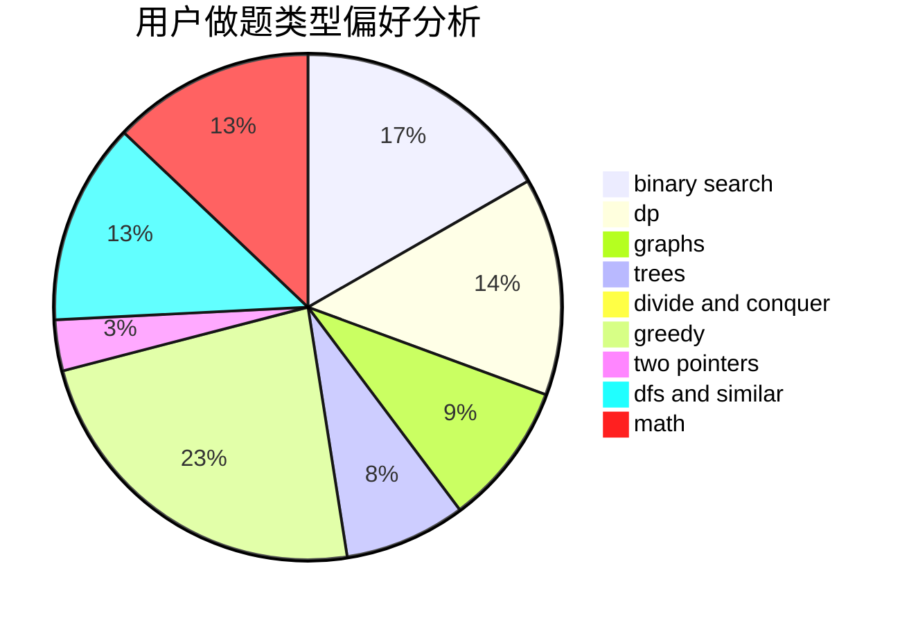

# 79975580

<!-- tabs:start -->

#### **用户提交结果分析**

#### **用户做题类型偏好分析**

<!-- tabs:end -->
# 推荐题目
[1059A](https://codeforces.com/contest/1059/problem/A)
[1111A](https://codeforces.com/contest/1111/problem/A)
[1342B](https://codeforces.com/contest/1342/problem/B)
[1164H](https://codeforces.com/contest/1164/problem/H)
[1353F](https://codeforces.com/contest/1353/problem/F)
[1434E](https://codeforces.com/contest/1434/problem/E)
[1435E](https://codeforces.com/contest/1435/problem/E)
[1010D](https://codeforces.com/contest/1010/problem/D)
[1341D](https://codeforces.com/contest/1341/problem/D)
[1278F](https://codeforces.com/contest/1278/problem/F)
