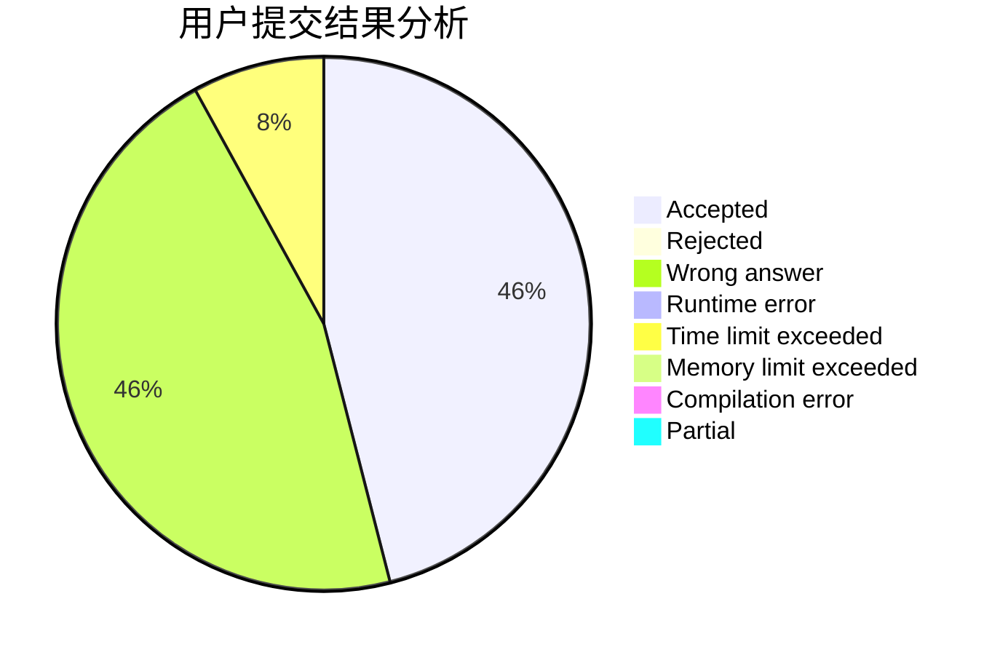
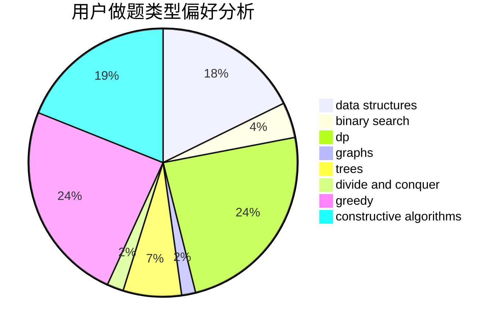
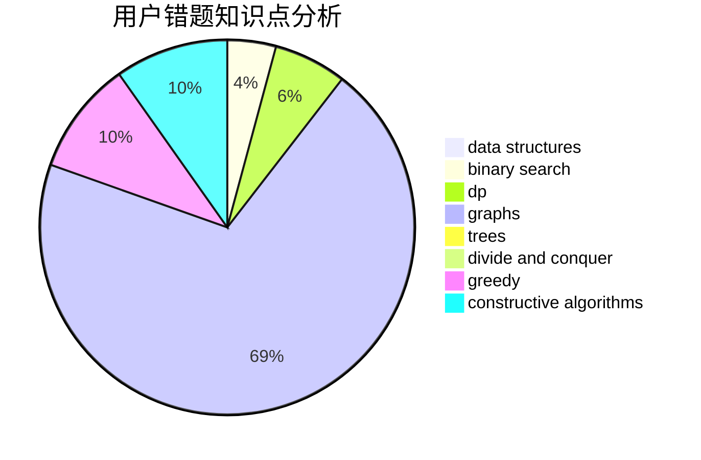

# 79975580
<!-- tabs:start -->
#### **用户提交结果分析**

#### **用户做题类型偏好分析**

#### **用户错题知识点分析**

<!-- tabs:end -->
# 推荐题目
[Unshuffling a Deck](http://codeforces.com/problemset/problem/1427/D)		constructive algorithms,
                        implementation		  
[Danger of Mad Snakes](http://codeforces.com/problemset/problem/1425/D)		combinatorics,
                        dp,
                        math		  
[Greedy Subsequences](http://codeforces.com/problemset/problem/1132/G)		data structures,
                        dp,
                        trees		  
[Construct the String](http://codeforces.com/problemset/problem/1335/B)		constructive algorithms		  
[Vasya and Golden Ticket](https://codeforces.com/contest/1058/problem/C)		implementation		  
[Magic Tricks](http://codeforces.com/problemset/problem/1346/E)		*special problem,
                        dp,
                        graphs		  
[Number of Subsequences](http://codeforces.com/problemset/problem/1426/F)		combinatorics,
                        dp,
                        strings		  
[Divisor Paths](http://codeforces.com/problemset/problem/1334/E)		combinatorics,
                        graphs,
                        greedy,
                        math,
                        number theory		  
[Blue and Red of Our Faculty!](http://codeforces.com/problemset/problem/1425/B)		divide and conquer,
                        dp		  
[Quantifier Question](https://codeforces.com/contest/1345/problem/E)		dfs and similar,
                        dp,
                        graphs,
                        math		  
<!-- tabs:start -->
#### **data structures**
[Unshuffling a Deck](http://codeforces.com/problemset/problem/1132/G)		data structures,
                        dp,
                        trees		  
[Danger of Mad Snakes](http://codeforces.com/problemset/problem/1185/C2)		brute force,
                        data structures,
                        greedy,
                        math		  
[Greedy Subsequences](http://codeforces.com/problemset/problem/1427/F)		data structures,
                        greedy,
                        trees		  
[Construct the String](http://codeforces.com/problemset/problem/1426/D)		constructive algorithms,
                        data structures,
                        greedy,
                        sortings		  
[Vasya and Golden Ticket](http://codeforces.com/problemset/problem/1110/F)		data structures,
                        trees		  
[Magic Tricks](http://codeforces.com/problemset/problem/1423/H)		data structures,
                        divide and conquer,
                        dsu,
                        graphs		  
[Number of Subsequences](http://codeforces.com/problemset/problem/1492/C)		binary search,
                        data structures,
                        dp,
                        greedy,
                        two pointers		  
[Divisor Paths](http://codeforces.com/problemset/problem/1490/G)		binary search,
                        data structures,
                        math		  
[Blue and Red of Our Faculty!](http://codeforces.com/problemset/problem/1479/D)		binary search,
                        bitmasks,
                        brute force,
                        data structures,
                        probabilities,
                        trees		  
[Quantifier Question](http://codeforces.com/problemset/problem/1497/A)		brute force,
                        data structures,
                        greedy,
                        sortings		  
#### **binary search**
[Unshuffling a Deck](http://codeforces.com/problemset/problem/1010/A)		binary search,
                        math		  
[Danger of Mad Snakes](http://codeforces.com/problemset/problem/1426/C)		binary search,
                        constructive algorithms,
                        math		  
[Greedy Subsequences](http://codeforces.com/problemset/problem/126/B)		binary search,
                        dp,
                        hashing,
                        string suffix structures,
                        strings		  
[Construct the String](http://codeforces.com/problemset/problem/1492/C)		binary search,
                        data structures,
                        dp,
                        greedy,
                        two pointers		  
[Vasya and Golden Ticket](http://codeforces.com/problemset/problem/1463/D)		binary search,
                        constructive algorithms,
                        greedy,
                        two pointers		  
[Magic Tricks](http://codeforces.com/problemset/problem/1490/G)		binary search,
                        data structures,
                        math		  
[Number of Subsequences](http://codeforces.com/problemset/problem/1479/D)		binary search,
                        bitmasks,
                        brute force,
                        data structures,
                        probabilities,
                        trees		  
[Divisor Paths](http://codeforces.com/problemset/problem/1436/E)		binary search,
                        data structures,
                        two pointers		  
[Blue and Red of Our Faculty!](http://codeforces.com/problemset/problem/1461/D)		binary search,
                        brute force,
                        data structures,
                        divide and conquer,
                        implementation,
                        sortings		  
[Quantifier Question](http://codeforces.com/problemset/problem/1493/C)		binary search,
                        brute force,
                        constructive algorithms,
                        greedy,
                        strings		  
#### **dp**
[Unshuffling a Deck](http://codeforces.com/problemset/problem/1425/D)		combinatorics,
                        dp,
                        math		  
[Danger of Mad Snakes](http://codeforces.com/problemset/problem/1132/G)		data structures,
                        dp,
                        trees		  
[Greedy Subsequences](http://codeforces.com/problemset/problem/1346/E)		*special problem,
                        dp,
                        graphs		  
[Construct the String](http://codeforces.com/problemset/problem/1426/F)		combinatorics,
                        dp,
                        strings		  
[Vasya and Golden Ticket](http://codeforces.com/problemset/problem/1425/B)		divide and conquer,
                        dp		  
[Magic Tricks](https://codeforces.com/contest/1345/problem/E)		dfs and similar,
                        dp,
                        graphs,
                        math		  
[Number of Subsequences](http://codeforces.com/problemset/problem/1422/C)		combinatorics,
                        dp,
                        math		  
[Divisor Paths](http://codeforces.com/problemset/problem/1427/C)		dp		  
[Blue and Red of Our Faculty!](http://codeforces.com/problemset/problem/126/B)		binary search,
                        dp,
                        hashing,
                        string suffix structures,
                        strings		  
[Quantifier Question](http://codeforces.com/problemset/problem/1492/C)		binary search,
                        data structures,
                        dp,
                        greedy,
                        two pointers		  
#### **graph**
[Unshuffling a Deck](http://codeforces.com/problemset/problem/1346/E)		*special problem,
                        dp,
                        graphs		  
[Danger of Mad Snakes](http://codeforces.com/problemset/problem/1334/E)		combinatorics,
                        graphs,
                        greedy,
                        math,
                        number theory		  
[Greedy Subsequences](https://codeforces.com/contest/1345/problem/E)		dfs and similar,
                        dp,
                        graphs,
                        math		  
[Construct the String](http://codeforces.com/problemset/problem/1427/G)		flows,
                        graphs		  
[Vasya and Golden Ticket](http://codeforces.com/problemset/problem/1423/H)		data structures,
                        divide and conquer,
                        dsu,
                        graphs		  
[Magic Tricks](http://codeforces.com/problemset/problem/1487/C)		brute force,
                        constructive algorithms,
                        dfs and similar,
                        graphs,
                        greedy,
                        implementation,
                        math		  
[Number of Subsequences](http://codeforces.com/problemset/problem/1437/C)		dp,
                        flows,
                        graph matchings,
                        greedy,
                        math,
                        sortings		  
[Divisor Paths](http://codeforces.com/problemset/problem/1470/D)		constructive algorithms,
                        dfs and similar,
                        graph matchings,
                        graphs,
                        greedy		  
[Blue and Red of Our Faculty!](http://codeforces.com/problemset/problem/1476/C)		dp,
                        graphs,
                        greedy		  
[Quantifier Question](http://codeforces.com/problemset/problem/1304/D)		constructive algorithms,
                        graphs,
                        greedy,
                        two pointers		  
#### **trees**
[Unshuffling a Deck](http://codeforces.com/problemset/problem/1132/G)		data structures,
                        dp,
                        trees		  
[Danger of Mad Snakes](http://codeforces.com/problemset/problem/1427/F)		data structures,
                        greedy,
                        trees		  
[Greedy Subsequences](http://codeforces.com/problemset/problem/1110/F)		data structures,
                        trees		  
[Construct the String](http://codeforces.com/problemset/problem/1479/D)		binary search,
                        bitmasks,
                        brute force,
                        data structures,
                        probabilities,
                        trees		  
[Vasya and Golden Ticket](http://codeforces.com/problemset/problem/1511/C)		brute force,
                        data structures,
                        implementation,
                        trees		  
[Magic Tricks](http://codeforces.com/problemset/problem/1499/F)		combinatorics,
                        dfs and similar,
                        dp,
                        trees		  
[Number of Subsequences](http://codeforces.com/problemset/problem/1491/E)		brute force,
                        dfs and similar,
                        divide and conquer,
                        number theory,
                        trees		  
[Divisor Paths](http://codeforces.com/problemset/problem/1466/D)		data structures,
                        greedy,
                        sortings,
                        trees		  
[Blue and Red of Our Faculty!](http://codeforces.com/problemset/problem/1495/D)		combinatorics,
                        dfs and similar,
                        graphs,
                        math,
                        shortest paths,
                        trees		  
[Quantifier Question](http://codeforces.com/problemset/problem/1303/G)		data structures,
                        divide and conquer,
                        geometry,
                        trees		  
#### **divide and conquer**
[Unshuffling a Deck](http://codeforces.com/problemset/problem/1425/B)		divide and conquer,
                        dp		  
[Danger of Mad Snakes](http://codeforces.com/problemset/problem/1423/H)		data structures,
                        divide and conquer,
                        dsu,
                        graphs		  
[Greedy Subsequences](http://codeforces.com/problemset/problem/1461/D)		binary search,
                        brute force,
                        data structures,
                        divide and conquer,
                        implementation,
                        sortings		  
[Construct the String](http://codeforces.com/problemset/problem/1466/G)		combinatorics,
                        divide and conquer,
                        hashing,
                        math,
                        string suffix structures,
                        strings		  
[Vasya and Golden Ticket](http://codeforces.com/problemset/problem/1490/D)		dfs and similar,
                        divide and conquer,
                        implementation		  
[Magic Tricks](https://codeforces.com/contest/1483/problem/C)		data structures,
                        divide and conquer,
                        dp		  
[Number of Subsequences](http://codeforces.com/problemset/problem/1491/E)		brute force,
                        dfs and similar,
                        divide and conquer,
                        number theory,
                        trees		  
[Divisor Paths](http://codeforces.com/problemset/problem/1303/G)		data structures,
                        divide and conquer,
                        geometry,
                        trees		  
[Blue and Red of Our Faculty!](http://codeforces.com/problemset/problem/1494/D)		constructive algorithms,
                        data structures,
                        dfs and similar,
                        divide and conquer,
                        dsu,
                        greedy,
                        sortings,
                        trees		  
[Quantifier Question](http://codeforces.com/problemset/problem/1482/E)		data structures,
                        divide and conquer,
                        dp		  
#### **greedy**
[Unshuffling a Deck](http://codeforces.com/problemset/problem/1334/E)		combinatorics,
                        graphs,
                        greedy,
                        math,
                        number theory		  
[Danger of Mad Snakes](http://codeforces.com/problemset/problem/1425/E)		greedy,
                        implementation		  
[Greedy Subsequences](http://codeforces.com/problemset/problem/1185/C2)		brute force,
                        data structures,
                        greedy,
                        math		  
[Construct the String](http://codeforces.com/problemset/problem/1358/B)		greedy,
                        sortings		  
[Vasya and Golden Ticket](http://codeforces.com/problemset/problem/1427/F)		data structures,
                        greedy,
                        trees		  
[Magic Tricks](http://codeforces.com/problemset/problem/1203/D1)		greedy,
                        implementation		  
[Number of Subsequences](http://codeforces.com/problemset/problem/1426/D)		constructive algorithms,
                        data structures,
                        greedy,
                        sortings		  
[Divisor Paths](http://codeforces.com/problemset/problem/1385/C)		greedy		  
[Blue and Red of Our Faculty!](http://codeforces.com/problemset/problem/1083/B)		greedy,
                        strings		  
[Quantifier Question](http://codeforces.com/problemset/problem/1427/B)		greedy,
                        implementation,
                        sortings		  
#### **constructive algorithms**
[Unshuffling a Deck](http://codeforces.com/problemset/problem/1427/D)		constructive algorithms,
                        implementation		  
[Danger of Mad Snakes](http://codeforces.com/problemset/problem/1335/B)		constructive algorithms		  
[Greedy Subsequences](http://codeforces.com/problemset/problem/1427/E)		bitmasks,
                        constructive algorithms,
                        math,
                        matrices,
                        number theory		  
[Construct the String](http://codeforces.com/problemset/problem/1426/D)		constructive algorithms,
                        data structures,
                        greedy,
                        sortings		  
[Vasya and Golden Ticket](http://codeforces.com/problemset/problem/1426/C)		binary search,
                        constructive algorithms,
                        math		  
[Magic Tricks](http://codeforces.com/problemset/problem/1270/C)		bitmasks,
                        constructive algorithms,
                        math		  
[Number of Subsequences](http://codeforces.com/problemset/problem/1368/B)		brute force,
                        constructive algorithms,
                        greedy,
                        math,
                        strings		  
[Divisor Paths](http://codeforces.com/problemset/problem/1426/E)		brute force,
                        constructive algorithms,
                        flows,
                        greedy,
                        math		  
[Blue and Red of Our Faculty!](http://codeforces.com/problemset/problem/1425/H)		constructive algorithms		  
[Quantifier Question](http://codeforces.com/problemset/problem/1493/A)		constructive algorithms,
                        greedy		  
#### **sortings**
[Unshuffling a Deck](http://codeforces.com/problemset/problem/1358/B)		greedy,
                        sortings		  
[Danger of Mad Snakes](http://codeforces.com/problemset/problem/1426/D)		constructive algorithms,
                        data structures,
                        greedy,
                        sortings		  
[Greedy Subsequences](http://codeforces.com/problemset/problem/1427/A)		math,
                        sortings		  
[Construct the String](http://codeforces.com/problemset/problem/1427/B)		greedy,
                        implementation,
                        sortings		  
[Vasya and Golden Ticket](https://codeforces.com/contest/1496/problem/C)		geometry,
                        greedy,
                        math,
                        sortings		  
[Magic Tricks](http://codeforces.com/problemset/problem/1495/A)		geometry,
                        greedy,
                        math,
                        sortings		  
[Number of Subsequences](http://codeforces.com/problemset/problem/1497/A)		brute force,
                        data structures,
                        greedy,
                        sortings		  
[Divisor Paths](http://codeforces.com/problemset/problem/1427/A)		math,
                        sortings		  
[Blue and Red of Our Faculty!](http://codeforces.com/problemset/problem/1461/D)		binary search,
                        brute force,
                        data structures,
                        divide and conquer,
                        implementation,
                        sortings		  
[Quantifier Question](http://codeforces.com/problemset/problem/1437/C)		dp,
                        flows,
                        graph matchings,
                        greedy,
                        math,
                        sortings		  
<!-- tabs:end -->
