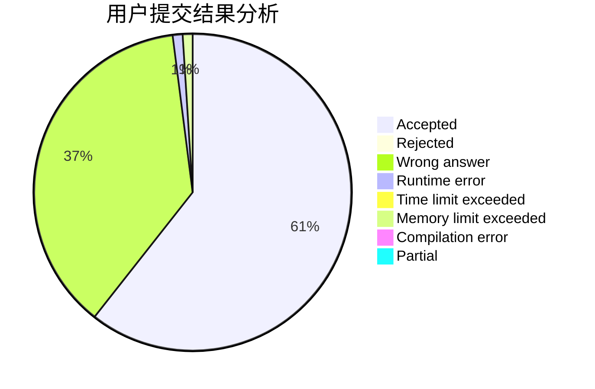
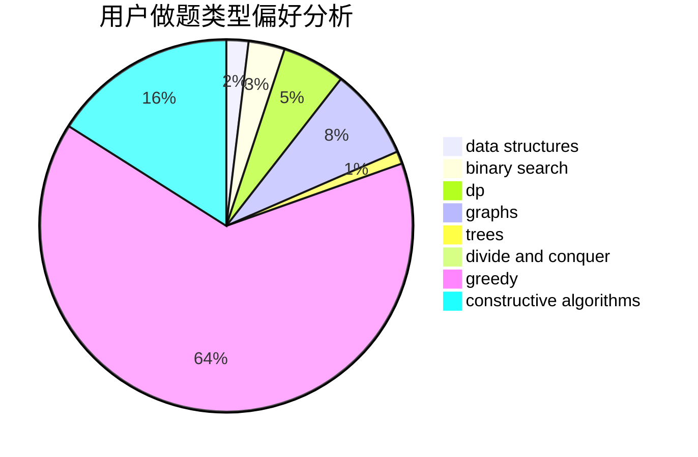

# Maxzz
<!-- tabs:start -->
#### **用户提交结果分析**

#### **用户做题类型偏好分析**

#### **用户错题知识点分析**

<!-- tabs:end -->
# 推荐题目
[SMSC](http://codeforces.com/problemset/problem/292/A)		implementation		  
[Vasya and Templates](https://codeforces.com/contest/1087/problem/E)		greedy,
                        implementation,
                        strings		  
[Drazil and Park](https://codeforces.com/contest/516/problem/C)		data structures		  
[Tavas and Karafs](http://codeforces.com/problemset/problem/535/C)		binary search,
                        greedy,
                        math		  
[Mahmoud and Ehab and yet another xor task](http://codeforces.com/problemset/problem/959/F)		bitmasks,
                        dp,
                        math,
                        matrices		  
[Bears and Juice](https://codeforces.com/contest/674/problem/F)		dp,
                        math,
                        meet-in-the-middle		  
[Yaroslav and Points](http://codeforces.com/problemset/problem/295/E)		data structures		  
[Football](http://codeforces.com/problemset/problem/1240/F)		graphs		  
[Pig and Palindromes](http://codeforces.com/problemset/problem/570/E)		combinatorics,
                        dp		  
[Circular Dungeon](http://codeforces.com/problemset/problem/1380/G)		greedy,
                        math,
                        probabilities		  
<!-- tabs:start -->
#### **data structures**
[SMSC](https://codeforces.com/contest/516/problem/C)		data structures		  
[Vasya and Templates](http://codeforces.com/problemset/problem/295/E)		data structures		  
[Drazil and Park](http://codeforces.com/problemset/problem/803/G)		data structures		  
[Tavas and Karafs](http://codeforces.com/problemset/problem/286/D)		data structures,
                        sortings		  
[Mahmoud and Ehab and yet another xor task](http://codeforces.com/problemset/problem/527/D)		data structures,
                        dp,
                        greedy,
                        implementation,
                        sortings		  
[Bears and Juice](http://codeforces.com/problemset/problem/1344/E)		data structures,
                        trees		  
[Yaroslav and Points](http://codeforces.com/problemset/problem/331/D3)		data structures,
                        implementation,
                        trees		  
[Football](http://codeforces.com/problemset/problem/515/E)		data structures		  
[Pig and Palindromes](http://codeforces.com/problemset/problem/1100/B)		data structures,
                        implementation		  
[Circular Dungeon](http://codeforces.com/problemset/problem/418/D)		data structures,
                        graphs,
                        trees		  
#### **binary search**
[SMSC](http://codeforces.com/problemset/problem/535/C)		binary search,
                        greedy,
                        math		  
[Vasya and Templates](http://codeforces.com/problemset/problem/448/D)		binary search,
                        brute force		  
[Drazil and Park](http://codeforces.com/problemset/problem/1492/C)		binary search,
                        data structures,
                        dp,
                        greedy,
                        two pointers		  
[Tavas and Karafs](http://codeforces.com/problemset/problem/1463/D)		binary search,
                        constructive algorithms,
                        greedy,
                        two pointers		  
[Mahmoud and Ehab and yet another xor task](http://codeforces.com/problemset/problem/1490/G)		binary search,
                        data structures,
                        math		  
[Bears and Juice](http://codeforces.com/problemset/problem/1479/D)		binary search,
                        bitmasks,
                        brute force,
                        data structures,
                        probabilities,
                        trees		  
[Yaroslav and Points](http://codeforces.com/problemset/problem/1436/E)		binary search,
                        data structures,
                        two pointers		  
[Football](http://codeforces.com/problemset/problem/1461/D)		binary search,
                        brute force,
                        data structures,
                        divide and conquer,
                        implementation,
                        sortings		  
[Pig and Palindromes](http://codeforces.com/problemset/problem/1493/C)		binary search,
                        brute force,
                        constructive algorithms,
                        greedy,
                        strings		  
[Circular Dungeon](http://codeforces.com/problemset/problem/1487/D)		binary search,
                        brute force,
                        math,
                        number theory		  
#### **dp**
[SMSC](http://codeforces.com/problemset/problem/959/F)		bitmasks,
                        dp,
                        math,
                        matrices		  
[Vasya and Templates](https://codeforces.com/contest/674/problem/F)		dp,
                        math,
                        meet-in-the-middle		  
[Drazil and Park](http://codeforces.com/problemset/problem/570/E)		combinatorics,
                        dp		  
[Tavas and Karafs](http://codeforces.com/problemset/problem/1081/C)		combinatorics,
                        dp,
                        math		  
[Mahmoud and Ehab and yet another xor task](http://codeforces.com/problemset/problem/527/D)		data structures,
                        dp,
                        greedy,
                        implementation,
                        sortings		  
[Bears and Juice](http://codeforces.com/problemset/problem/1051/D)		bitmasks,
                        dp		  
[Yaroslav and Points](https://codeforces.com/contest/956/problem/C)		data structures,
                        dp,
                        greedy		  
[Football](http://codeforces.com/problemset/problem/577/B)		combinatorics,
                        data structures,
                        dp,
                        two pointers		  
[Pig and Palindromes](http://codeforces.com/problemset/problem/1295/C)		dp,
                        greedy,
                        strings		  
[Circular Dungeon](http://codeforces.com/problemset/problem/1455/G)		data structures,
                        dp		  
#### **graph**
[SMSC](http://codeforces.com/problemset/problem/1240/F)		graphs		  
[Vasya and Templates](http://codeforces.com/problemset/problem/418/D)		data structures,
                        graphs,
                        trees		  
[Drazil and Park](http://codeforces.com/problemset/problem/1487/C)		brute force,
                        constructive algorithms,
                        dfs and similar,
                        graphs,
                        greedy,
                        implementation,
                        math		  
[Tavas and Karafs](http://codeforces.com/problemset/problem/1437/C)		dp,
                        flows,
                        graph matchings,
                        greedy,
                        math,
                        sortings		  
[Mahmoud and Ehab and yet another xor task](http://codeforces.com/problemset/problem/1470/D)		constructive algorithms,
                        dfs and similar,
                        graph matchings,
                        graphs,
                        greedy		  
[Bears and Juice](http://codeforces.com/problemset/problem/1476/C)		dp,
                        graphs,
                        greedy		  
[Yaroslav and Points](http://codeforces.com/problemset/problem/1304/D)		constructive algorithms,
                        graphs,
                        greedy,
                        two pointers		  
[Football](http://codeforces.com/problemset/problem/1475/C)		combinatorics,
                        graphs,
                        math		  
[Pig and Palindromes](http://codeforces.com/problemset/problem/553/E)		dp,
                        fft,
                        graphs,
                        math,
                        probabilities		  
[Circular Dungeon](http://codeforces.com/problemset/problem/1495/C)		constructive algorithms,
                        graphs		  
#### **trees**
[SMSC](http://codeforces.com/problemset/problem/1344/E)		data structures,
                        trees		  
[Vasya and Templates](http://codeforces.com/problemset/problem/331/D3)		data structures,
                        implementation,
                        trees		  
[Drazil and Park](http://codeforces.com/problemset/problem/418/D)		data structures,
                        graphs,
                        trees		  
[Tavas and Karafs](http://codeforces.com/problemset/problem/1404/B)		dfs and similar,
                        dp,
                        games,
                        trees		  
[Mahmoud and Ehab and yet another xor task](http://codeforces.com/problemset/problem/1479/D)		binary search,
                        bitmasks,
                        brute force,
                        data structures,
                        probabilities,
                        trees		  
[Bears and Juice](http://codeforces.com/problemset/problem/1511/C)		brute force,
                        data structures,
                        implementation,
                        trees		  
[Yaroslav and Points](http://codeforces.com/problemset/problem/1499/F)		combinatorics,
                        dfs and similar,
                        dp,
                        trees		  
[Football](http://codeforces.com/problemset/problem/1491/E)		brute force,
                        dfs and similar,
                        divide and conquer,
                        number theory,
                        trees		  
[Pig and Palindromes](http://codeforces.com/problemset/problem/1466/D)		data structures,
                        greedy,
                        sortings,
                        trees		  
[Circular Dungeon](http://codeforces.com/problemset/problem/1495/D)		combinatorics,
                        dfs and similar,
                        graphs,
                        math,
                        shortest paths,
                        trees		  
#### **divide and conquer**
[SMSC](http://codeforces.com/problemset/problem/1461/D)		binary search,
                        brute force,
                        data structures,
                        divide and conquer,
                        implementation,
                        sortings		  
[Vasya and Templates](http://codeforces.com/problemset/problem/1466/G)		combinatorics,
                        divide and conquer,
                        hashing,
                        math,
                        string suffix structures,
                        strings		  
[Drazil and Park](http://codeforces.com/problemset/problem/1490/D)		dfs and similar,
                        divide and conquer,
                        implementation		  
[Tavas and Karafs](https://codeforces.com/contest/1483/problem/C)		data structures,
                        divide and conquer,
                        dp		  
[Mahmoud and Ehab and yet another xor task](http://codeforces.com/problemset/problem/1491/E)		brute force,
                        dfs and similar,
                        divide and conquer,
                        number theory,
                        trees		  
[Bears and Juice](http://codeforces.com/problemset/problem/1303/G)		data structures,
                        divide and conquer,
                        geometry,
                        trees		  
[Yaroslav and Points](http://codeforces.com/problemset/problem/1494/D)		constructive algorithms,
                        data structures,
                        dfs and similar,
                        divide and conquer,
                        dsu,
                        greedy,
                        sortings,
                        trees		  
[Football](http://codeforces.com/problemset/problem/1482/E)		data structures,
                        divide and conquer,
                        dp		  
[Pig and Palindromes](http://codeforces.com/problemset/problem/566/C)		dfs and similar,
                        divide and conquer,
                        trees		  
[Circular Dungeon](http://codeforces.com/problemset/problem/1428/F)		binary search,
                        data structures,
                        divide and conquer,
                        dp,
                        two pointers		  
#### **greedy**
[SMSC](https://codeforces.com/contest/1087/problem/E)		greedy,
                        implementation,
                        strings		  
[Vasya and Templates](http://codeforces.com/problemset/problem/535/C)		binary search,
                        greedy,
                        math		  
[Drazil and Park](http://codeforces.com/problemset/problem/1380/G)		greedy,
                        math,
                        probabilities		  
[Tavas and Karafs](http://codeforces.com/problemset/problem/903/B)		greedy,
                        implementation		  
[Mahmoud and Ehab and yet another xor task](http://codeforces.com/problemset/problem/39/B)		greedy		  
[Bears and Juice](http://codeforces.com/problemset/problem/389/A)		greedy,
                        math		  
[Yaroslav and Points](http://codeforces.com/problemset/problem/527/D)		data structures,
                        dp,
                        greedy,
                        implementation,
                        sortings		  
[Football](https://codeforces.com/contest/1362/problem/E)		greedy,
                        implementation,
                        math,
                        sortings		  
[Pig and Palindromes](https://codeforces.com/contest/1314/problem/A)		data structures,
                        greedy,
                        sortings		  
[Circular Dungeon](https://codeforces.com/contest/956/problem/C)		data structures,
                        dp,
                        greedy		  
#### **constructive algorithms**
[SMSC](http://codeforces.com/problemset/problem/1179/B)		constructive algorithms		  
[Vasya and Templates](http://codeforces.com/problemset/problem/417/E)		constructive algorithms,
                        math,
                        probabilities		  
[Drazil and Park](http://codeforces.com/problemset/problem/145/B)		constructive algorithms		  
[Tavas and Karafs](http://codeforces.com/problemset/problem/1208/C)		constructive algorithms		  
[Mahmoud and Ehab and yet another xor task](https://codeforces.com/contest/1262/problem/B)		constructive algorithms		  
[Bears and Juice](http://codeforces.com/problemset/problem/1493/A)		constructive algorithms,
                        greedy		  
[Yaroslav and Points](http://codeforces.com/problemset/problem/1463/D)		binary search,
                        constructive algorithms,
                        greedy,
                        two pointers		  
[Football](https://codeforces.com/contest/1456/problem/B)		bitmasks,
                        brute force,
                        constructive algorithms		  
[Pig and Palindromes](http://codeforces.com/problemset/problem/1492/D)		bitmasks,
                        constructive algorithms,
                        greedy,
                        math		  
[Circular Dungeon](https://codeforces.com/contest/1504/problem/D)		constructive algorithms,
                        games,
                        interactive		  
#### **sortings**
[SMSC](http://codeforces.com/problemset/problem/286/D)		data structures,
                        sortings		  
[Vasya and Templates](http://codeforces.com/problemset/problem/527/D)		data structures,
                        dp,
                        greedy,
                        implementation,
                        sortings		  
[Drazil and Park](http://codeforces.com/problemset/problem/1269/B)		brute force,
                        sortings		  
[Tavas and Karafs](https://codeforces.com/contest/1362/problem/E)		greedy,
                        implementation,
                        math,
                        sortings		  
[Mahmoud and Ehab and yet another xor task](https://codeforces.com/contest/1314/problem/A)		data structures,
                        greedy,
                        sortings		  
[Bears and Juice](https://codeforces.com/contest/1496/problem/C)		geometry,
                        greedy,
                        math,
                        sortings		  
[Yaroslav and Points](http://codeforces.com/problemset/problem/1495/A)		geometry,
                        greedy,
                        math,
                        sortings		  
[Football](http://codeforces.com/problemset/problem/1497/A)		brute force,
                        data structures,
                        greedy,
                        sortings		  
[Pig and Palindromes](http://codeforces.com/problemset/problem/1427/A)		math,
                        sortings		  
[Circular Dungeon](http://codeforces.com/problemset/problem/1461/D)		binary search,
                        brute force,
                        data structures,
                        divide and conquer,
                        implementation,
                        sortings		  
<!-- tabs:end -->
