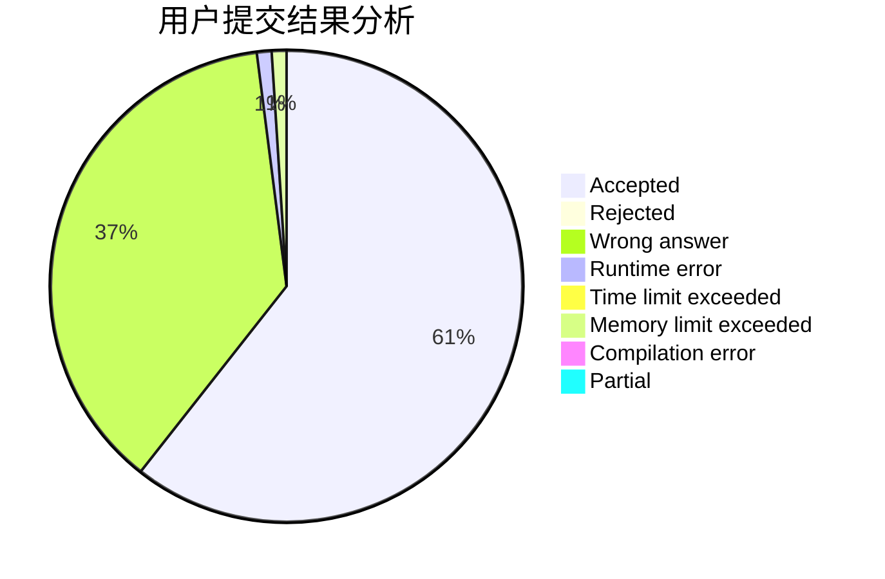
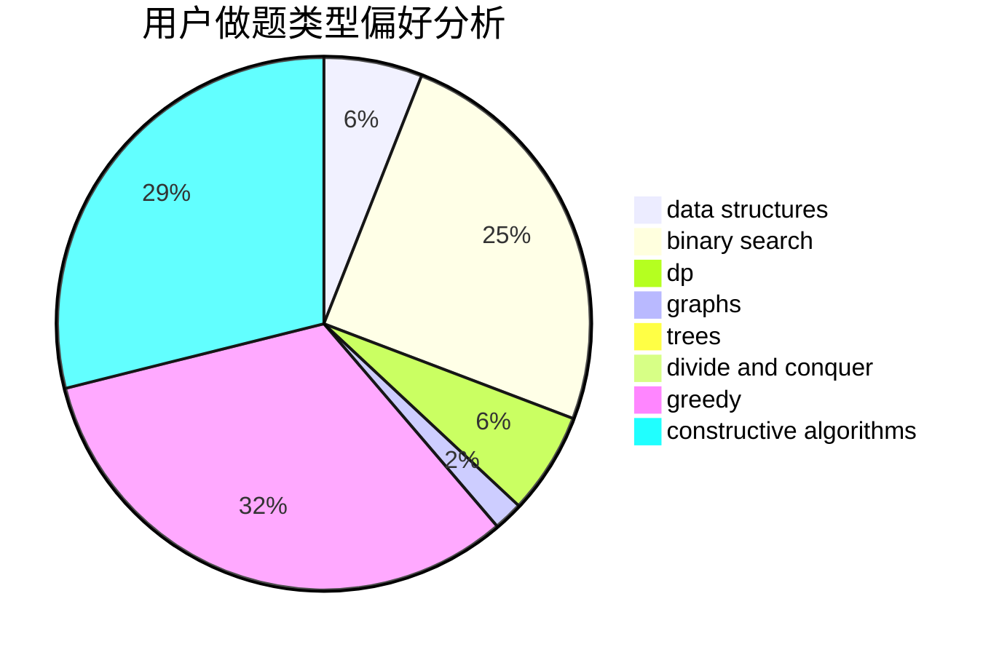

# Maxzz

<!-- tabs:start -->

#### **用户提交结果分析**

#### **用户做题类型偏好分析**

#### **用户错题知识点分析**

<!-- tabs:end -->
# 推荐题目
[1213G](https://codeforces.com/contest/1213/problem/G)		divide and conquer,
                        dsu,
                        graphs,
                        sortings,
                        trees		  
[1088B](https://codeforces.com/contest/1088/problem/B)		implementation,
                        sortings		  
[11181](https://codeforces.com/contest/1118/problem/1)		dsu,graphs,sortings,trees		  
[300E](https://codeforces.com/contest/300/problem/E)		binary search,
                        math,
                        number theory		  
[306D](https://codeforces.com/contest/306/problem/D)		constructive algorithms,
                        geometry		  
[444C](https://codeforces.com/contest/444/problem/C)		data structures		  
[543C](https://codeforces.com/contest/543/problem/C)		bitmasks,
                        dp		  
[981D](https://codeforces.com/contest/981/problem/D)		bitmasks,
                        dp,
                        greedy		  
[750G](https://codeforces.com/contest/750/problem/G)		bitmasks,
                        brute force,
                        combinatorics,
                        dp		  
[81C](https://codeforces.com/contest/81/problem/C)		greedy,
                        math,
                        sortings		  
