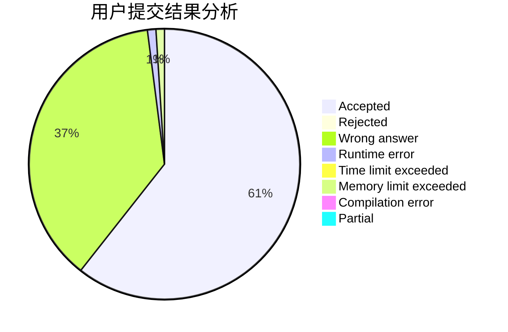
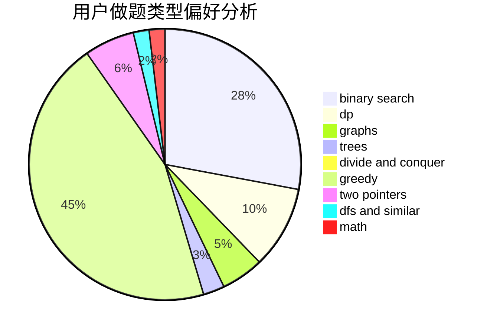

# Maxzz

<!-- tabs:start -->

#### **用户提交结果分析**

#### **用户做题类型偏好分析**

<!-- tabs:end -->
# 推荐题目
[1213G](https://codeforces.com/contest/1213/problem/G)
[1088B](https://codeforces.com/contest/1088/problem/B)
[11181](https://codeforces.com/contest/1118/problem/1)
[300E](https://codeforces.com/contest/300/problem/E)
[306D](https://codeforces.com/contest/306/problem/D)
[444C](https://codeforces.com/contest/444/problem/C)
[543C](https://codeforces.com/contest/543/problem/C)
[981D](https://codeforces.com/contest/981/problem/D)
[750G](https://codeforces.com/contest/750/problem/G)
[81C](https://codeforces.com/contest/81/problem/C)
