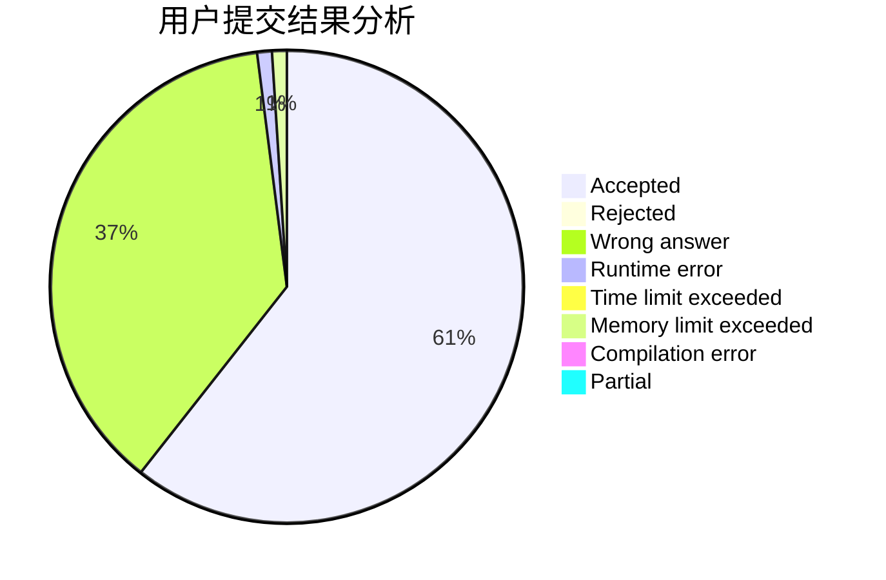
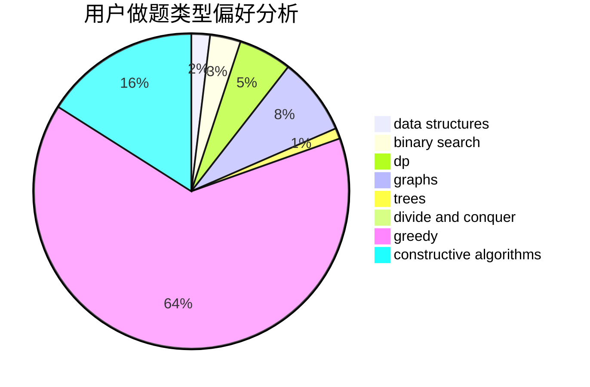

# Maxzz

<!-- tabs:start -->

#### **用户提交结果分析**

#### **用户做题类型偏好分析**

#### **用户错题知识点分析**

<!-- tabs:end -->
# 推荐题目
[1208C](https://codeforces.com/contest/1208/problem/C)		constructive algorithms		  
[1087E](https://codeforces.com/contest/1087/problem/E)		dsu,graphs,sortings,trees		  
[1116C2](https://codeforces.com/contest/1116C/problem/2)		nan		  
[286D](https://codeforces.com/contest/286/problem/D)		data structures,
                        sortings		  
[292A](https://codeforces.com/contest/292/problem/A)		implementation		  
[418D](https://codeforces.com/contest/418/problem/D)		data structures,
                        graphs,
                        trees		  
[516C](https://codeforces.com/contest/516/problem/C)		dsu,graphs,sortings,trees		  
[959F](https://codeforces.com/contest/959/problem/F)		bitmasks,
                        dp,
                        math,
                        matrices		  
[733B](https://codeforces.com/contest/733/problem/B)		math		  
[803G](https://codeforces.com/contest/803/problem/G)		data structures		  
