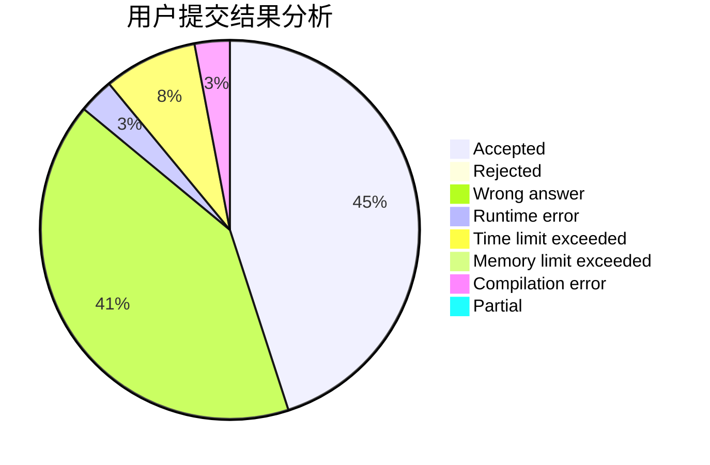
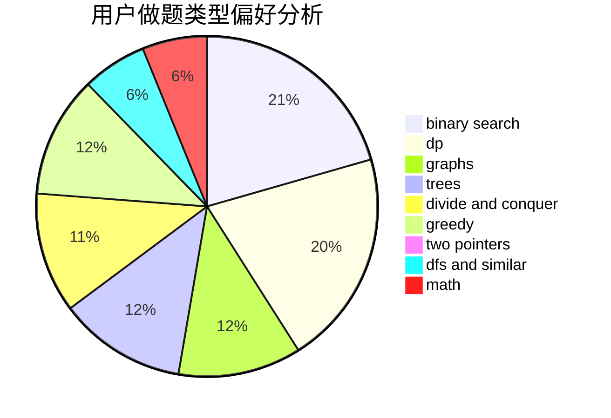

# MayFlyyh

<!-- tabs:start -->

#### **用户提交结果分析**

#### **用户做题类型偏好分析**

<!-- tabs:end -->
# 推荐题目
[1379E](https://codeforces.com/contest/1379/problem/E)
[311A](https://codeforces.com/contest/311/problem/A)
[12621](https://codeforces.com/contest/1262/problem/1)
[176B](https://codeforces.com/contest/176/problem/B)
[746D](https://codeforces.com/contest/746/problem/D)
[218C](https://codeforces.com/contest/218/problem/C)
[39C](https://codeforces.com/contest/39/problem/C)
[721E](https://codeforces.com/contest/721/problem/E)
[683A](https://codeforces.com/contest/683/problem/A)
[253A](https://codeforces.com/contest/253/problem/A)
