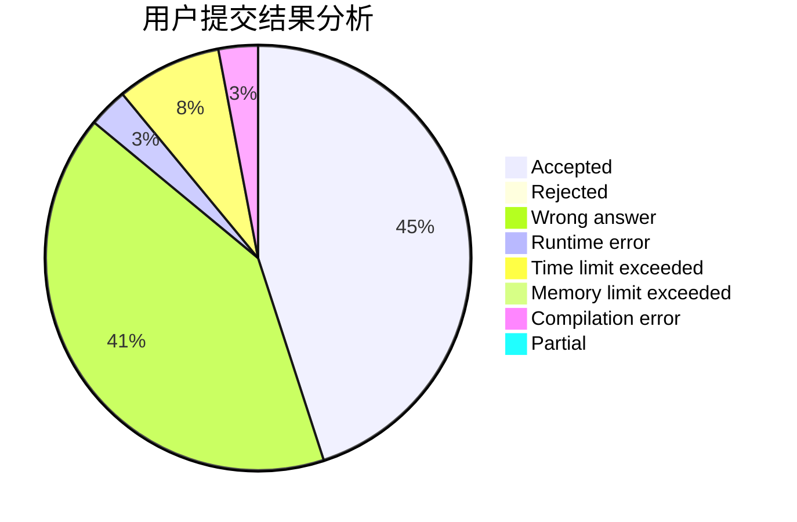
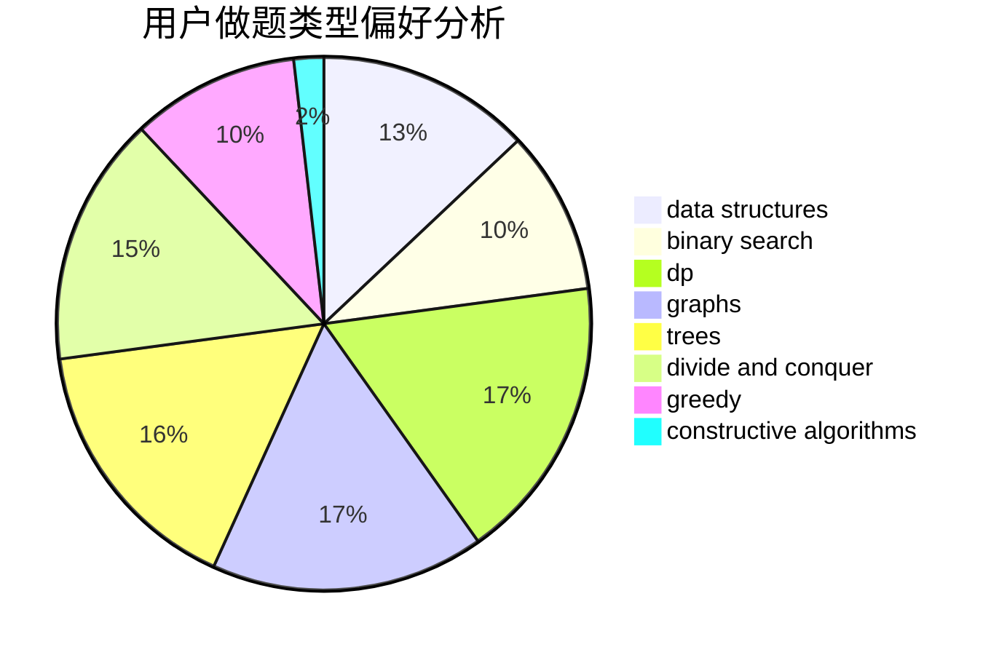
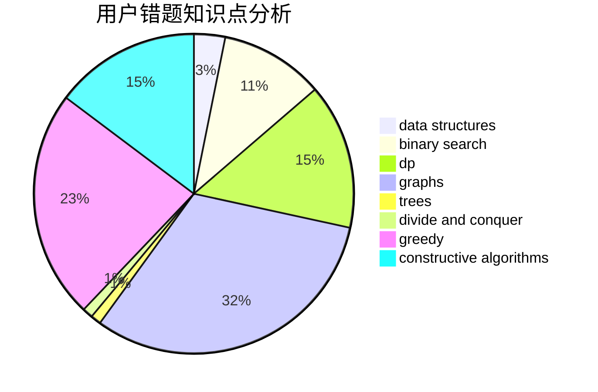

# MayFlyyh

<!-- tabs:start -->

#### **用户提交结果分析**

#### **用户做题类型偏好分析**

#### **用户错题知识点分析**

<!-- tabs:end -->
# 推荐题目
[1379E](https://codeforces.com/contest/1379/problem/E)		constructive algorithms,
                        divide and conquer,
                        dp,
                        math,
                        trees		  
[311A](https://codeforces.com/contest/311/problem/A)		constructive algorithms,
                        implementation		  
[12621](https://codeforces.com/contest/1262/problem/1)		dsu,graphs,sortings,trees		  
[176B](https://codeforces.com/contest/176/problem/B)		dp		  
[746D](https://codeforces.com/contest/746/problem/D)		constructive algorithms,
                        greedy,
                        math		  
[218C](https://codeforces.com/contest/218/problem/C)		dsu,graphs,sortings,trees		  
[39C](https://codeforces.com/contest/39/problem/C)		dp,
                        sortings		  
[721E](https://codeforces.com/contest/721/problem/E)		binary search,
                        dp		  
[683A](https://codeforces.com/contest/683/problem/A)		*special problem,
                        geometry		  
[253A](https://codeforces.com/contest/253/problem/A)		greedy		  
