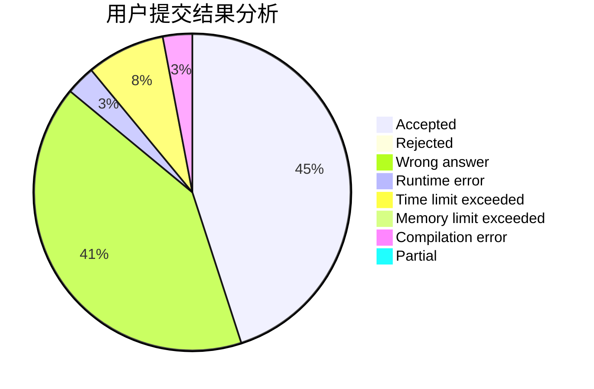
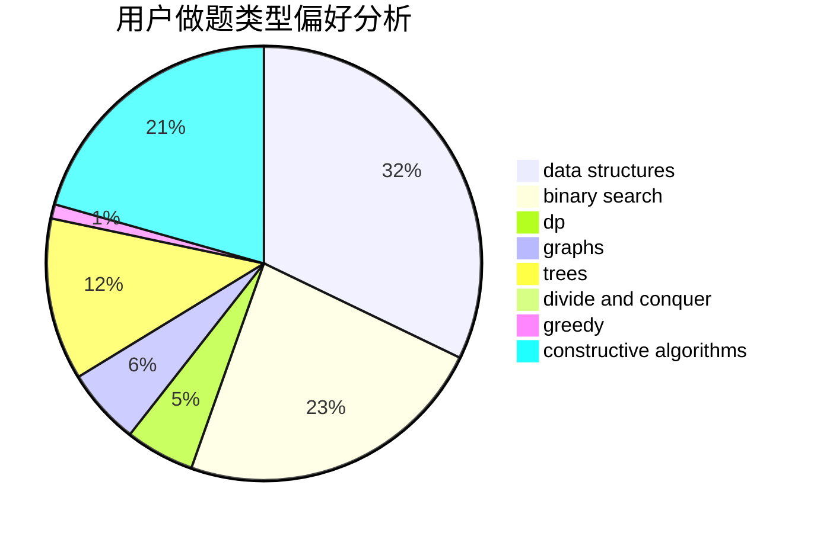
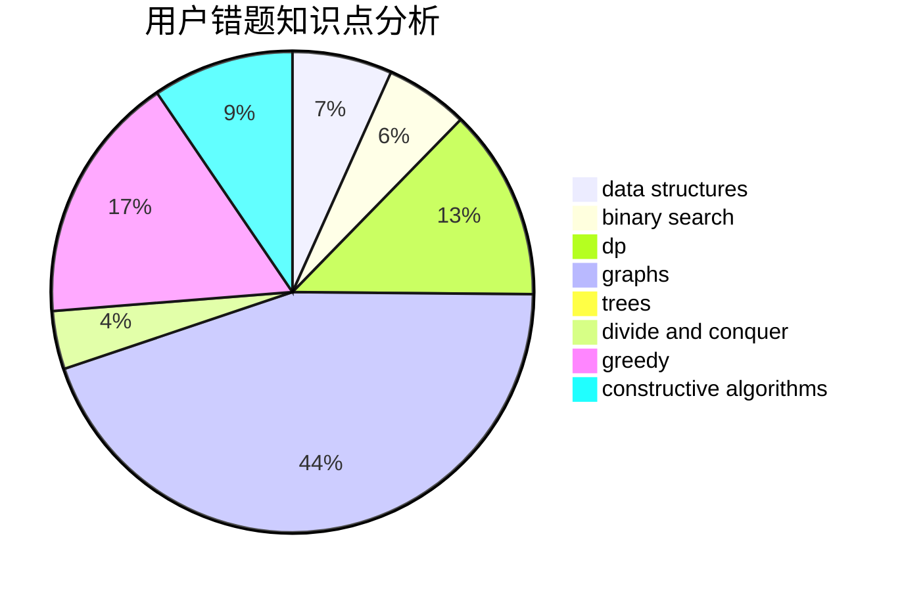

# MayFlyyh

<!-- tabs:start -->

#### **用户提交结果分析**

#### **用户做题类型偏好分析**

#### **用户错题知识点分析**

<!-- tabs:end -->
# 推荐题目
[1371A](https://codeforces.com/contest/1371/problem/A)		math		  
[294D](https://codeforces.com/contest/294/problem/D)		brute force,
                        implementation,
                        number theory		  
[1254D](https://codeforces.com/contest/1254/problem/D)		data structures,
                        probabilities,
                        trees		  
[154C](https://codeforces.com/contest/154/problem/C)		graphs,
                        hashing,
                        sortings		  
[729D](https://codeforces.com/contest/729/problem/D)		constructive algorithms,
                        greedy,
                        math		  
[195C](https://codeforces.com/contest/195/problem/C)		expression parsing,
                        implementation		  
[369A](https://codeforces.com/contest/369/problem/A)		greedy,
                        implementation		  
[703A](https://codeforces.com/contest/703/problem/A)		implementation		  
[663E](https://codeforces.com/contest/663/problem/E)		dsu,graphs,sortings,trees		  
[231C](https://codeforces.com/contest/231/problem/C)		binary search,
                        sortings,
                        two pointers		  
