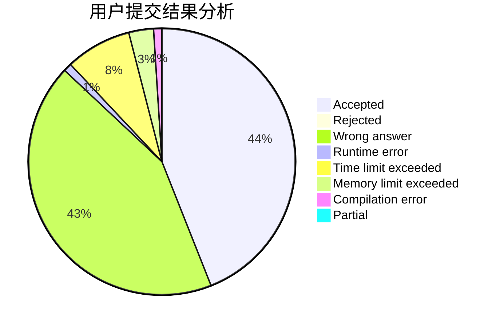
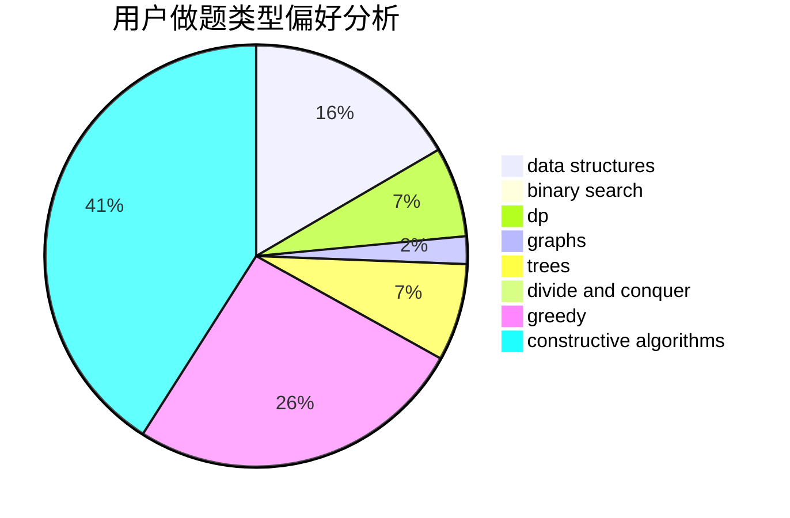
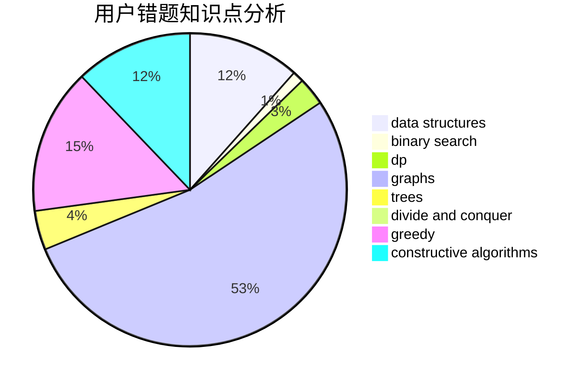

# Mazart_z

<!-- tabs:start -->

#### **用户提交结果分析**

#### **用户做题类型偏好分析**

#### **用户错题知识点分析**

<!-- tabs:end -->
# 推荐题目
[600C](https://codeforces.com/contest/600/problem/C)		constructive algorithms,
                        greedy,
                        strings		  
[1215D](https://codeforces.com/contest/1215/problem/D)		games,
                        greedy,
                        math		  
[1428C](https://codeforces.com/contest/1428/problem/C)		brute force,
                        data structures,
                        greedy,
                        strings		  
[755G](https://codeforces.com/contest/755/problem/G)		combinatorics,
                        divide and conquer,
                        dp,
                        fft,
                        math,
                        number theory		  
[819A](https://codeforces.com/contest/819/problem/A)		games,
                        greedy		  
[723C](https://codeforces.com/contest/723/problem/C)		greedy		  
[389B](https://codeforces.com/contest/389/problem/B)		greedy,
                        implementation		  
[13577](https://codeforces.com/contest/1357/problem/7)		dsu,graphs,sortings,trees		  
[51F](https://codeforces.com/contest/51/problem/F)		dfs and similar,
                        dp,
                        graphs,
                        trees		  
[1324C](https://codeforces.com/contest/1324/problem/C)		binary search,
                        data structures,
                        dfs and similar,
                        greedy,
                        implementation		  
