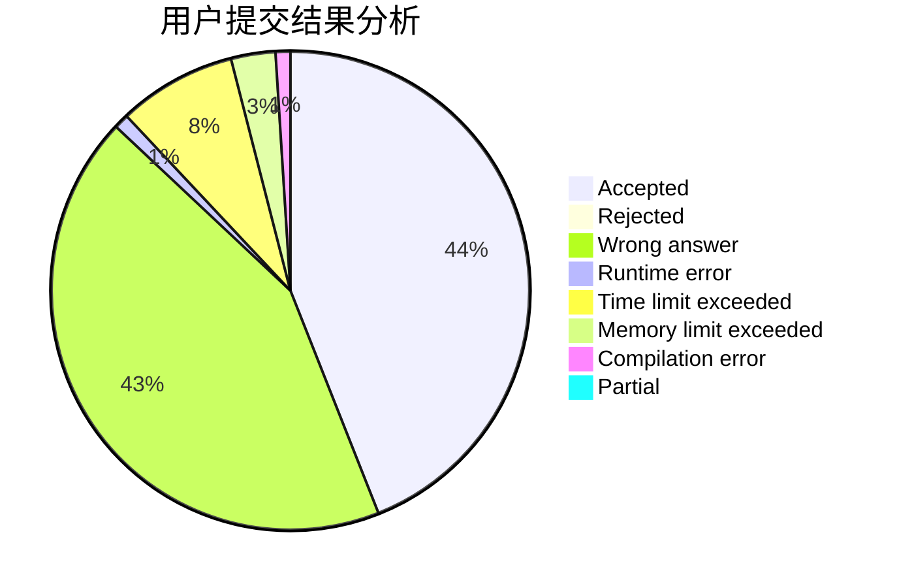
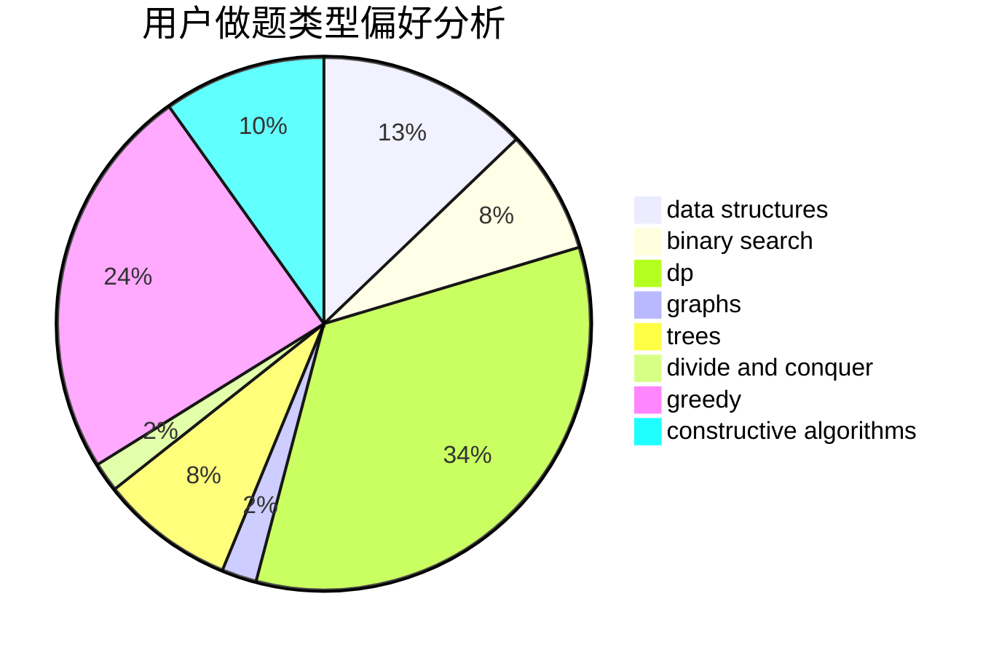
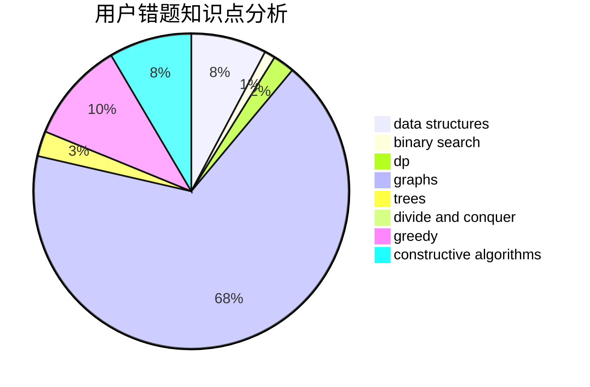

# Mazart_z

<!-- tabs:start -->

#### **用户提交结果分析**

#### **用户做题类型偏好分析**

#### **用户错题知识点分析**

<!-- tabs:end -->
# 推荐题目
[580A](https://codeforces.com/contest/580/problem/A)		brute force,
                        dp,
                        implementation		  
[1209G1](https://codeforces.com/contest/1209G/problem/1)		data structures,
                        dsu,
                        greedy,
                        implementation,
                        two pointers		  
[1420E](https://codeforces.com/contest/1420/problem/E)		dp,
                        greedy		  
[735A](https://codeforces.com/contest/735/problem/A)		implementation,
                        strings		  
[803C](https://codeforces.com/contest/803/problem/C)		constructive algorithms,
                        greedy,
                        math		  
[704C](https://codeforces.com/contest/704/problem/C)		dp,
                        graphs,
                        implementation,
                        math		  
[362C](https://codeforces.com/contest/362/problem/C)		data structures,
                        dp,
                        implementation,
                        math		  
[1350D](https://codeforces.com/contest/1350/problem/D)		dsu,graphs,sortings,trees		  
[49E](https://codeforces.com/contest/49/problem/E)		dp		  
[1314D](https://codeforces.com/contest/1314/problem/D)		dsu,graphs,sortings,trees		  
