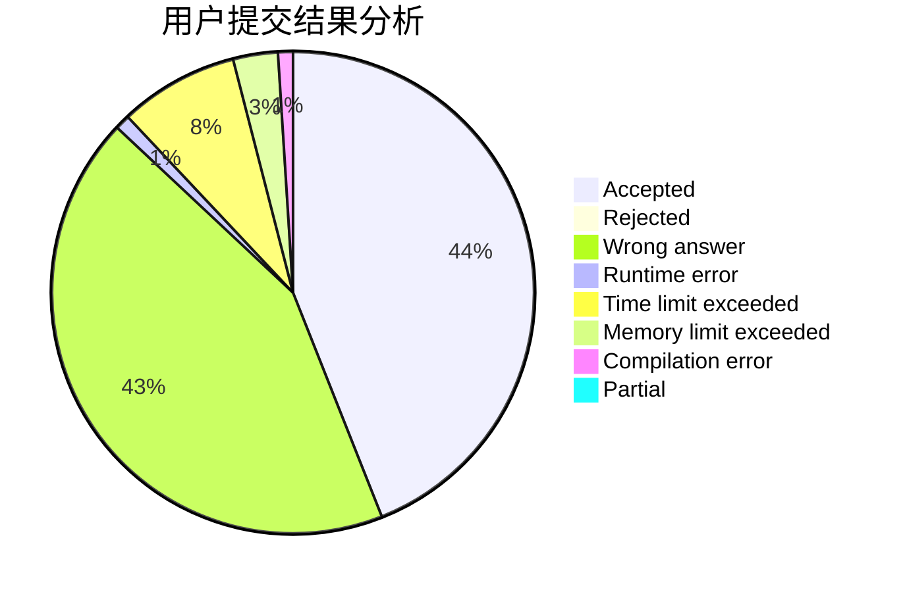
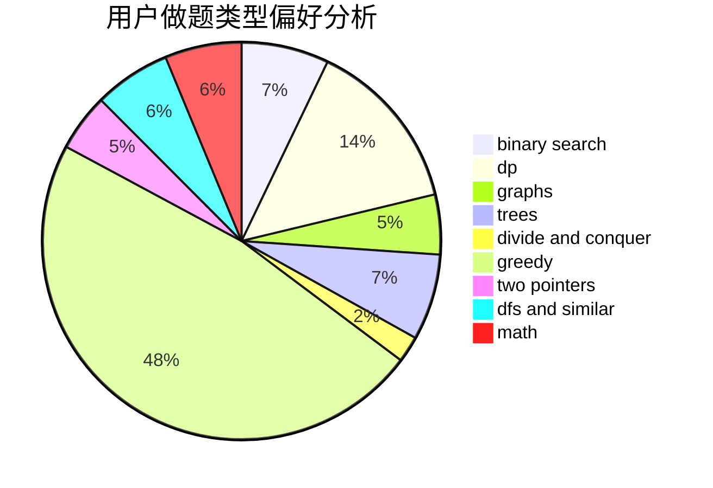

# Mazart_z

<!-- tabs:start -->

#### **用户提交结果分析**

#### **用户做题类型偏好分析**

<!-- tabs:end -->
# 推荐题目
[600C](https://codeforces.com/contest/600/problem/C)
[1215D](https://codeforces.com/contest/1215/problem/D)
[1428C](https://codeforces.com/contest/1428/problem/C)
[755G](https://codeforces.com/contest/755/problem/G)
[819A](https://codeforces.com/contest/819/problem/A)
[723C](https://codeforces.com/contest/723/problem/C)
[389B](https://codeforces.com/contest/389/problem/B)
[13577](https://codeforces.com/contest/1357/problem/7)
[51F](https://codeforces.com/contest/51/problem/F)
[1324C](https://codeforces.com/contest/1324/problem/C)
