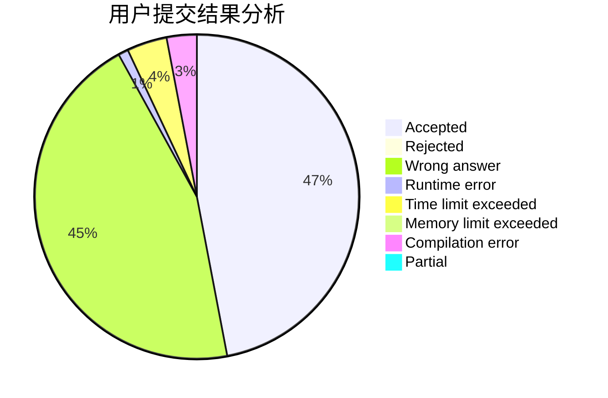
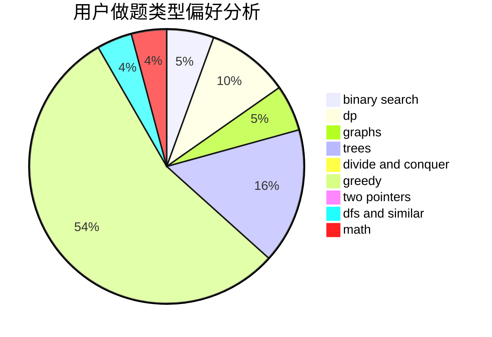

# Meguruuuuu

<!-- tabs:start -->

#### **用户提交结果分析**

#### **用户做题类型偏好分析**

<!-- tabs:end -->
# 推荐题目
[1324A](https://codeforces.com/contest/1324/problem/A)
[412D](https://codeforces.com/contest/412/problem/D)
[95A](https://codeforces.com/contest/95/problem/A)
[367B](https://codeforces.com/contest/367/problem/B)
[1070A](https://codeforces.com/contest/1070/problem/A)
[831A](https://codeforces.com/contest/831/problem/A)
[471D](https://codeforces.com/contest/471/problem/D)
[1156A](https://codeforces.com/contest/1156/problem/A)
[627E](https://codeforces.com/contest/627/problem/E)
[13573](https://codeforces.com/contest/1357/problem/3)
