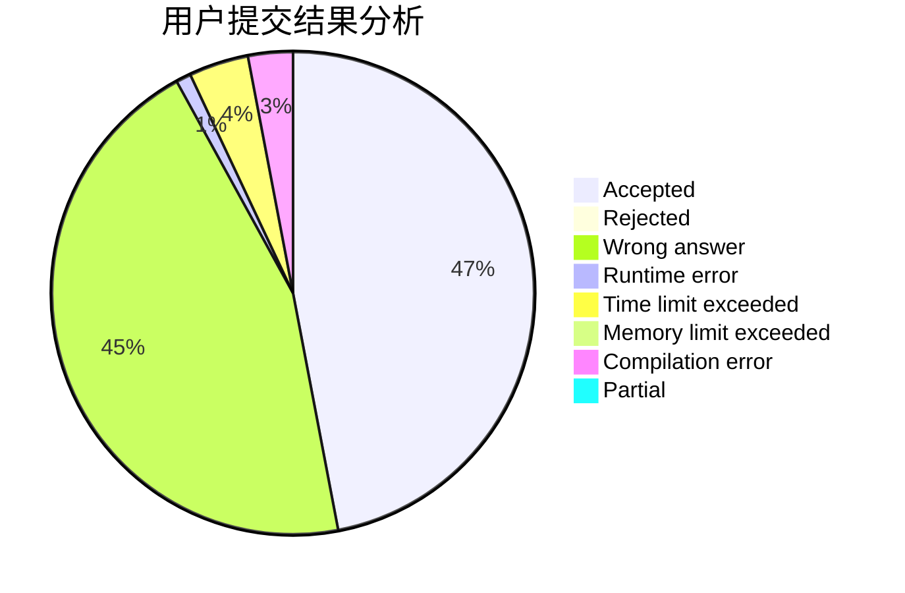
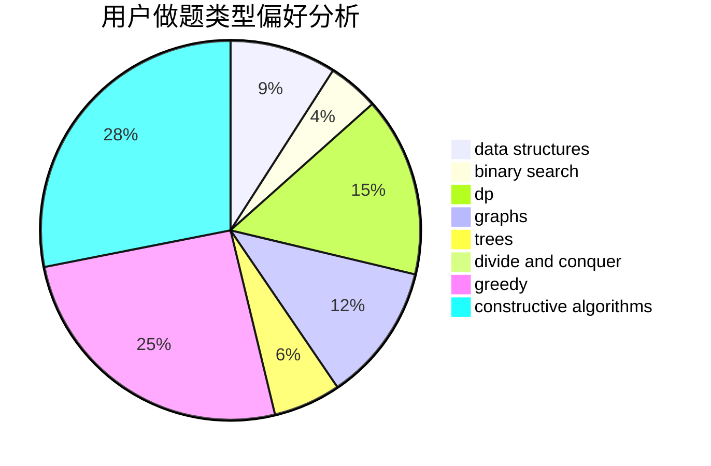
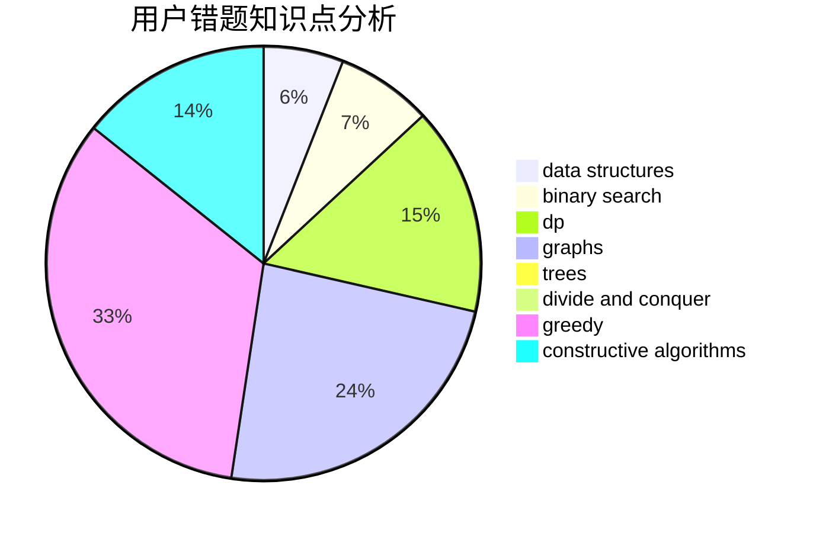

# Meguruuuuu

<!-- tabs:start -->

#### **用户提交结果分析**

#### **用户做题类型偏好分析**

#### **用户错题知识点分析**

<!-- tabs:end -->
# 推荐题目
[1314B](https://codeforces.com/contest/1314/problem/B)		dsu,graphs,sortings,trees		  
[380E](https://codeforces.com/contest/380/problem/E)		data structures		  
[938B](https://codeforces.com/contest/938/problem/B)		brute force,
                        greedy		  
[33A](https://codeforces.com/contest/33/problem/A)		greedy,
                        implementation		  
[106A](https://codeforces.com/contest/106/problem/A)		implementation		  
[812C](https://codeforces.com/contest/812/problem/C)		binary search,
                        sortings		  
[44E](https://codeforces.com/contest/44/problem/E)		dp		  
[1154A](https://codeforces.com/contest/1154/problem/A)		math		  
[608D](https://codeforces.com/contest/608/problem/D)		dsu,graphs,sortings,trees		  
[134B](https://codeforces.com/contest/134/problem/B)		brute force,
                        dfs and similar,
                        math,
                        number theory		  
