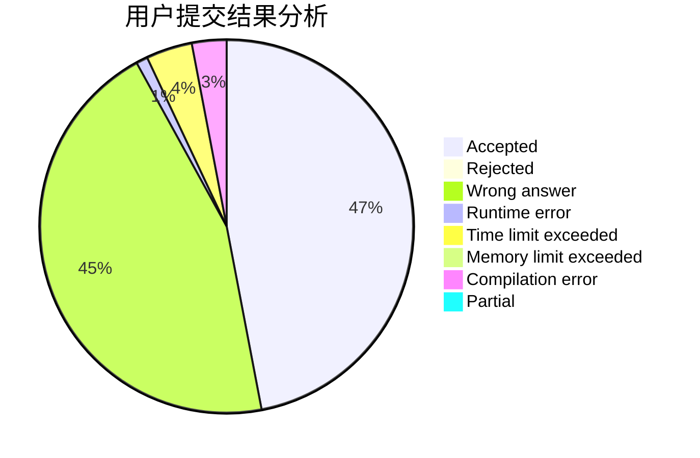
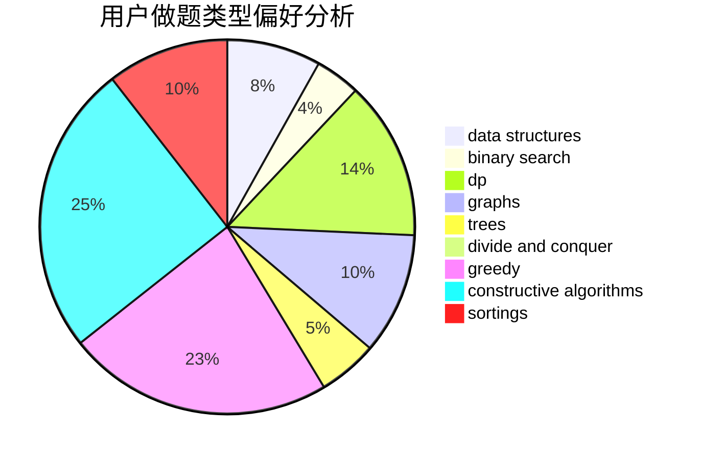
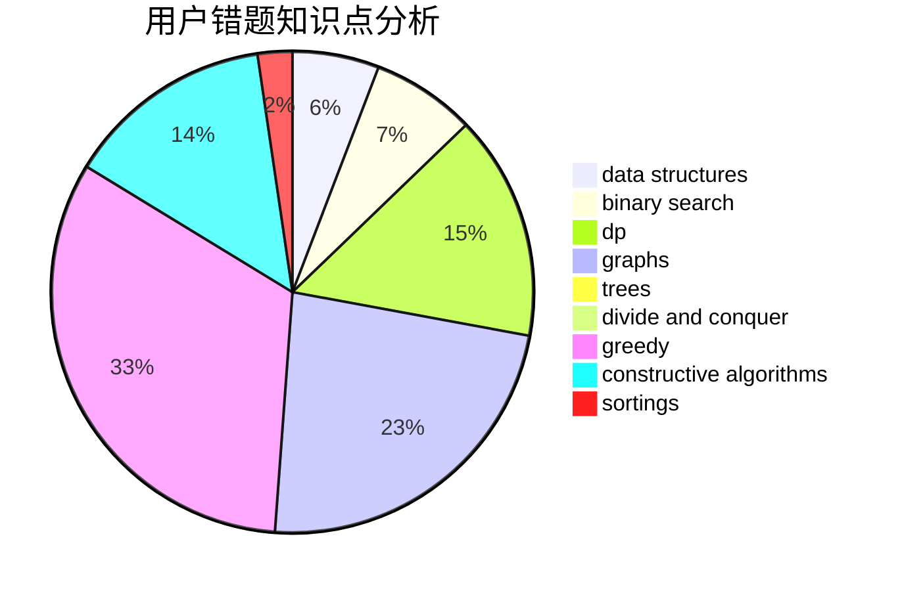

# Meguruuuuu
<!-- tabs:start -->
#### **用户提交结果分析**

#### **用户做题类型偏好分析**

#### **用户错题知识点分析**

<!-- tabs:end -->
# 推荐题目
[160D](http://codeforces.com/problemset/problem/160/D)		dfs and similar,
                        dsu,
                        graphs,
                        sortings		  
[193D](http://codeforces.com/problemset/problem/193/D)		data structures		  
[47B](http://codeforces.com/problemset/problem/47/B)		implementation		  
[938B](http://codeforces.com/problemset/problem/938/B)		brute force,
                        greedy		  
[134B](http://codeforces.com/problemset/problem/134/B)		brute force,
                        dfs and similar,
                        math,
                        number theory		  
[33A](http://codeforces.com/problemset/problem/33/A)		greedy,
                        implementation		  
[380E](http://codeforces.com/problemset/problem/380/E)		data structures		  
[608D](https://codeforces.com/contest/608/problem/D)		dp		  
[44E](http://codeforces.com/problemset/problem/44/E)		dp		  
[1358D](http://codeforces.com/problemset/problem/1358/D)		binary search,
                        brute force,
                        greedy,
                        implementation,
                        two pointers		  
<!-- tabs:start -->
#### **data structures**
[193D](http://codeforces.com/problemset/problem/193/D)		data structures		  
[380E](http://codeforces.com/problemset/problem/380/E)		data structures		  
[780G](http://codeforces.com/problemset/problem/780/G)		data structures,
                        dp		  
[359D](http://codeforces.com/problemset/problem/359/D)		binary search,
                        brute force,
                        data structures,
                        math,
                        two pointers		  
[616D](http://codeforces.com/problemset/problem/616/D)		binary search,
                        data structures,
                        two pointers		  
[1296E2](http://codeforces.com/problemset/problem/1296/E2)		data structures,
                        dp		  
[1492C](http://codeforces.com/problemset/problem/1492/C)		binary search,
                        data structures,
                        dp,
                        greedy,
                        two pointers		  
[1490G](http://codeforces.com/problemset/problem/1490/G)		binary search,
                        data structures,
                        math		  
[1479D](http://codeforces.com/problemset/problem/1479/D)		binary search,
                        bitmasks,
                        brute force,
                        data structures,
                        probabilities,
                        trees		  
[1497A](http://codeforces.com/problemset/problem/1497/A)		brute force,
                        data structures,
                        greedy,
                        sortings		  
#### **binary search**
[1358D](http://codeforces.com/problemset/problem/1358/D)		binary search,
                        brute force,
                        greedy,
                        implementation,
                        two pointers		  
[812C](http://codeforces.com/problemset/problem/812/C)		binary search,
                        sortings		  
[166A](http://codeforces.com/problemset/problem/166/A)		binary search,
                        implementation,
                        sortings		  
[359D](http://codeforces.com/problemset/problem/359/D)		binary search,
                        brute force,
                        data structures,
                        math,
                        two pointers		  
[623C](http://codeforces.com/problemset/problem/623/C)		binary search,
                        dp		  
[616D](http://codeforces.com/problemset/problem/616/D)		binary search,
                        data structures,
                        two pointers		  
[1486E](http://codeforces.com/problemset/problem/1486/E)		binary search,
                        brute force,
                        constructive algorithms,
                        dp,
                        flows,
                        graphs,
                        shortest paths		  
[1492C](http://codeforces.com/problemset/problem/1492/C)		binary search,
                        data structures,
                        dp,
                        greedy,
                        two pointers		  
[1463D](http://codeforces.com/problemset/problem/1463/D)		binary search,
                        constructive algorithms,
                        greedy,
                        two pointers		  
[1490G](http://codeforces.com/problemset/problem/1490/G)		binary search,
                        data structures,
                        math		  
#### **dp**
[608D](https://codeforces.com/contest/608/problem/D)		dp		  
[44E](http://codeforces.com/problemset/problem/44/E)		dp		  
[1314B](https://codeforces.com/contest/1314/problem/B)		dp,
                        implementation		  
[780G](http://codeforces.com/problemset/problem/780/G)		data structures,
                        dp		  
[232E](http://codeforces.com/problemset/problem/232/E)		bitmasks,
                        divide and conquer,
                        dp		  
[1032F](http://codeforces.com/problemset/problem/1032/F)		dp,
                        trees		  
[1096G](http://codeforces.com/problemset/problem/1096/G)		divide and conquer,
                        dp,
                        fft		  
[623C](http://codeforces.com/problemset/problem/623/C)		binary search,
                        dp		  
[1486E](http://codeforces.com/problemset/problem/1486/E)		binary search,
                        brute force,
                        constructive algorithms,
                        dp,
                        flows,
                        graphs,
                        shortest paths		  
[1296E2](http://codeforces.com/problemset/problem/1296/E2)		data structures,
                        dp		  
#### **graph**
[160D](http://codeforces.com/problemset/problem/160/D)		dfs and similar,
                        dsu,
                        graphs,
                        sortings		  
[1146C](http://codeforces.com/problemset/problem/1146/C)		bitmasks,
                        graphs,
                        interactive		  
[29E](http://codeforces.com/problemset/problem/29/E)		graphs,
                        shortest paths		  
[218C](https://codeforces.com/contest/218/problem/C)		brute force,
                        dfs and similar,
                        dsu,
                        graphs		  
[1486E](http://codeforces.com/problemset/problem/1486/E)		binary search,
                        brute force,
                        constructive algorithms,
                        dp,
                        flows,
                        graphs,
                        shortest paths		  
[1133F1](http://codeforces.com/problemset/problem/1133/F1)		graphs		  
[1428B](http://codeforces.com/problemset/problem/1428/B)		graphs,
                        implementation		  
[1487C](http://codeforces.com/problemset/problem/1487/C)		brute force,
                        constructive algorithms,
                        dfs and similar,
                        graphs,
                        greedy,
                        implementation,
                        math		  
[1437C](http://codeforces.com/problemset/problem/1437/C)		dp,
                        flows,
                        graph matchings,
                        greedy,
                        math,
                        sortings		  
[1470D](http://codeforces.com/problemset/problem/1470/D)		constructive algorithms,
                        dfs and similar,
                        graph matchings,
                        graphs,
                        greedy		  
#### **trees**
[1214H](http://codeforces.com/problemset/problem/1214/H)		constructive algorithms,
                        dfs and similar,
                        trees		  
[1032F](http://codeforces.com/problemset/problem/1032/F)		dp,
                        trees		  
[913B](http://codeforces.com/problemset/problem/913/B)		implementation,
                        trees		  
[1479D](http://codeforces.com/problemset/problem/1479/D)		binary search,
                        bitmasks,
                        brute force,
                        data structures,
                        probabilities,
                        trees		  
[1511C](http://codeforces.com/problemset/problem/1511/C)		brute force,
                        data structures,
                        implementation,
                        trees		  
[1499F](http://codeforces.com/problemset/problem/1499/F)		combinatorics,
                        dfs and similar,
                        dp,
                        trees		  
[1491E](http://codeforces.com/problemset/problem/1491/E)		brute force,
                        dfs and similar,
                        divide and conquer,
                        number theory,
                        trees		  
[1466D](http://codeforces.com/problemset/problem/1466/D)		data structures,
                        greedy,
                        sortings,
                        trees		  
[1495D](http://codeforces.com/problemset/problem/1495/D)		combinatorics,
                        dfs and similar,
                        graphs,
                        math,
                        shortest paths,
                        trees		  
[1303G](http://codeforces.com/problemset/problem/1303/G)		data structures,
                        divide and conquer,
                        geometry,
                        trees		  
#### **divide and conquer**
[232E](http://codeforces.com/problemset/problem/232/E)		bitmasks,
                        divide and conquer,
                        dp		  
[1096G](http://codeforces.com/problemset/problem/1096/G)		divide and conquer,
                        dp,
                        fft		  
[1461D](http://codeforces.com/problemset/problem/1461/D)		binary search,
                        brute force,
                        data structures,
                        divide and conquer,
                        implementation,
                        sortings		  
[1466G](http://codeforces.com/problemset/problem/1466/G)		combinatorics,
                        divide and conquer,
                        hashing,
                        math,
                        string suffix structures,
                        strings		  
[1490D](http://codeforces.com/problemset/problem/1490/D)		dfs and similar,
                        divide and conquer,
                        implementation		  
[1483C](https://codeforces.com/contest/1483/problem/C)		data structures,
                        divide and conquer,
                        dp		  
[1491E](http://codeforces.com/problemset/problem/1491/E)		brute force,
                        dfs and similar,
                        divide and conquer,
                        number theory,
                        trees		  
[1303G](http://codeforces.com/problemset/problem/1303/G)		data structures,
                        divide and conquer,
                        geometry,
                        trees		  
[1494D](http://codeforces.com/problemset/problem/1494/D)		constructive algorithms,
                        data structures,
                        dfs and similar,
                        divide and conquer,
                        dsu,
                        greedy,
                        sortings,
                        trees		  
[1482E](http://codeforces.com/problemset/problem/1482/E)		data structures,
                        divide and conquer,
                        dp		  
#### **greedy**
[938B](http://codeforces.com/problemset/problem/938/B)		brute force,
                        greedy		  
[33A](http://codeforces.com/problemset/problem/33/A)		greedy,
                        implementation		  
[1358D](http://codeforces.com/problemset/problem/1358/D)		binary search,
                        brute force,
                        greedy,
                        implementation,
                        two pointers		  
[898D](http://codeforces.com/problemset/problem/898/D)		greedy		  
[1017C](http://codeforces.com/problemset/problem/1017/C)		constructive algorithms,
                        greedy		  
[790A](https://codeforces.com/contest/790/problem/A)		constructive algorithms,
                        greedy		  
[1396B](http://codeforces.com/problemset/problem/1396/B)		brute force,
                        constructive algorithms,
                        games,
                        greedy		  
[1463B](http://codeforces.com/problemset/problem/1463/B)		bitmasks,
                        constructive algorithms,
                        greedy		  
[1492C](http://codeforces.com/problemset/problem/1492/C)		binary search,
                        data structures,
                        dp,
                        greedy,
                        two pointers		  
[1496C](https://codeforces.com/contest/1496/problem/C)		geometry,
                        greedy,
                        math,
                        sortings		  
#### **constructive algorithms**
[497A](https://codeforces.com/contest/497/problem/A)		brute force,
                        constructive algorithms,
                        implementation		  
[1214H](http://codeforces.com/problemset/problem/1214/H)		constructive algorithms,
                        dfs and similar,
                        trees		  
[1287E1](https://codeforces.com/contest/1287/problem/E1)		brute force,
                        constructive algorithms,
                        interactive,
                        math		  
[1017C](http://codeforces.com/problemset/problem/1017/C)		constructive algorithms,
                        greedy		  
[632B](http://codeforces.com/problemset/problem/632/B)		brute force,
                        constructive algorithms		  
[790A](https://codeforces.com/contest/790/problem/A)		constructive algorithms,
                        greedy		  
[1486E](http://codeforces.com/problemset/problem/1486/E)		binary search,
                        brute force,
                        constructive algorithms,
                        dp,
                        flows,
                        graphs,
                        shortest paths		  
[1396B](http://codeforces.com/problemset/problem/1396/B)		brute force,
                        constructive algorithms,
                        games,
                        greedy		  
[1463B](http://codeforces.com/problemset/problem/1463/B)		bitmasks,
                        constructive algorithms,
                        greedy		  
[1493A](http://codeforces.com/problemset/problem/1493/A)		constructive algorithms,
                        greedy		  
#### **sortings**
[160D](http://codeforces.com/problemset/problem/160/D)		dfs and similar,
                        dsu,
                        graphs,
                        sortings		  
[812C](http://codeforces.com/problemset/problem/812/C)		binary search,
                        sortings		  
[166A](http://codeforces.com/problemset/problem/166/A)		binary search,
                        implementation,
                        sortings		  
[1496C](https://codeforces.com/contest/1496/problem/C)		geometry,
                        greedy,
                        math,
                        sortings		  
[1495A](http://codeforces.com/problemset/problem/1495/A)		geometry,
                        greedy,
                        math,
                        sortings		  
[1497A](http://codeforces.com/problemset/problem/1497/A)		brute force,
                        data structures,
                        greedy,
                        sortings		  
[1427A](http://codeforces.com/problemset/problem/1427/A)		math,
                        sortings		  
[1461D](http://codeforces.com/problemset/problem/1461/D)		binary search,
                        brute force,
                        data structures,
                        divide and conquer,
                        implementation,
                        sortings		  
[1437C](http://codeforces.com/problemset/problem/1437/C)		dp,
                        flows,
                        graph matchings,
                        greedy,
                        math,
                        sortings		  
[1473A](http://codeforces.com/problemset/problem/1473/A)		greedy,
                        implementation,
                        math,
                        sortings		  
<!-- tabs:end -->
