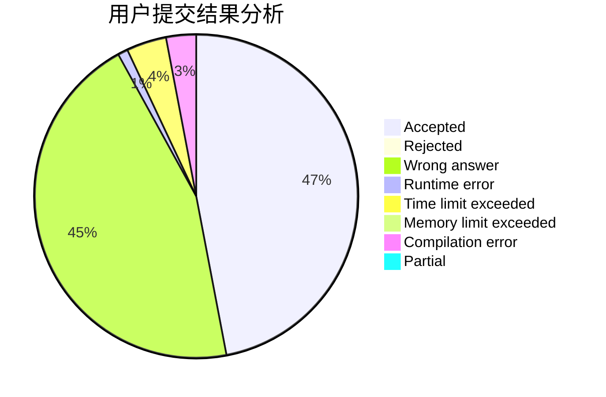
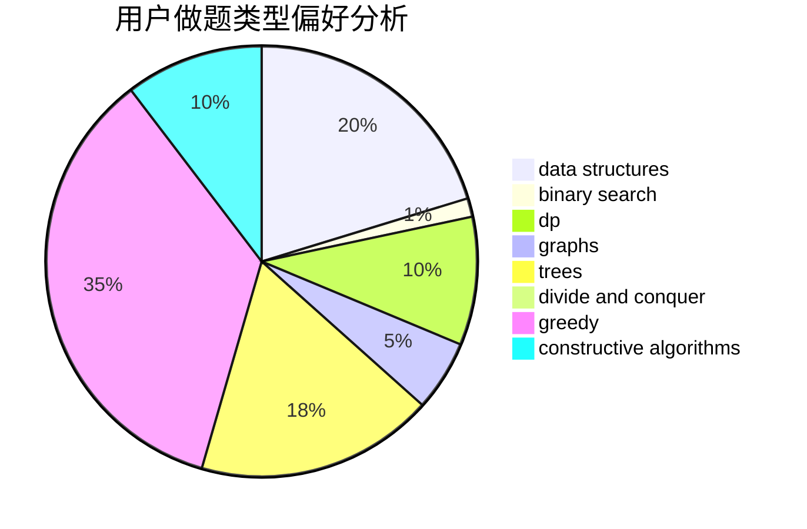
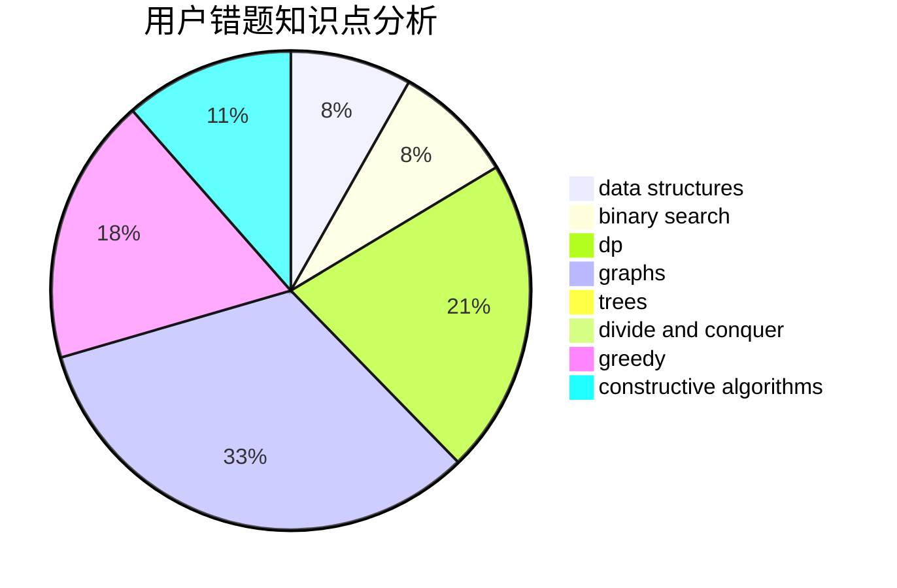

# Meguruuuuu

<!-- tabs:start -->

#### **用户提交结果分析**

#### **用户做题类型偏好分析**

#### **用户错题知识点分析**

<!-- tabs:end -->
# 推荐题目
[1324A](https://codeforces.com/contest/1324/problem/A)		implementation,
                        number theory		  
[412D](https://codeforces.com/contest/412/problem/D)		dfs and similar		  
[95A](https://codeforces.com/contest/95/problem/A)		implementation,
                        strings		  
[367B](https://codeforces.com/contest/367/problem/B)		binary search,
                        data structures		  
[1070A](https://codeforces.com/contest/1070/problem/A)		dp,
                        graphs,
                        number theory,
                        shortest paths		  
[831A](https://codeforces.com/contest/831/problem/A)		implementation		  
[471D](https://codeforces.com/contest/471/problem/D)		string suffix structures,
                        strings		  
[1156A](https://codeforces.com/contest/1156/problem/A)		geometry		  
[627E](https://codeforces.com/contest/627/problem/E)		two pointers		  
[13573](https://codeforces.com/contest/1357/problem/3)		dsu,graphs,sortings,trees		  
