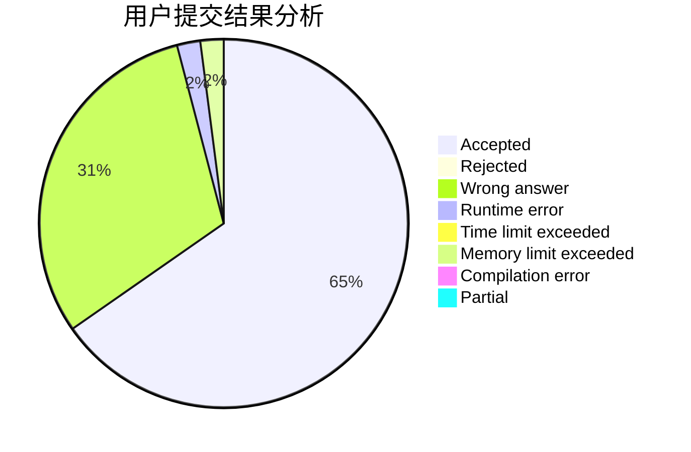
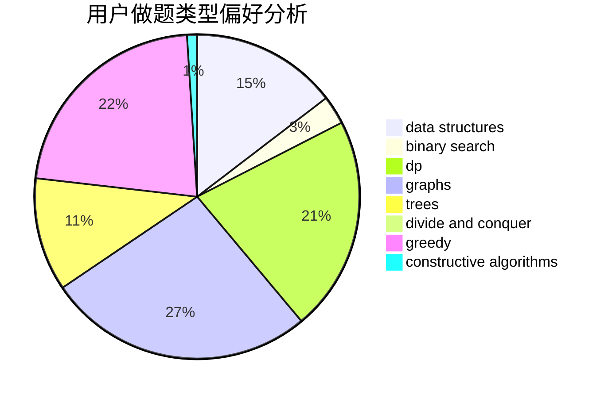
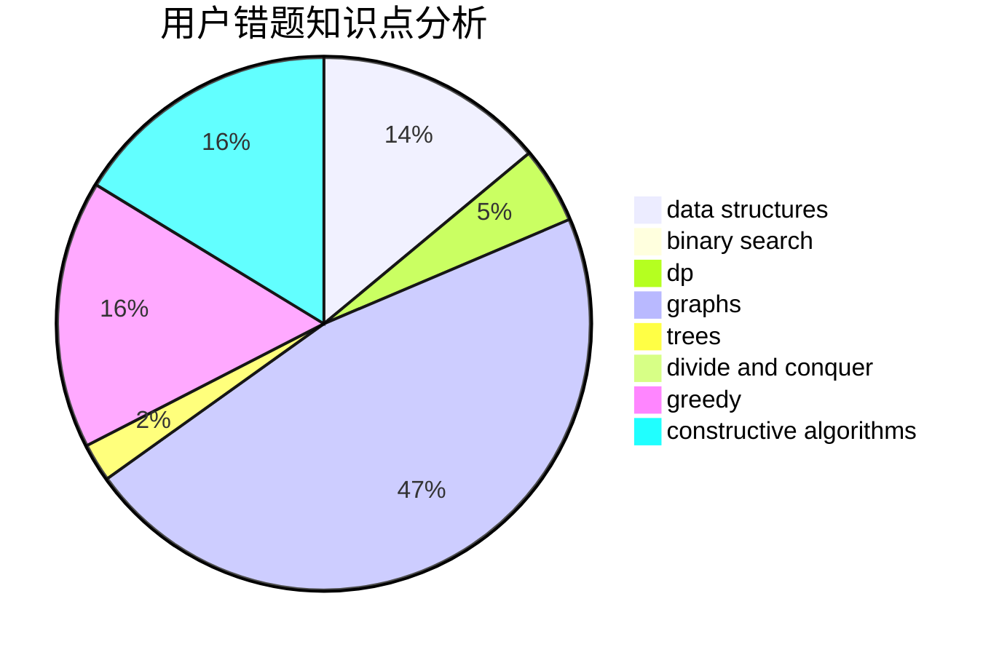

# Meronri

<!-- tabs:start -->

#### **用户提交结果分析**

#### **用户做题类型偏好分析**

#### **用户错题知识点分析**

<!-- tabs:end -->
# 推荐题目
[853C](https://codeforces.com/contest/853/problem/C)		data structures		  
[877F](https://codeforces.com/contest/877/problem/F)		data structures,
                        flows,
                        hashing		  
[1339C](https://codeforces.com/contest/1339/problem/C)		dsu,graphs,sortings,trees		  
[405A](https://codeforces.com/contest/405/problem/A)		greedy,
                        implementation,
                        sortings		  
[1107A](https://codeforces.com/contest/1107/problem/A)		greedy,
                        strings		  
[445B](https://codeforces.com/contest/445/problem/B)		dfs and similar,
                        dsu,
                        greedy		  
[113B](https://codeforces.com/contest/113/problem/B)		brute force,
                        data structures,
                        hashing,
                        strings		  
[444E](https://codeforces.com/contest/444/problem/E)		binary search,
                        dsu,
                        trees		  
[29B](https://codeforces.com/contest/29/problem/B)		implementation		  
[1051F](https://codeforces.com/contest/1051/problem/F)		graphs,
                        shortest paths,
                        trees		  
