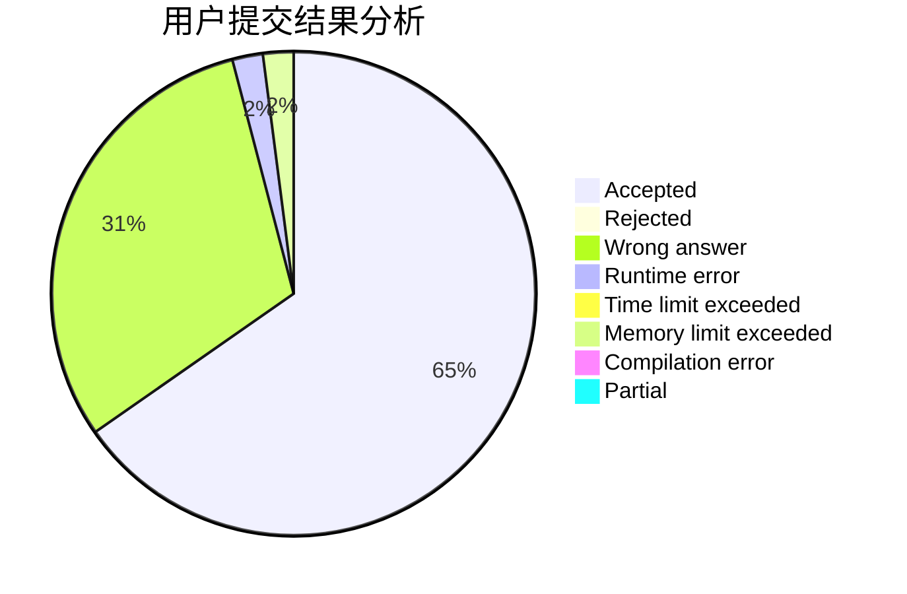
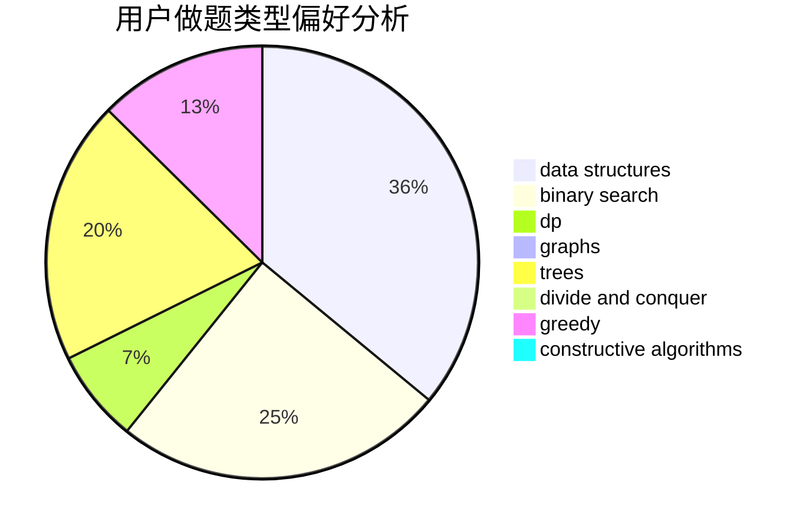
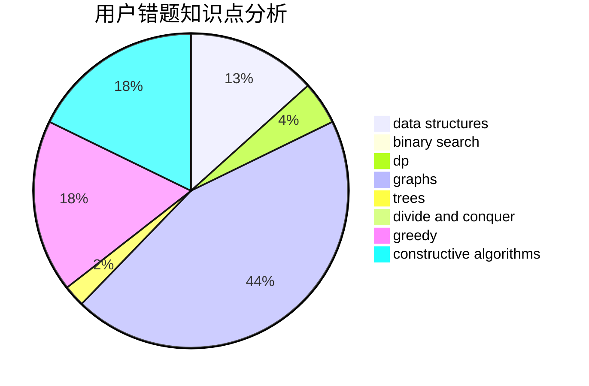

# Meronri

<!-- tabs:start -->

#### **用户提交结果分析**

#### **用户做题类型偏好分析**

#### **用户错题知识点分析**

<!-- tabs:end -->
# 推荐题目
[835E](https://codeforces.com/contest/835/problem/E)		binary search,
                        constructive algorithms,
                        interactive		  
[85E](https://codeforces.com/contest/85/problem/E)		binary search,
                        dsu,
                        geometry,
                        graphs,
                        sortings		  
[1332F](https://codeforces.com/contest/1332/problem/F)		dfs and similar,
                        dp,
                        trees		  
[376B](https://codeforces.com/contest/376/problem/B)		implementation		  
[1106D](https://codeforces.com/contest/1106/problem/D)		data structures,
                        dfs and similar,
                        graphs,
                        greedy,
                        shortest paths		  
[41D](https://codeforces.com/contest/41/problem/D)		dp		  
[1137F](https://codeforces.com/contest/1137/problem/F)		data structures,
                        trees		  
[41A](https://codeforces.com/contest/41/problem/A)		implementation,
                        strings		  
[283B](https://codeforces.com/contest/283/problem/B)		dfs and similar,
                        dp,
                        graphs		  
[1051C](https://codeforces.com/contest/1051/problem/C)		brute force,
                        dp,
                        greedy,
                        implementation,
                        math		  
