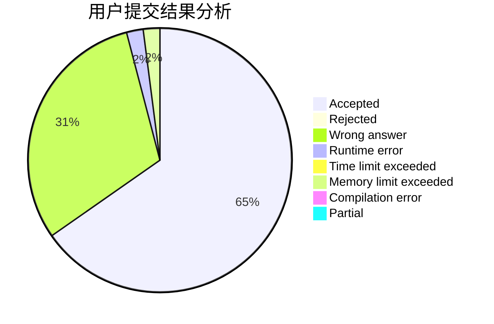
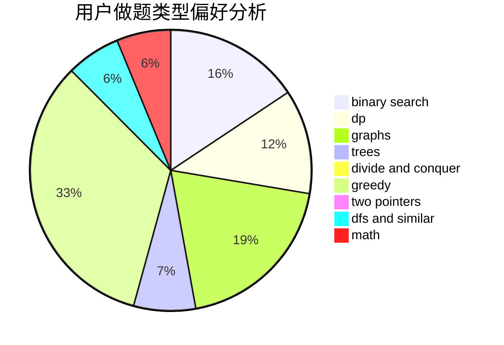

# Meronri

<!-- tabs:start -->

#### **用户提交结果分析**

#### **用户做题类型偏好分析**

<!-- tabs:end -->
# 推荐题目
[853C](https://codeforces.com/contest/853/problem/C)
[877F](https://codeforces.com/contest/877/problem/F)
[1339C](https://codeforces.com/contest/1339/problem/C)
[405A](https://codeforces.com/contest/405/problem/A)
[1107A](https://codeforces.com/contest/1107/problem/A)
[445B](https://codeforces.com/contest/445/problem/B)
[113B](https://codeforces.com/contest/113/problem/B)
[444E](https://codeforces.com/contest/444/problem/E)
[29B](https://codeforces.com/contest/29/problem/B)
[1051F](https://codeforces.com/contest/1051/problem/F)
