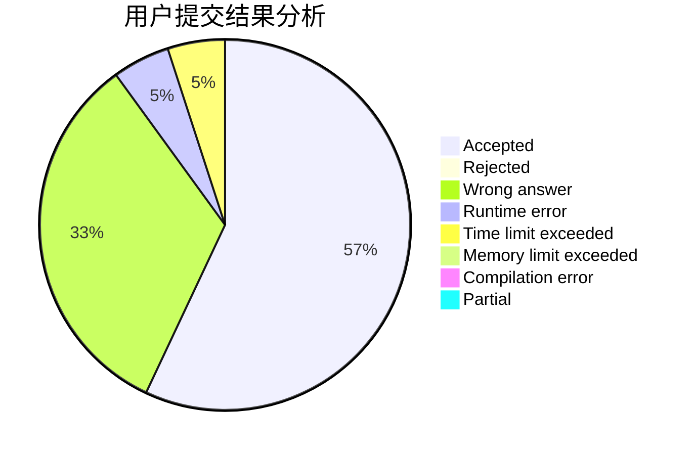
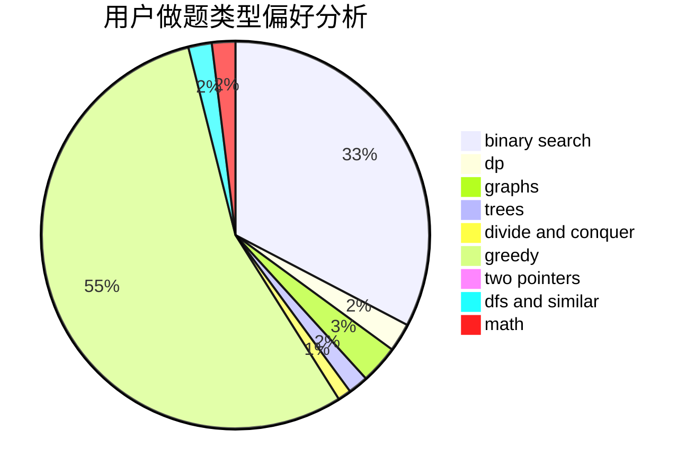

# Meternal

<!-- tabs:start -->

#### **用户提交结果分析**

#### **用户做题类型偏好分析**

<!-- tabs:end -->
# 推荐题目
[691E](https://codeforces.com/contest/691/problem/E)
[962A](https://codeforces.com/contest/962/problem/A)
[1091H](https://codeforces.com/contest/1091/problem/H)
[981G](https://codeforces.com/contest/981/problem/G)
[936B](https://codeforces.com/contest/936/problem/B)
[678F](https://codeforces.com/contest/678/problem/F)
[13A](https://codeforces.com/contest/13/problem/A)
[46F](https://codeforces.com/contest/46/problem/F)
[41E](https://codeforces.com/contest/41/problem/E)
[1217B](https://codeforces.com/contest/1217/problem/B)
