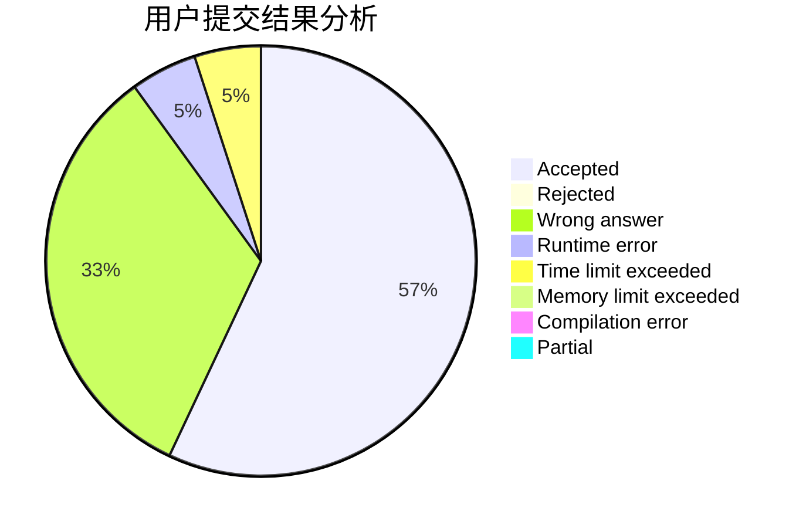
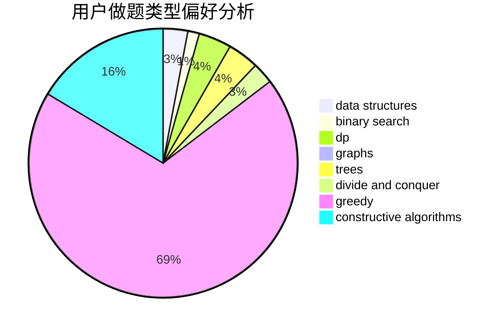

# Meternal

<!-- tabs:start -->

#### **用户提交结果分析**

#### **用户做题类型偏好分析**

#### **用户错题知识点分析**

<!-- tabs:end -->
# 推荐题目
[670A](https://codeforces.com/contest/670/problem/A)		brute force,
                        constructive algorithms,
                        greedy,
                        math		  
[940D](https://codeforces.com/contest/940/problem/D)		binary search,
                        implementation		  
[1091E](https://codeforces.com/contest/1091/problem/E)		binary search,
                        data structures,
                        graphs,
                        greedy,
                        implementation,
                        math,
                        sortings		  
[95E](https://codeforces.com/contest/95/problem/E)		dp,
                        dsu,
                        graphs		  
[916B](https://codeforces.com/contest/916/problem/B)		bitmasks,
                        greedy,
                        math		  
[656F](https://codeforces.com/contest/656/problem/F)		*special problem		  
[1391D](https://codeforces.com/contest/1391/problem/D)		bitmasks,
                        brute force,
                        constructive algorithms,
                        dp,
                        greedy,
                        implementation		  
[44A](https://codeforces.com/contest/44/problem/A)		implementation		  
[38G](https://codeforces.com/contest/38/problem/G)		data structures		  
[1211B](https://codeforces.com/contest/1211/problem/B)		*special problem,
                        implementation		  
