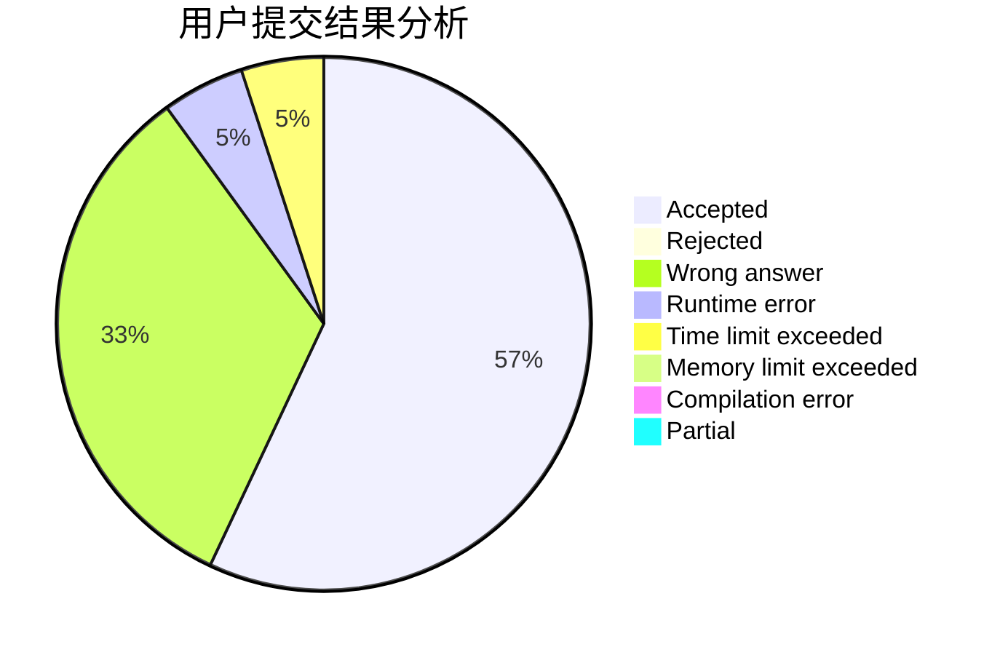
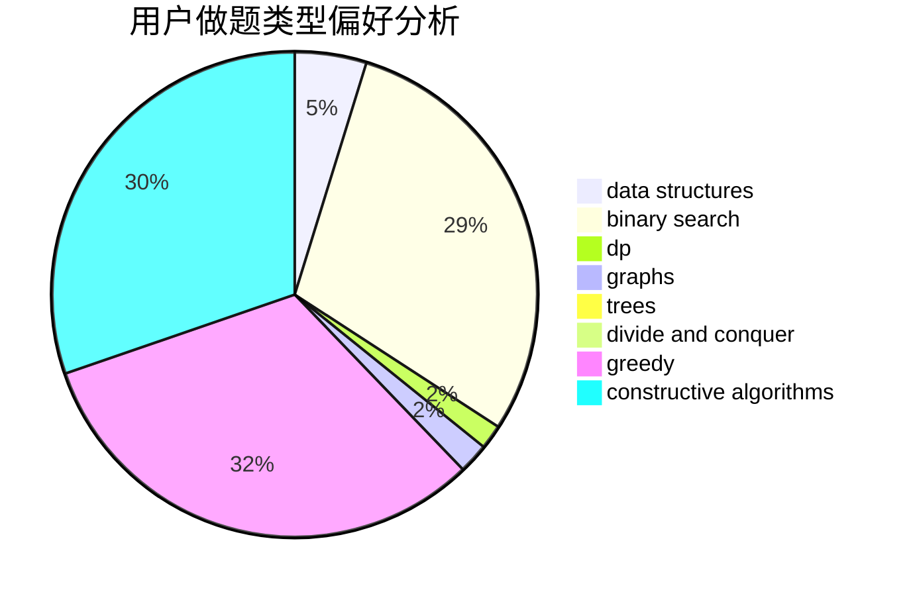
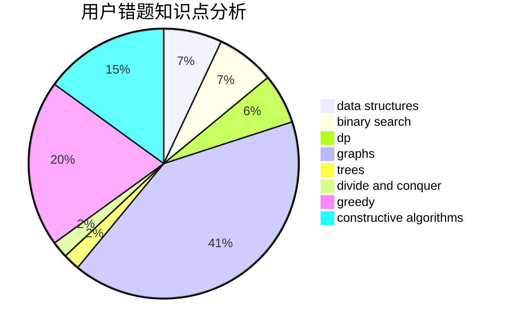

# Meternal

<!-- tabs:start -->

#### **用户提交结果分析**

#### **用户做题类型偏好分析**

#### **用户错题知识点分析**

<!-- tabs:end -->
# 推荐题目
[691E](https://codeforces.com/contest/691/problem/E)		matrices		  
[962A](https://codeforces.com/contest/962/problem/A)		implementation		  
[1091H](https://codeforces.com/contest/1091/problem/H)		games		  
[981G](https://codeforces.com/contest/981/problem/G)		data structures		  
[936B](https://codeforces.com/contest/936/problem/B)		dfs and similar,
                        dp,
                        games,
                        graphs		  
[678F](https://codeforces.com/contest/678/problem/F)		data structures,
                        divide and conquer,
                        geometry		  
[13A](https://codeforces.com/contest/13/problem/A)		implementation,
                        math		  
[46F](https://codeforces.com/contest/46/problem/F)		dsu,
                        graphs		  
[41E](https://codeforces.com/contest/41/problem/E)		constructive algorithms,
                        graphs,
                        greedy		  
[1217B](https://codeforces.com/contest/1217/problem/B)		greedy,
                        math		  
