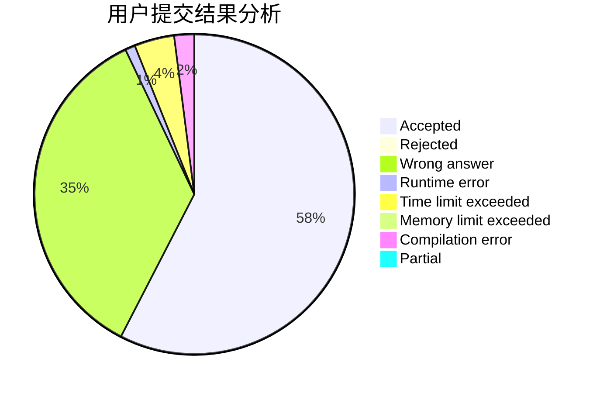
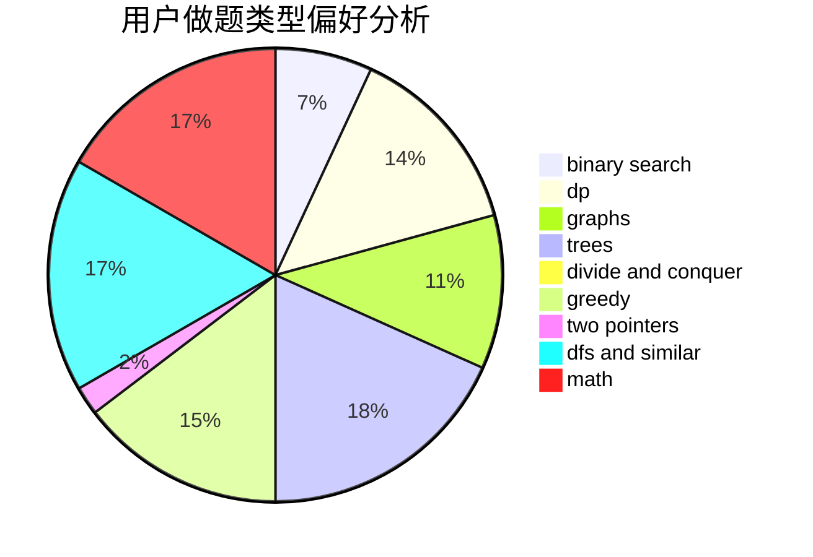

# Meul

<!-- tabs:start -->

#### **用户提交结果分析**

#### **用户做题类型偏好分析**

<!-- tabs:end -->
# 推荐题目
[1053B](https://codeforces.com/contest/1053/problem/B)
[607E](https://codeforces.com/contest/607/problem/E)
[23B](https://codeforces.com/contest/23/problem/B)
[618A](https://codeforces.com/contest/618/problem/A)
[462E](https://codeforces.com/contest/462/problem/E)
[11C](https://codeforces.com/contest/11/problem/C)
[617E](https://codeforces.com/contest/617/problem/E)
[801B](https://codeforces.com/contest/801/problem/B)
[1276B](https://codeforces.com/contest/1276/problem/B)
[261E](https://codeforces.com/contest/261/problem/E)
