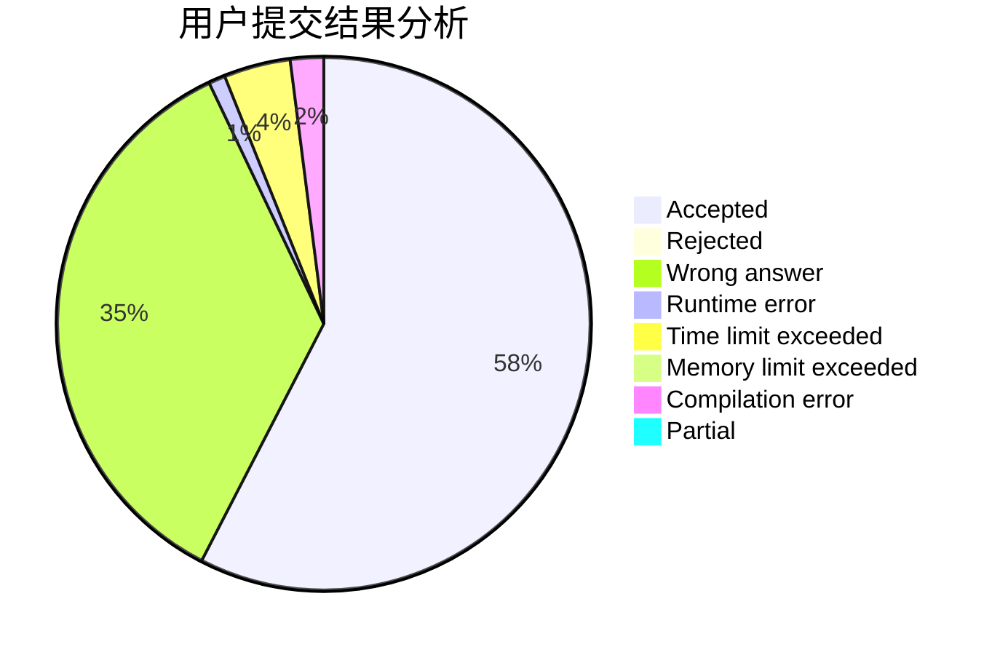
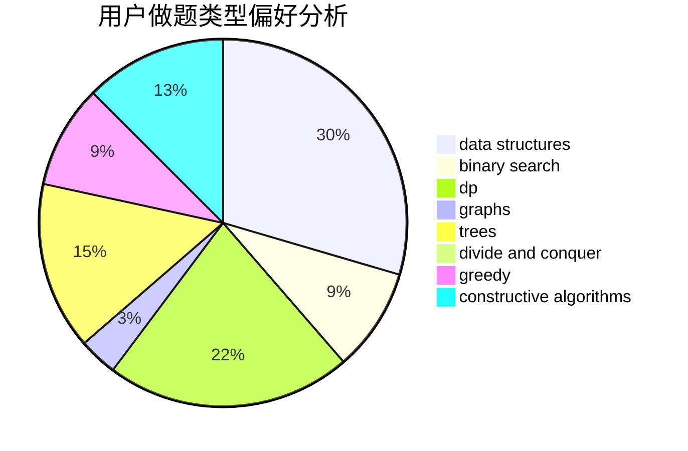
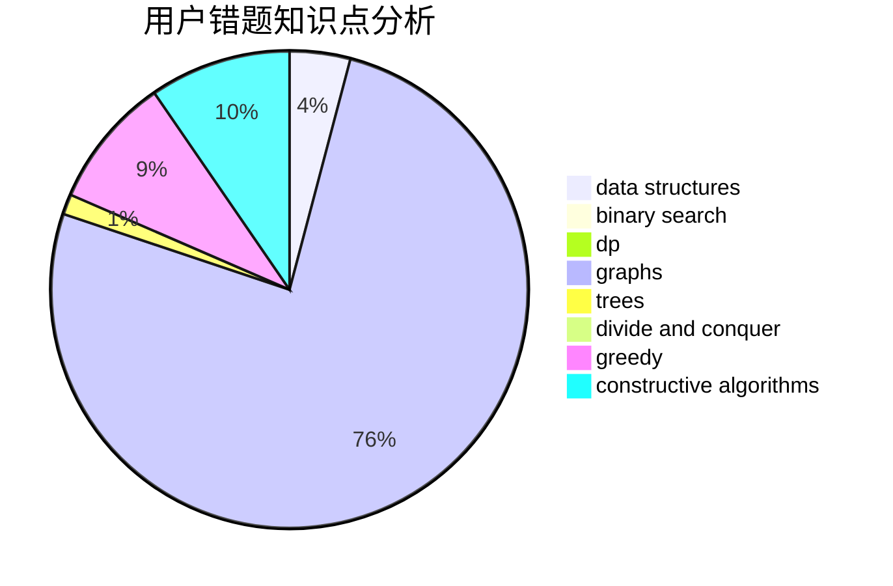

# Meul

<!-- tabs:start -->

#### **用户提交结果分析**

#### **用户做题类型偏好分析**

#### **用户错题知识点分析**

<!-- tabs:end -->
# 推荐题目
[1053B](https://codeforces.com/contest/1053/problem/B)		dsu,graphs,sortings,trees		  
[607E](https://codeforces.com/contest/607/problem/E)		binary search,
                        geometry		  
[23B](https://codeforces.com/contest/23/problem/B)		constructive algorithms,
                        graphs,
                        math		  
[618A](https://codeforces.com/contest/618/problem/A)		implementation		  
[462E](https://codeforces.com/contest/462/problem/E)		dsu,graphs,sortings,trees		  
[11C](https://codeforces.com/contest/11/problem/C)		implementation		  
[617E](https://codeforces.com/contest/617/problem/E)		data structures		  
[801B](https://codeforces.com/contest/801/problem/B)		constructive algorithms,
                        greedy,
                        strings		  
[1276B](https://codeforces.com/contest/1276/problem/B)		combinatorics,
                        dfs and similar,
                        dsu,
                        graphs		  
[261E](https://codeforces.com/contest/261/problem/E)		brute force,
                        dp,
                        two pointers		  
