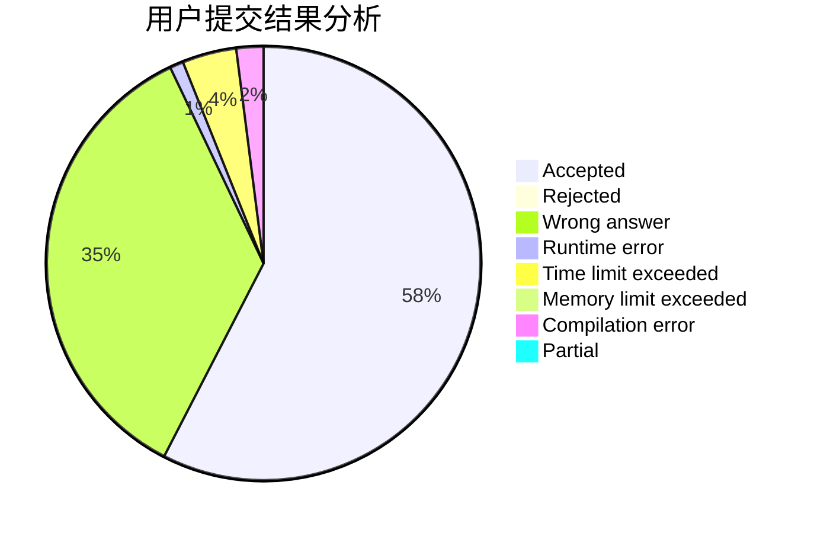
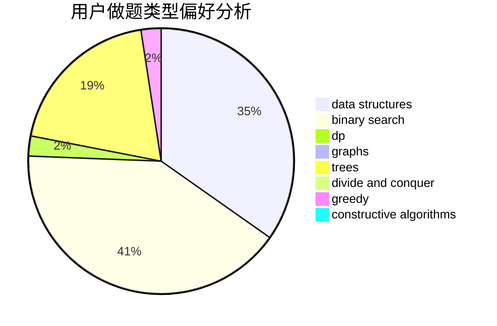
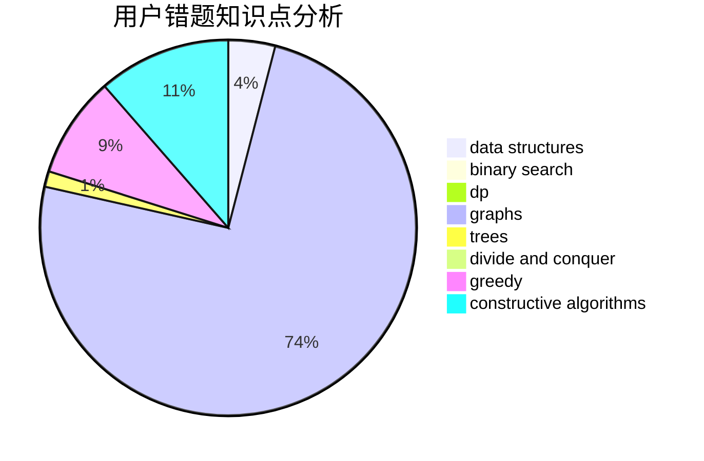

# Meul

<!-- tabs:start -->

#### **用户提交结果分析**

#### **用户做题类型偏好分析**

#### **用户错题知识点分析**

<!-- tabs:end -->
# 推荐题目
[1051F](https://codeforces.com/contest/1051/problem/F)		graphs,
                        shortest paths,
                        trees		  
[587D](https://codeforces.com/contest/587/problem/D)		2-sat,
                        binary search		  
[21D](https://codeforces.com/contest/21/problem/D)		bitmasks,
                        graph matchings,
                        graphs		  
[599E](https://codeforces.com/contest/599/problem/E)		bitmasks,
                        dp,
                        trees		  
[442B](https://codeforces.com/contest/442/problem/B)		greedy,
                        math,
                        probabilities		  
[1196B](https://codeforces.com/contest/1196/problem/B)		constructive algorithms,
                        math		  
[599D](https://codeforces.com/contest/599/problem/D)		brute force,
                        math		  
[784B](https://codeforces.com/contest/784/problem/B)		*special problem		  
[1267F](https://codeforces.com/contest/1267/problem/F)		graphs		  
[241B](https://codeforces.com/contest/241/problem/B)		binary search,
                        bitmasks,
                        data structures,
                        math		  
