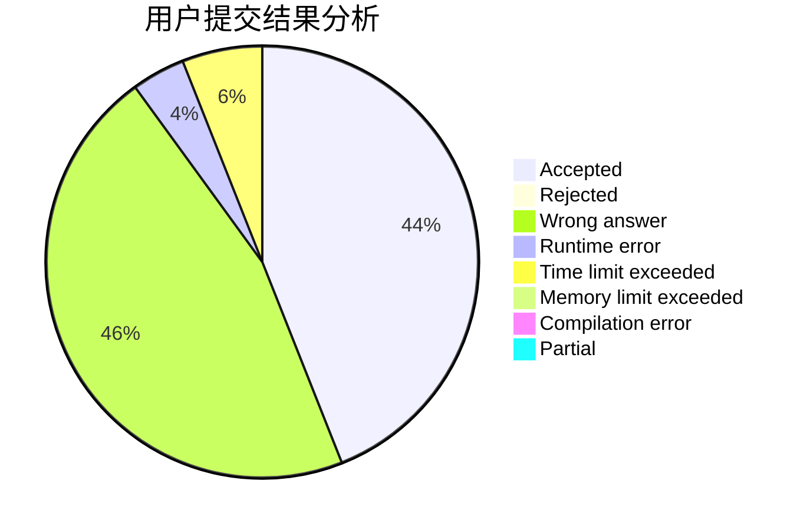
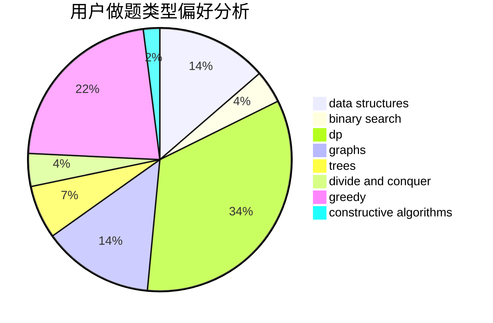

# Michael_Li_Bryant

<!-- tabs:start -->

#### **用户提交结果分析**

#### **用户做题类型偏好分析**

#### **用户错题知识点分析**

<!-- tabs:end -->
# 推荐题目
[1461D](https://codeforces.com/contest/1461/problem/D)		binary search,
                        brute force,
                        data structures,
                        divide and conquer,
                        implementation,
                        sortings		  
[1300E](https://codeforces.com/contest/1300/problem/E)		dsu,graphs,sortings,trees		  
[25E](https://codeforces.com/contest/25/problem/E)		hashing,
                        strings		  
[690D1](https://codeforces.com/contest/690D/problem/1)		nan		  
[1466G](https://codeforces.com/contest/1466/problem/G)		combinatorics,
                        divide and conquer,
                        hashing,
                        math,
                        string suffix structures,
                        strings		  
[501E](https://codeforces.com/contest/501/problem/E)		binary search,
                        combinatorics,
                        implementation		  
[1162D](https://codeforces.com/contest/1162/problem/D)		dsu,graphs,sortings,trees		  
[1143B](https://codeforces.com/contest/1143/problem/B)		brute force,
                        math,
                        number theory		  
[300B](https://codeforces.com/contest/300/problem/B)		brute force,
                        dfs and similar,
                        graphs		  
[730D](https://codeforces.com/contest/730/problem/D)		greedy,
                        implementation,
                        math		  
