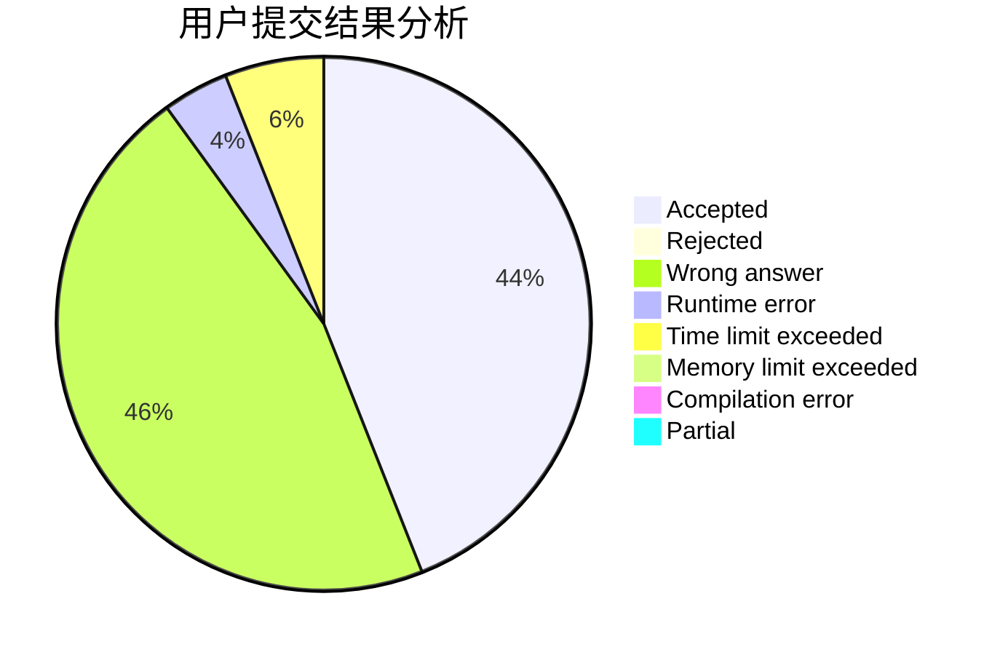
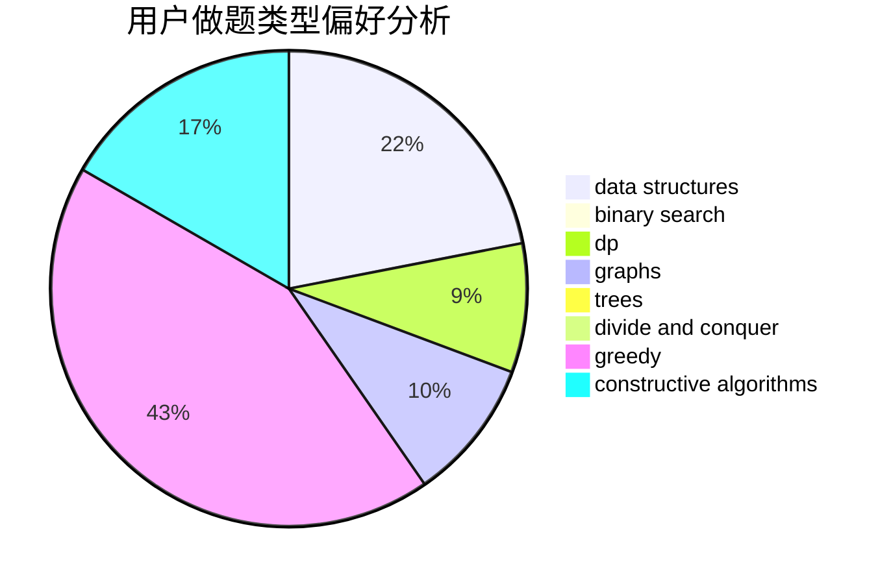

# Michael_Li_Bryant

<!-- tabs:start -->

#### **用户提交结果分析**

#### **用户做题类型偏好分析**

#### **用户错题知识点分析**

<!-- tabs:end -->
# 推荐题目
[1468N](https://codeforces.com/contest/1468/problem/N)		greedy,
                        implementation		  
[1310C](https://codeforces.com/contest/1310/problem/C)		binary search,
                        dp,
                        strings		  
[277E](https://codeforces.com/contest/277/problem/E)		flows,
                        trees		  
[710D](https://codeforces.com/contest/710/problem/D)		math,
                        number theory		  
[1473G](https://codeforces.com/contest/1473/problem/G)		combinatorics,
                        dp,
                        fft,
                        math		  
[523D](https://codeforces.com/contest/523/problem/D)		*special problem,
                        data structures,
                        implementation		  
[1164K](https://codeforces.com/contest/1164/problem/K)		dsu,graphs,sortings,trees		  
[1145B](https://codeforces.com/contest/1145/problem/B)		brute force		  
[318D](https://codeforces.com/contest/318/problem/D)		dsu,graphs,sortings,trees		  
[747D](https://codeforces.com/contest/747/problem/D)		dp,
                        greedy,
                        sortings		  
