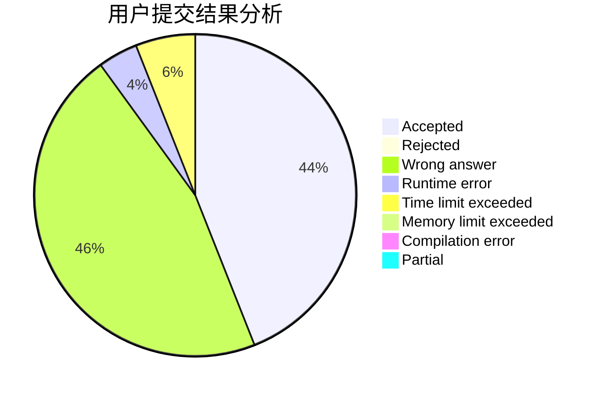
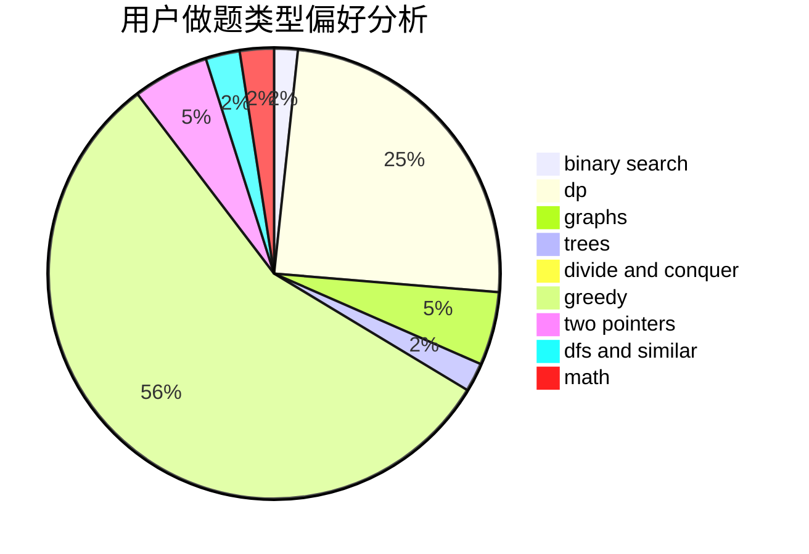

# Michael_Li_Bryant

<!-- tabs:start -->

#### **用户提交结果分析**

#### **用户做题类型偏好分析**

<!-- tabs:end -->
# 推荐题目
[1468N](https://codeforces.com/contest/1468/problem/N)
[1310C](https://codeforces.com/contest/1310/problem/C)
[277E](https://codeforces.com/contest/277/problem/E)
[710D](https://codeforces.com/contest/710/problem/D)
[1473G](https://codeforces.com/contest/1473/problem/G)
[523D](https://codeforces.com/contest/523/problem/D)
[1164K](https://codeforces.com/contest/1164/problem/K)
[1145B](https://codeforces.com/contest/1145/problem/B)
[318D](https://codeforces.com/contest/318/problem/D)
[747D](https://codeforces.com/contest/747/problem/D)
