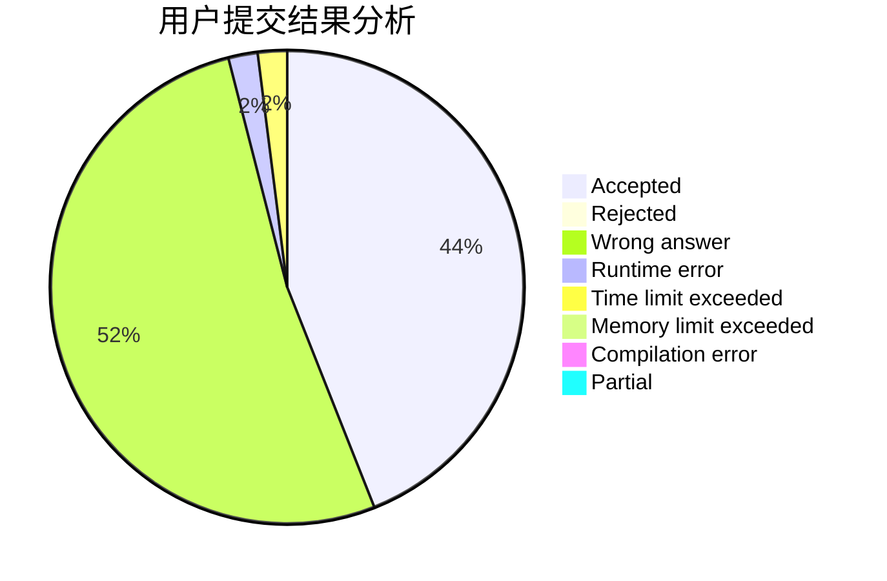
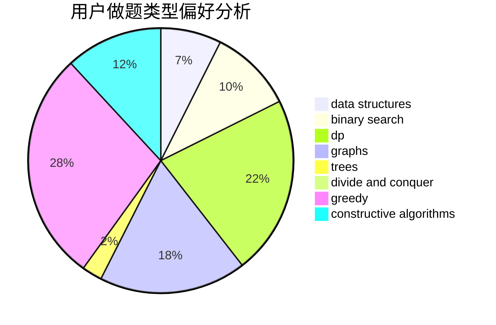

# Michael__

<!-- tabs:start -->

#### **用户提交结果分析**

#### **用户做题类型偏好分析**

#### **用户错题知识点分析**

<!-- tabs:end -->
# 推荐题目
[939D](https://codeforces.com/contest/939/problem/D)		dfs and similar,
                        dsu,
                        graphs,
                        greedy,
                        strings		  
[13A](https://codeforces.com/contest/13/problem/A)		implementation,
                        math		  
[1290C](https://codeforces.com/contest/1290/problem/C)		dfs and similar,
                        dsu,
                        graphs		  
[814C](https://codeforces.com/contest/814/problem/C)		brute force,
                        dp,
                        strings,
                        two pointers		  
[1164M](https://codeforces.com/contest/1164/problem/M)		dsu,graphs,sortings,trees		  
[1217A](https://codeforces.com/contest/1217/problem/A)		binary search,
                        math		  
[1372A](https://codeforces.com/contest/1372/problem/A)		constructive algorithms,
                        implementation		  
[1005C](https://codeforces.com/contest/1005/problem/C)		brute force,
                        greedy,
                        implementation		  
[404C](https://codeforces.com/contest/404/problem/C)		dfs and similar,
                        graphs,
                        sortings		  
[427D](https://codeforces.com/contest/427/problem/D)		dp,
                        string suffix structures,
                        strings		  
