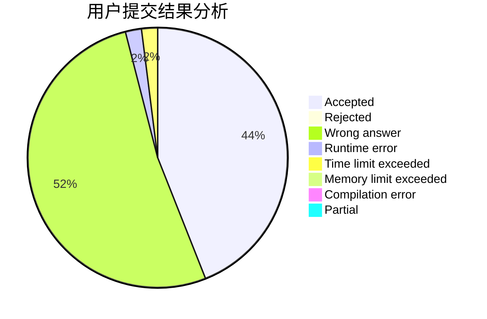
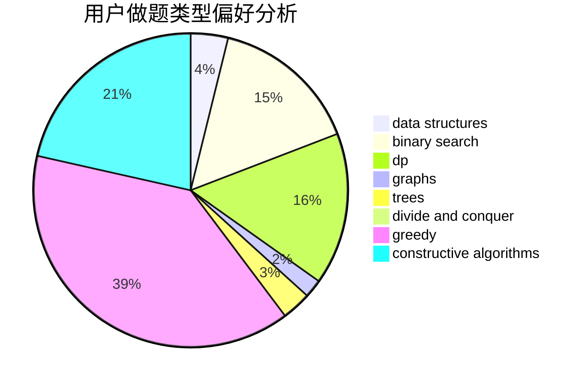

# Michael__

<!-- tabs:start -->

#### **用户提交结果分析**

#### **用户做题类型偏好分析**

#### **用户错题知识点分析**

<!-- tabs:end -->
# 推荐题目
[960G](https://codeforces.com/contest/960/problem/G)		combinatorics,
                        dp,
                        fft,
                        math		  
[1409A](https://codeforces.com/contest/1409/problem/A)		greedy,
                        math		  
[1296F](https://codeforces.com/contest/1296/problem/F)		constructive algorithms,
                        dfs and similar,
                        greedy,
                        sortings,
                        trees		  
[833A](https://codeforces.com/contest/833/problem/A)		math,
                        number theory		  
[1166D](https://codeforces.com/contest/1166/problem/D)		binary search,
                        brute force,
                        greedy,
                        math		  
[1223E](https://codeforces.com/contest/1223/problem/E)		dp,
                        sortings,
                        trees		  
[1380F](https://codeforces.com/contest/1380/problem/F)		data structures,
                        dp,
                        matrices		  
[1005D](https://codeforces.com/contest/1005/problem/D)		dp,
                        greedy,
                        number theory		  
[433B](https://codeforces.com/contest/433/problem/B)		dp,
                        implementation,
                        sortings		  
[44C](https://codeforces.com/contest/44/problem/C)		implementation		  
