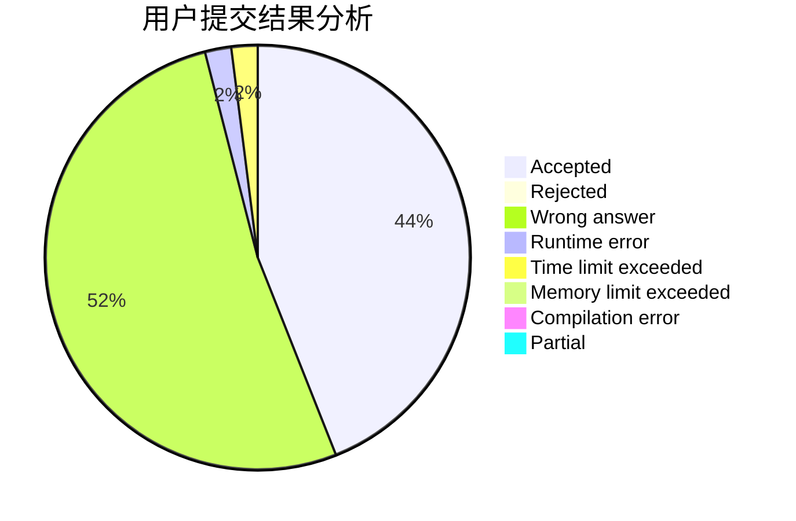
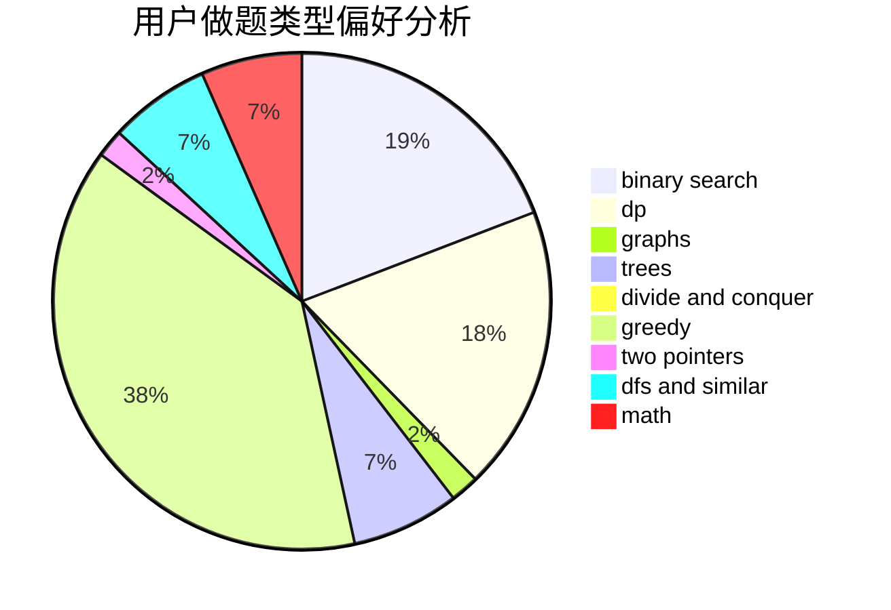

# Michael__

<!-- tabs:start -->

#### **用户提交结果分析**

#### **用户做题类型偏好分析**

<!-- tabs:end -->
# 推荐题目
[960G](https://codeforces.com/contest/960/problem/G)
[1409A](https://codeforces.com/contest/1409/problem/A)
[1296F](https://codeforces.com/contest/1296/problem/F)
[833A](https://codeforces.com/contest/833/problem/A)
[1166D](https://codeforces.com/contest/1166/problem/D)
[1223E](https://codeforces.com/contest/1223/problem/E)
[1380F](https://codeforces.com/contest/1380/problem/F)
[1005D](https://codeforces.com/contest/1005/problem/D)
[433B](https://codeforces.com/contest/433/problem/B)
[44C](https://codeforces.com/contest/44/problem/C)
