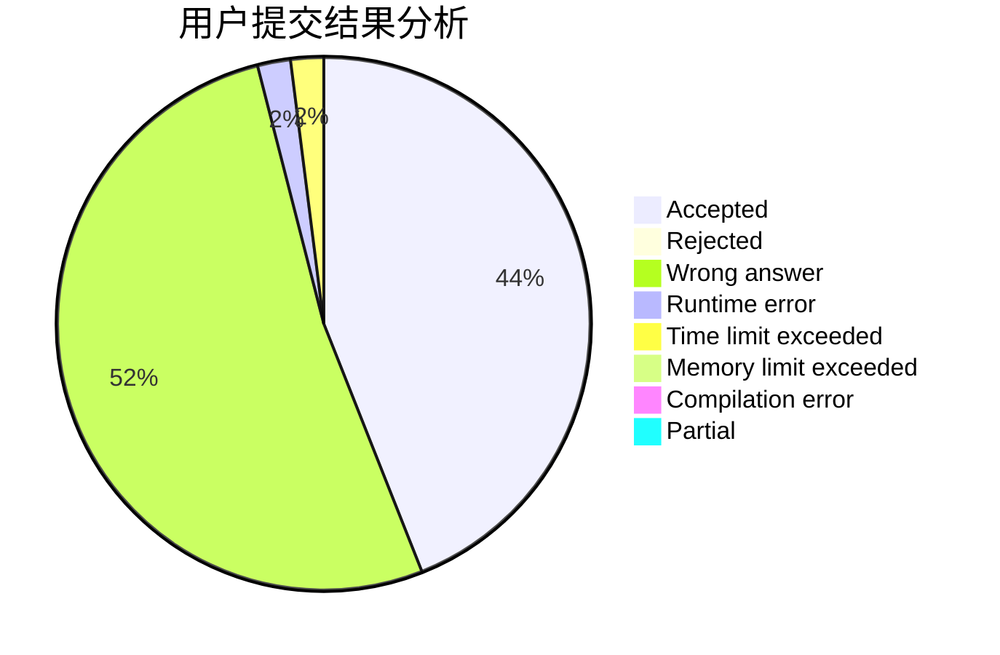
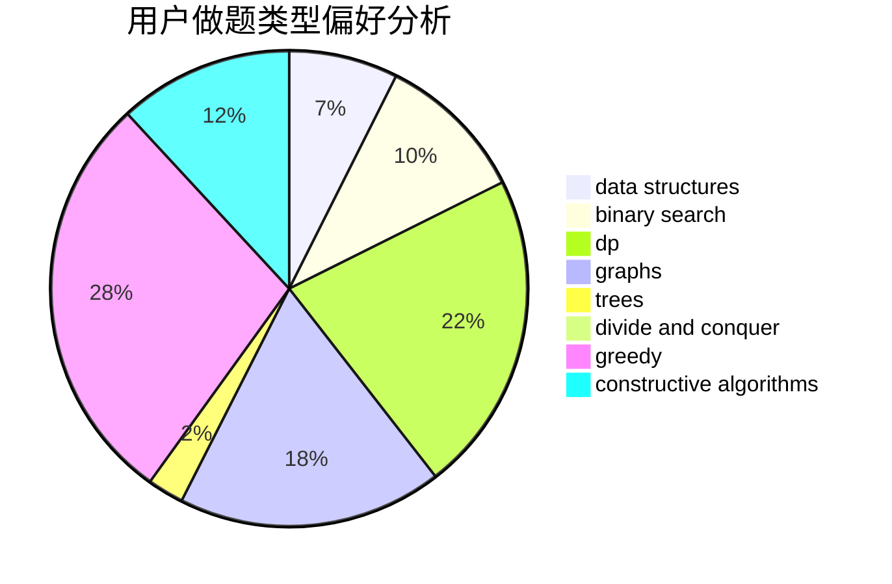

# Michael__
<!-- tabs:start -->
#### **用户提交结果分析**

#### **用户做题类型偏好分析**

#### **用户错题知识点分析**

<!-- tabs:end -->
# 推荐题目
[An impassioned circulation of affection](http://codeforces.com/problemset/problem/814/C)		brute force,
                        dp,
                        strings,
                        two pointers		  
[Prefix Enlightenment](http://codeforces.com/problemset/problem/1290/C)		dfs and similar,
                        dsu,
                        graphs		  
[Numbers](http://codeforces.com/problemset/problem/13/A)		implementation,
                        math		  
[Omkar and Completion](http://codeforces.com/problemset/problem/1372/A)		constructive algorithms,
                        implementation		  
[Seven Digit Number (2 points)](https://codeforces.com/contest/1164/problem/M)		nan		  
[Restore Graph](http://codeforces.com/problemset/problem/404/C)		dfs and similar,
                        graphs,
                        sortings		  
[Creating a Character](http://codeforces.com/problemset/problem/1217/A)		binary search,
                        math		  
[Bash's Big Day](http://codeforces.com/problemset/problem/757/B)		greedy,
                        math,
                        number theory		  
[Summarize to the Power of Two](http://codeforces.com/problemset/problem/1005/C)		brute force,
                        greedy,
                        implementation		  
[Speed Dial](http://codeforces.com/problemset/problem/1082/F)		dp,
                        strings,
                        trees		  
<!-- tabs:start -->
#### **data structures**
[An impassioned circulation of affection](http://codeforces.com/problemset/problem/837/G)		data structures		  
[Prefix Enlightenment](http://codeforces.com/problemset/problem/241/B)		binary search,
                        bitmasks,
                        data structures,
                        math		  
[Numbers](http://codeforces.com/problemset/problem/486/E)		data structures,
                        dp,
                        greedy,
                        hashing,
                        math		  
[Omkar and Completion](http://codeforces.com/problemset/problem/29/C)		data structures,
                        dfs and similar,
                        graphs,
                        implementation		  
[Seven Digit Number (2 points)](http://codeforces.com/problemset/problem/1251/E2)		binary search,
                        data structures,
                        greedy		  
[Restore Graph](http://codeforces.com/problemset/problem/1209/G2)		data structures		  
[Creating a Character](http://codeforces.com/problemset/problem/1393/B)		constructive algorithms,
                        data structures,
                        greedy,
                        implementation		  
[Bash's Big Day](http://codeforces.com/problemset/problem/1503/C)		binary search,
                        data structures,
                        dp,
                        greedy,
                        shortest paths,
                        sortings,
                        two pointers		  
[Summarize to the Power of Two](http://codeforces.com/problemset/problem/1286/E)		data structures,
                        strings		  
[Speed Dial](http://codeforces.com/problemset/problem/1499/G)		data structures,
                        graphs,
                        interactive		  
#### **binary search**
[An impassioned circulation of affection](http://codeforces.com/problemset/problem/1217/A)		binary search,
                        math		  
[Prefix Enlightenment](http://codeforces.com/problemset/problem/241/B)		binary search,
                        bitmasks,
                        data structures,
                        math		  
[Numbers](http://codeforces.com/problemset/problem/1251/E2)		binary search,
                        data structures,
                        greedy		  
[Omkar and Completion](http://codeforces.com/problemset/problem/1503/C)		binary search,
                        data structures,
                        dp,
                        greedy,
                        shortest paths,
                        sortings,
                        two pointers		  
[Seven Digit Number (2 points)](http://codeforces.com/problemset/problem/1492/C)		binary search,
                        data structures,
                        dp,
                        greedy,
                        two pointers		  
[Restore Graph](http://codeforces.com/problemset/problem/1463/D)		binary search,
                        constructive algorithms,
                        greedy,
                        two pointers		  
[Creating a Character](http://codeforces.com/problemset/problem/1490/G)		binary search,
                        data structures,
                        math		  
[Bash's Big Day](http://codeforces.com/problemset/problem/1479/D)		binary search,
                        bitmasks,
                        brute force,
                        data structures,
                        probabilities,
                        trees		  
[Summarize to the Power of Two](http://codeforces.com/problemset/problem/1436/E)		binary search,
                        data structures,
                        two pointers		  
[Speed Dial](http://codeforces.com/problemset/problem/1461/D)		binary search,
                        brute force,
                        data structures,
                        divide and conquer,
                        implementation,
                        sortings		  
#### **dp**
[An impassioned circulation of affection](http://codeforces.com/problemset/problem/814/C)		brute force,
                        dp,
                        strings,
                        two pointers		  
[Prefix Enlightenment](http://codeforces.com/problemset/problem/1082/F)		dp,
                        strings,
                        trees		  
[Numbers](http://codeforces.com/problemset/problem/486/E)		data structures,
                        dp,
                        greedy,
                        hashing,
                        math		  
[Omkar and Completion](http://codeforces.com/problemset/problem/283/B)		dfs and similar,
                        dp,
                        graphs		  
[Seven Digit Number (2 points)](http://codeforces.com/problemset/problem/623/B)		dp,
                        greedy,
                        number theory		  
[Restore Graph](http://codeforces.com/problemset/problem/1272/D)		brute force,
                        dp		  
[Creating a Character](http://codeforces.com/problemset/problem/348/D)		dp,
                        matrices		  
[Bash's Big Day](http://codeforces.com/problemset/problem/427/D)		dp,
                        string suffix structures,
                        strings		  
[Summarize to the Power of Two](http://codeforces.com/problemset/problem/1503/C)		binary search,
                        data structures,
                        dp,
                        greedy,
                        shortest paths,
                        sortings,
                        two pointers		  
[Speed Dial](http://codeforces.com/problemset/problem/734/E)		dfs and similar,
                        dp,
                        trees		  
#### **graph**
[An impassioned circulation of affection](http://codeforces.com/problemset/problem/1290/C)		dfs and similar,
                        dsu,
                        graphs		  
[Prefix Enlightenment](http://codeforces.com/problemset/problem/404/C)		dfs and similar,
                        graphs,
                        sortings		  
[Numbers](http://codeforces.com/problemset/problem/939/D)		dfs and similar,
                        dsu,
                        graphs,
                        greedy,
                        strings		  
[Omkar and Completion](http://codeforces.com/problemset/problem/283/B)		dfs and similar,
                        dp,
                        graphs		  
[Seven Digit Number (2 points)](http://codeforces.com/problemset/problem/29/C)		data structures,
                        dfs and similar,
                        graphs,
                        implementation		  
[Restore Graph](http://codeforces.com/problemset/problem/1499/G)		data structures,
                        graphs,
                        interactive		  
[Creating a Character](http://codeforces.com/problemset/problem/786/B)		data structures,
                        graphs,
                        shortest paths		  
[Bash's Big Day](http://codeforces.com/problemset/problem/1498/E)		brute force,
                        graphs,
                        greedy,
                        interactive,
                        sortings		  
[Summarize to the Power of Two](http://codeforces.com/problemset/problem/1481/D)		brute force,
                        constructive algorithms,
                        graphs,
                        greedy,
                        implementation		  
[Speed Dial](http://codeforces.com/problemset/problem/1495/F)		constructive algorithms,
                        data structures,
                        dp,
                        graphs,
                        trees		  
#### **trees**
[An impassioned circulation of affection](http://codeforces.com/problemset/problem/1082/F)		dp,
                        strings,
                        trees		  
[Prefix Enlightenment](http://codeforces.com/problemset/problem/734/E)		dfs and similar,
                        dp,
                        trees		  
[Numbers](http://codeforces.com/problemset/problem/1495/F)		constructive algorithms,
                        data structures,
                        dp,
                        graphs,
                        trees		  
[Omkar and Completion](http://codeforces.com/problemset/problem/1479/D)		binary search,
                        bitmasks,
                        brute force,
                        data structures,
                        probabilities,
                        trees		  
[Seven Digit Number (2 points)](http://codeforces.com/problemset/problem/1511/C)		brute force,
                        data structures,
                        implementation,
                        trees		  
[Restore Graph](http://codeforces.com/problemset/problem/1499/F)		combinatorics,
                        dfs and similar,
                        dp,
                        trees		  
[Creating a Character](http://codeforces.com/problemset/problem/1491/E)		brute force,
                        dfs and similar,
                        divide and conquer,
                        number theory,
                        trees		  
[Bash's Big Day](http://codeforces.com/problemset/problem/1466/D)		data structures,
                        greedy,
                        sortings,
                        trees		  
[Summarize to the Power of Two](http://codeforces.com/problemset/problem/1495/D)		combinatorics,
                        dfs and similar,
                        graphs,
                        math,
                        shortest paths,
                        trees		  
[Speed Dial](http://codeforces.com/problemset/problem/1303/G)		data structures,
                        divide and conquer,
                        geometry,
                        trees		  
#### **divide and conquer**
[An impassioned circulation of affection](http://codeforces.com/problemset/problem/1461/D)		binary search,
                        brute force,
                        data structures,
                        divide and conquer,
                        implementation,
                        sortings		  
[Prefix Enlightenment](http://codeforces.com/problemset/problem/1466/G)		combinatorics,
                        divide and conquer,
                        hashing,
                        math,
                        string suffix structures,
                        strings		  
[Numbers](http://codeforces.com/problemset/problem/1490/D)		dfs and similar,
                        divide and conquer,
                        implementation		  
[Omkar and Completion](https://codeforces.com/contest/1483/problem/C)		data structures,
                        divide and conquer,
                        dp		  
[Seven Digit Number (2 points)](http://codeforces.com/problemset/problem/1491/E)		brute force,
                        dfs and similar,
                        divide and conquer,
                        number theory,
                        trees		  
[Restore Graph](http://codeforces.com/problemset/problem/1303/G)		data structures,
                        divide and conquer,
                        geometry,
                        trees		  
[Creating a Character](http://codeforces.com/problemset/problem/1494/D)		constructive algorithms,
                        data structures,
                        dfs and similar,
                        divide and conquer,
                        dsu,
                        greedy,
                        sortings,
                        trees		  
[Bash's Big Day](http://codeforces.com/problemset/problem/1482/E)		data structures,
                        divide and conquer,
                        dp		  
[Summarize to the Power of Two](http://codeforces.com/problemset/problem/566/C)		dfs and similar,
                        divide and conquer,
                        trees		  
[Speed Dial](http://codeforces.com/problemset/problem/1428/F)		binary search,
                        data structures,
                        divide and conquer,
                        dp,
                        two pointers		  
#### **greedy**
[An impassioned circulation of affection](http://codeforces.com/problemset/problem/757/B)		greedy,
                        math,
                        number theory		  
[Prefix Enlightenment](http://codeforces.com/problemset/problem/1005/C)		brute force,
                        greedy,
                        implementation		  
[Numbers](http://codeforces.com/problemset/problem/939/D)		dfs and similar,
                        dsu,
                        graphs,
                        greedy,
                        strings		  
[Omkar and Completion](http://codeforces.com/problemset/problem/486/E)		data structures,
                        dp,
                        greedy,
                        hashing,
                        math		  
[Seven Digit Number (2 points)](https://codeforces.com/contest/1099/problem/E)		brute force,
                        constructive algorithms,
                        greedy,
                        math		  
[Restore Graph](http://codeforces.com/problemset/problem/1051/A)		greedy,
                        implementation,
                        strings		  
[Creating a Character](http://codeforces.com/problemset/problem/623/B)		dp,
                        greedy,
                        number theory		  
[Bash's Big Day](http://codeforces.com/problemset/problem/1251/E2)		binary search,
                        data structures,
                        greedy		  
[Summarize to the Power of Two](http://codeforces.com/problemset/problem/337/A)		greedy		  
[Speed Dial](http://codeforces.com/problemset/problem/1393/B)		constructive algorithms,
                        data structures,
                        greedy,
                        implementation		  
#### **constructive algorithms**
[An impassioned circulation of affection](http://codeforces.com/problemset/problem/1372/A)		constructive algorithms,
                        implementation		  
[Prefix Enlightenment](https://codeforces.com/contest/1099/problem/E)		brute force,
                        constructive algorithms,
                        greedy,
                        math		  
[Numbers](http://codeforces.com/problemset/problem/1393/B)		constructive algorithms,
                        data structures,
                        greedy,
                        implementation		  
[Omkar and Completion](http://codeforces.com/problemset/problem/1481/D)		brute force,
                        constructive algorithms,
                        graphs,
                        greedy,
                        implementation		  
[Seven Digit Number (2 points)](http://codeforces.com/problemset/problem/1495/F)		constructive algorithms,
                        data structures,
                        dp,
                        graphs,
                        trees		  
[Restore Graph](http://codeforces.com/problemset/problem/1493/A)		constructive algorithms,
                        greedy		  
[Creating a Character](http://codeforces.com/problemset/problem/1463/D)		binary search,
                        constructive algorithms,
                        greedy,
                        two pointers		  
[Bash's Big Day](https://codeforces.com/contest/1456/problem/B)		bitmasks,
                        brute force,
                        constructive algorithms		  
[Summarize to the Power of Two](http://codeforces.com/problemset/problem/1492/D)		bitmasks,
                        constructive algorithms,
                        greedy,
                        math		  
[Speed Dial](https://codeforces.com/contest/1504/problem/D)		constructive algorithms,
                        games,
                        interactive		  
#### **sortings**
[An impassioned circulation of affection](http://codeforces.com/problemset/problem/404/C)		dfs and similar,
                        graphs,
                        sortings		  
[Prefix Enlightenment](http://codeforces.com/problemset/problem/1503/C)		binary search,
                        data structures,
                        dp,
                        greedy,
                        shortest paths,
                        sortings,
                        two pointers		  
[Numbers](http://codeforces.com/problemset/problem/1498/E)		brute force,
                        graphs,
                        greedy,
                        interactive,
                        sortings		  
[Omkar and Completion](https://codeforces.com/contest/1496/problem/C)		geometry,
                        greedy,
                        math,
                        sortings		  
[Seven Digit Number (2 points)](http://codeforces.com/problemset/problem/1495/A)		geometry,
                        greedy,
                        math,
                        sortings		  
[Restore Graph](http://codeforces.com/problemset/problem/1497/A)		brute force,
                        data structures,
                        greedy,
                        sortings		  
[Creating a Character](http://codeforces.com/problemset/problem/1427/A)		math,
                        sortings		  
[Bash's Big Day](http://codeforces.com/problemset/problem/1461/D)		binary search,
                        brute force,
                        data structures,
                        divide and conquer,
                        implementation,
                        sortings		  
[Summarize to the Power of Two](http://codeforces.com/problemset/problem/1437/C)		dp,
                        flows,
                        graph matchings,
                        greedy,
                        math,
                        sortings		  
[Speed Dial](http://codeforces.com/problemset/problem/1473/A)		greedy,
                        implementation,
                        math,
                        sortings		  
<!-- tabs:end -->
